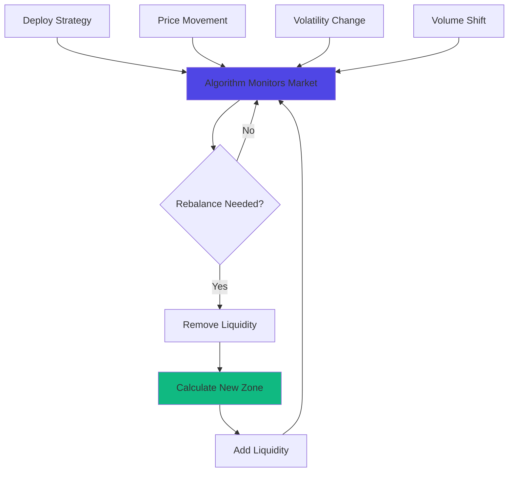

# CLM

Automated liquidity management directly connected to DEX. CLM deploys algorithmic strategies that rebalance Liquidity Zones, maximize capital efficiency, and adapt to changing market conditions.

## At a Glance

- Automated Liquidity Zone management with zero manual intervention
- Multiple Strategy Modes for different risk profiles and goals
- Continuous rebalancing enabled by MegaETH's low gas costs
- Real-time performance tracking and analytics
- Capital efficiency up to 95% vs 60-70% for manual positions
- Composable with DEX and Hedge

## How It Works



Strategy algorithms run continuously, analyzing market conditions and adjusting your positions automatically. MegaETH's ultra-low gas costs (~ $0.01 per rebalance) make frequent adjustments economically viable.

## Why Use Strategies?

### Manual Management Challenges

Managing concentrated liquidity manually is complex:

- Requires constant price monitoring
- Need to calculate optimal zones
- Must rebalance when price moves
- Time-intensive and prone to human error
- Emotional decisions during volatility

### CLM Benefits

**Automation**: Strategies work 24/7 without human input.

**Optimization**: Algorithms calculate mathematically optimal zones.

**Speed**: Rebalance in milliseconds when conditions change.

**Consistency**: No emotional decisions. Pure math.

**Scalability**: Manage multiple positions simultaneously.

## Strategy Modes

Different strategies for different goals:

### Conservative Mode

**Goal**: Maximize active time, minimize rebalancing.

**Characteristics**:
- Wide Liquidity Zones (±20-30%)
- Infrequent rebalancing
- Lower capital efficiency
- Stable, predictable earnings

**Best For**: Passive investors, volatile markets, risk-averse LPs.

[Details →](strategy-modes.md#conservative-mode)

### Balanced Mode

**Goal**: Optimize capital efficiency with moderate management.

**Characteristics**:
- Medium Liquidity Zones (±10-15%)
- Regular rebalancing based on thresholds
- Good capital efficiency
- Balanced risk-return

**Best For**: Most LPs, standard market conditions.

[Details →](strategy-modes.md#balanced-mode)

### Aggressive Mode

**Goal**: Maximum capital efficiency and fee earnings.

**Characteristics**:
- Narrow Liquidity Zones (±3-7%)
- Frequent rebalancing
- Highest capital efficiency
- Higher gas costs

**Best For**: Active traders, stable markets, high volume pools.

[Details →](strategy-modes.md#aggressive-mode)

### Dynamic Mode

**Goal**: Adapt zone width to market volatility.

**Characteristics**:
- Variable zone width
- Expands during high volatility
- Contracts during stability
- Intelligent rebalancing

**Best For**: Changing market conditions, experienced LPs.

[Details →](strategy-modes.md#dynamic-mode)

## Key Features

### Continuous Rebalancing

Traditional chains make frequent rebalancing unprofitable:

```
Ethereum Mainnet:
Rebalance cost: $100
Need $50+ fee improvement to justify
Rebalance frequency: Weekly or less

MegaETH:
Rebalance cost: $0.01
Need $0.50+ fee improvement to justify
Rebalance frequency: Hourly or more
```

MegaETH enables true continuous optimization.

### Real-Time Adjustments

Strategies adjust positions in real-time:

- Price moves 5%: Rebalance within seconds
- Volatility spikes: Widen zones immediately
- Volume shifts: Adjust to capture flow

No waiting for off-chain keepers or block confirmations.

### Multi-Position Management

Deploy strategies across multiple positions:

```
Position 1: ETH/USDC (Aggressive Mode)
Position 2: WBTC/ETH (Balanced Mode)
Position 3: USDC/USDT (Conservative Mode)
```

Each position runs its own strategy independently.

### Performance Analytics

Track strategy performance in detail:

- APR over time
- Rebalancing frequency and costs
- Zone width adjustments
- IL mitigation effectiveness

Compare manual vs automated performance.

[Performance tracking →](performance-tracking.md)

## Deploying a Strategy

### Select Strategy Mode

1. Navigate to CLM
2. Browse available modes
3. Review characteristics of each
4. Select mode matching your goals

### Configure Parameters

Customize strategy behavior:

**Rebalance Threshold**: How far price moves before rebalancing.

**Minimum Fee Delta**: Minimum expected fee improvement to justify rebalance.

**Max Zone Width**: Maximum Liquidity Zone width.

**Min Zone Width**: Minimum Liquidity Zone width.

**Volatility Lookback**: Period for calculating volatility metrics.

Most users use default parameters. Advanced users can fine-tune.

### Choose Pool and Amount

Select:
- Token pair
- Fee tier
- Initial capital amount

Strategy creates initial position with optimal zone.

### Confirm Deployment

Review:
- Strategy mode
- Pool details
- Expected APR
- Gas estimates

Approve and deploy. Strategy activates immediately.

## Strategy Performance

### Expected Returns

Strategy performance varies by mode and market:

**Conservative Mode**:
- Active time: 90-95%
- Capital efficiency: 3-5x traditional AMM
- Typical APR: 15-30%

**Balanced Mode**:
- Active time: 80-90%
- Capital efficiency: 5-8x traditional AMM
- Typical APR: 25-45%

**Aggressive Mode**:
- Active time: 60-80%
- Capital efficiency: 10-15x traditional AMM
- Typical APR: 40-80% (when active)

Returns depend on pool volume, volatility, and fee tier.

### Gas Efficiency

Strategies optimize for net return after gas:

```
Potential Fee Gain: $2
Rebalance Cost: $0.01
Net Benefit: $1.99

Decision: REBALANCE

vs

Potential Fee Gain: $0.30
Rebalance Cost: $0.01
Net Benefit: $0.29
Minimum threshold: $0.50

Decision: WAIT
```

Algorithms never rebalance unless net benefit exceeds threshold.

## Risk Management

Strategies include built-in risk controls:

### Stop-Loss

Automatically close position if losses exceed threshold:

```
Position Value: $10,000
Stop-Loss: 15%
If value drops to $8,500: Position closes automatically
```

Protects capital during extreme movements.

### IL Mitigation

Strategies adjust to minimize impermanent loss:

- Widen zones during high volatility (reduces IL)
- Tighten zones during stability (increases fees)
- Asymmetric zones based on trend direction

[IL mitigation details →](automated-rebalancing.md#impermanent-loss)

### Max Rebalance Frequency

Prevents over-trading:

```
Max rebalances: 24 per day (one per hour)
Cooldown: 30 minutes between rebalances
```

Ensures algorithms don't react to noise.

## Composability

Strategies integrate with other MegaFi layers:

### With DEX

Strategies build on top of MegaPools:
- Use same liquidity positions
- Manage Liquidity Zones automatically
- Collect and compound fees

### With Hedge

Combine strategies with hedging:

```
CLM: Earn fees from LP position
Hedge: Buy put option for downside protection
```

Fees help offset option premiums. Protection limits downside.

[Hedge integration →](../hedge/hedging-strategies.md)

## Strategy on MegaETH

MegaETH's unique properties enable sophisticated strategies:

### Sub-10ms Execution

Strategies rebalance faster than market can arbitrage:

```
1. Algorithm detects need to rebalance: 0ms
2. Calculate new zone: 1ms
3. Remove old position: 5ms
4. Add new position: 8ms
5. Total: 14ms
```

Position updates before most traders perceive price movement.

### Ultra-Low Costs

Gas costs enable profitability impossible elsewhere:

```
Profitable rebalance on Ethereum:
Need $50+ fee improvement (gas cost)
Opportunity frequency: 1-2x per week

Profitable rebalance on MegaETH:
Need $0.50+ fee improvement (gas cost)
Opportunity frequency: 10-20x per day
```

100x more rebalancing opportunities become economically viable.

### Real-Time Data

Continuous state updates provide perfect market data:

- No stale prices from block delays
- Instant volatility calculations
- Real-time volume tracking

Algorithms make better decisions with better data.

## Advanced Features

### Backtesting

Test strategies against historical data:

1. Select strategy mode
2. Choose historical period
3. Set pool and parameters
4. Run simulation
5. Review performance vs manual management

See how strategy would have performed before committing capital.

### Parameter Optimization

Automatically find optimal parameters:

- Algorithm tests different configurations
- Measures performance for each
- Recommends best settings for your pool

Available for experienced users.

### Custom Strategies

Build your own strategies (coming soon):

- Define custom rebalancing logic
- Set unique risk parameters
- Backtest before deploying
- Share with community

## FAQ

**Are strategies audited?**  
Yes. All strategy contracts undergo thorough security audits.

**Can I withdraw from a strategy anytime?**  
Yes. No lock periods. Exit whenever you want.

**Do strategies guarantee profits?**  
No. Strategies optimize management but can't eliminate market risk or IL.

**What happens if MegaETH goes down?**  
Strategies pause during outages. Resume automatically when network returns.

**Can I modify strategy parameters after deployment?**  
Some parameters are adjustable. Others require closing and redeploying.

**Do strategies work during high volatility?**  
Yes. Dynamic and Conservative modes specifically designed for volatile markets.

## Next Steps

Explore CLM components:

- [Strategy Modes](strategy-modes.md) - Detailed mode descriptions
- [Automated Rebalancing](automated-rebalancing.md) - How rebalancing works
- [Range Optimization](range-optimization.md) - Zone calculation algorithms
- [Performance Tracking](performance-tracking.md) - Monitor strategy returns

---

**Set it and forget it.**

