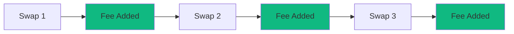

# Fees and Rewards

Understand how trading fees work, how they're distributed to liquidity providers, and how to maximize your earnings on MegaFi.

## At a Glance

- Trading fees paid by swappers, earned by liquidity providers
- Three fee tiers: 0.05%, 0.3%, and 1%
- Fees accumulate automatically in your position
- Claim fees anytime or collect when removing liquidity
- Real-time fee tracking shows earnings continuously
- No protocol fee - 100% of trading fees go to LPs

## Fee Structure

### Trading Fees

Swappers pay a percentage of their trade as a fee:

**0.05% Fee Tier**:
- Stable pairs (USDC/USDT, DAI/USDC)
- Low volatility
- High volume, low profit per trade

**0.3% Fee Tier**:
- Standard pairs (ETH/USDC, WBTC/ETH)
- Moderate volatility
- Balanced volume and profit

**1% Fee Tier**:
- Exotic pairs (new tokens, low liquidity)
- High volatility
- Lower volume, higher profit per trade

### Fee Distribution

Fees distribute proportionally among active liquidity providers:

```
Swap: 10 ETH for 20,000 USDC (0.3% fee = $60)

Pool has 1000 ETH total liquidity
Your position: 100 ETH (10% of pool)
Your fee share: $6

Position active for 50% of time
Your actual fee: $3
```

Only liquidity in active Liquidity Zones earns fees.

### No Protocol Fee

MegaFi charges zero protocol fee. 100% of trading fees go to liquidity providers.

Compare to protocols charging 10-20% protocol fee:
- Other protocol: LP receives $4.80 ($6 - 20% protocol fee)
- MegaFi: LP receives $6 (100% of fee)

## Fee Accrual

### Real-Time Accumulation

Fees accumulate continuously with each swap:



MegaETH's real-time execution means fees appear instantly, not after block confirmations.

### Viewing Unclaimed Fees

Check fee earnings in position details:

**Unclaimed Fees**: Total fees earned since last collection.

**Fee Value**: USD worth of unclaimed fees.

**Daily Rate**: Average daily fee earnings.

**APR**: Annualized return based on position value and fee rate.

Fees display separately for each token in the pair.

### Fee History

Track earnings over time:

**Total Fees Collected**: All-time earnings from position.

**Fee Chart**: Visual graph of fee accrual.

**APR History**: How return rate changed over time.

**Comparison**: Your APR vs pool average.

## Collecting Fees

### Manual Collection

Claim fees without removing liquidity:

1. Click "Collect Fees" on position
2. Review fee amounts
3. Confirm transaction (~ $0.003 gas)
4. Fees sent to wallet

Position remains active. Continue earning new fees immediately.

### Automatic Collection

Fees collect automatically when removing liquidity:

1. Click "Remove Liquidity"
2. Select percentage or amount
3. Receive tokens + accumulated fees
4. Single transaction (~ $0.005 gas)

No need to collect fees separately before removing liquidity.

### When to Collect

**Don't Collect Often**: Each collection costs gas (~ $0.003). For small positions, frequent collection reduces net profit.

**Collect When**:
- Fees > $50 and you need the funds
- Closing/rebalancing position (collect first to avoid losing track)
- Gas costs < 1% of fee value
- Want to compound fees into new positions

**Let Accumulate If**:
- Fees < $10 (gas cost significant portion)
- Position is long-term
- You don't need immediate access

Unclaimed fees remain safe in your position. No deadline to collect.

## Fee Optimization

### Position Near Current Price

Liquidity closest to current price earns most fees:

```
Current Price: $2000

Position A: $1900 - $2100 (includes current, HIGH fees)
Position B: $2200 - $2400 (outside current, NO fees)
```

Rebalance when your zone drifts from market price.

### Narrow Zones

Narrower zones earn higher fees per dollar of capital:

```
Capital: $10,000
Wide zone (±50%): Earns $5/day = 18% APR
Narrow zone (±10%): Earns $15/day = 54% APR (when active)
```

Trade-off: Narrow zones go out of range more easily.

### High Volume Pools

More swaps = more fees:

```
Pool A: $10M daily volume, 0.3% fee = $30k daily fees
Pool B: $1M daily volume, 0.3% fee = $3k daily fees
```

Target pools with consistent high volume for best earnings.

### Appropriate Fee Tier

Match fee tier to volatility:

**Wrong**: 1% fee tier on stable pair (USDC/USDT)
- Traders avoid due to high fees
- Low volume
- Low earnings despite high fee percentage

**Right**: 0.05% fee tier on stable pair
- Attracts volume
- High earnings despite low fee percentage

### Multiple Positions

Distribute capital across multiple positions:

**Diversification**:
- Different pools
- Different zone widths
- Different fee tiers

Benefits:
- Smooth earning variation
- Reduce single-pool risk
- Learn what works best

### Active Management

Rebalance positions regularly:

- When zone goes out of range
- When better opportunities appear
- When volatility changes

MegaETH's low gas costs make frequent rebalancing profitable.

## Fee Calculations

### Per-Swap Fee Math

For each swap through your position:

```
Swap Amount: 10 ETH
Fee Percentage: 0.3%
Total Fee: 0.03 ETH = $60 (at $2000/ETH)

Your Liquidity: 10% of active liquidity in zone
Your Fee: 0.003 ETH = $6
```

### APR Calculation

Annual Percentage Rate estimates return:

```
Position Value: $10,000
Total Fees in 30 days: $250
Daily Fees: $8.33
Annual Projection: $8.33 × 365 = $3,040
APR: ($3,040 / $10,000) × 100 = 30.4%
```

APR fluctuates with:
- Trading volume changes
- Pool liquidity changes
- Position active time
- Price movements (affecting IL)

### Net Return

Actual profit considers:

```
Fee Earnings: $1,000
Gas Costs (adds, removes, collects): $0.50
Impermanent Loss: -$200

Net Return: $1,000 - $0.50 - $200 = $799.50
Net APR: Lower than fee APR alone
```

Always factor IL into return calculations.

## Compound Strategies

### Reinvesting Fees

Grow position by adding fee earnings back:

1. Collect fees when they reach significant amount
2. Add to existing position or create new position
3. Increased capital earns more fees
4. Compound growth accelerates

### Balanced Reinvestment

Maintain target allocation:

```
Portfolio Target: 50% ETH/USDC LP, 50% ETH holdings

Collect fees: 0.1 ETH + 200 USDC
Rebalance: Add 0.05 ETH to LP, keep 0.05 ETH + 200 USDC
```

Prevents overexposure to single strategy.

### Cross-Pool Compounding

Use fees from one pool to enter different pools:

```
Collect fees from ETH/USDC
Deploy into WBTC/ETH for diversification
```

## Fee Comparison

### MegaFi vs Other Protocols

```
Volume: $1M swap in ETH/USDC

Traditional AMM (0.3% fee):
Trader pays: $3,000
LP receives: $3,000
Protocol receives: $0

MEV-Protected AMM (0.3% fee, 20% protocol cut):
Trader pays: $3,000
LP receives: $2,400
Protocol receives: $600

MegaFi (0.3% fee, 0% protocol cut):
Trader pays: $3,000
LP receives: $3,000 (FULL AMOUNT)
Protocol receives: $0
```

MegaFi LPs earn 25% more on identical volume.

### Concentrated vs Full-Range

```
Capital: $10,000
Volume: $100k daily through pool
Fee: 0.3% = $300 daily fees

Full-Range Position:
Share: 2% of liquidity
Earnings: $6/day = 21.9% APR

Concentrated Position (5x liquidity efficiency):
Effective Share: 10% of active liquidity
Earnings: $30/day = 109.5% APR
```

Concentrated liquidity earns 5x more from same capital.

## Performance Tracking

### Key Metrics

Monitor these metrics:

**APR**: Annualized return rate.

**Daily Fees**: Average fee earnings per day.

**Position Age**: How long you've provided liquidity.

**Total Earned**: All-time fee earnings.

**Active Time %**: Percent of time position was in range.

### Benchmarking

Compare your position to:

**Pool Average**: Your APR vs average LP in same pool.

**Historical Performance**: Current APR vs past periods.

**Other Pools**: Compare across different token pairs.

**Strategies**: Manual management vs automated strategies.

## Gas Costs

Fee-related transaction costs on MegaETH:

**Collect Fees**: ~ $0.003

**Add Liquidity**: ~ $0.005

**Remove Liquidity**: ~ $0.005

**Rebalance (remove + add)**: ~ $0.010

Compare to Ethereum mainnet:
- Collect: $20-50
- Add/Remove: $50-100
- Rebalance: $100-150

MegaETH enables profitable management of small positions and frequent rebalancing.

## Tax Considerations

Consult a tax professional, but generally:

**Fee Earnings**: May be taxable as income when claimed.

**Impermanent Loss**: May create taxable events when rebalancing.

**NFT Transfers**: May trigger capital gains/losses.

**Holding Period**: LP positions may not qualify for long-term capital gains treatment.

Track:
- Dates and amounts of fees collected
- Cost basis of deposited tokens
- IL realized when removing liquidity

## FAQ

**How often are fees paid?**  
Continuously. Every swap immediately adds fees to your position.

**Can I lose accumulated fees?**  
No. Once earned, fees remain in your position even if price moves out of range.

**Do out-of-range positions earn fees?**  
No. Fees accrue only when position is active (in range).

**What if I never collect fees?**  
They remain in your position indefinitely. Collect when you need them or when removing liquidity.

**Are fees paid in ETH or tokens?**  
Fees are paid in both tokens of the pair, proportional to how swaps flow through the pool.

**How are fees taxed?**  
Depends on jurisdiction. Consult tax professional for guidance.

**Can I see what fees I would have earned with different zone?**  
Yes. Historical simulator in interface shows projected fees for various zones.

## Next Steps

Maximize your fee earnings:

- [Liquidity Zones](liquidity-zones.md) - Optimize zone selection
- [CLM](../clm/overview.md) - Automate management
- [Performance Tracking](../clm/performance-tracking.md) - Monitor returns

---

**Earn while you sleep.**

