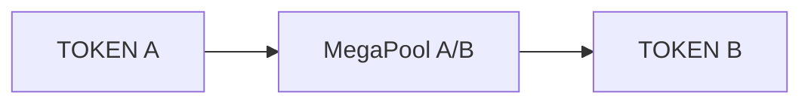
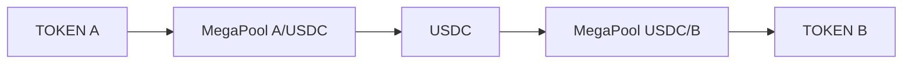
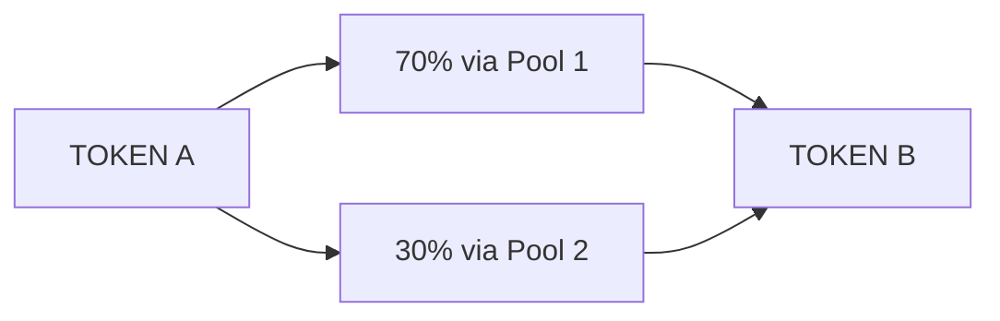

# First Swap

Execute your first token swap on MegaFi and experience sub-10 millisecond transaction finality. This guide walks you through a complete swap from selecting tokens to transaction confirmation.

## At a Glance

- Select any two supported tokens to swap
- Get instant price quotes with real-time updates
- Review slippage, fees, and expected output
- Execute swap in under 50 milliseconds
- Transaction finalizes immediately
- No order books or waiting periods

## Prerequisites

Before making your first swap:

- [Wallet connected](connect-wallet.md) to MegaFi
- [MegaETH network](megaeth-setup.md) active in wallet
- Tokens available on MegaETH (use [bridge](../megaeth/bridge-guide.md) if needed)
- Small amount of $MEGA for gas (~ $0.005 per swap)

## Swap Interface

Navigate to the Swap page at [megafi.app/swap](https://megafi.app/swap).

The interface has two main sections:

**Input**: Token you're swapping from and amount.

**Output**: Token you're receiving and expected amount.

Between them, you'll see the exchange rate, price impact, and estimated fees.

## Step-by-Step Swap

### 1. Select Input Token

Click the token selector in the top section. A modal displays all available tokens.

Options to find your token:
- Search by name or symbol
- Browse popular tokens
- Paste contract address for unlisted tokens
- View your token balances

Select the token you want to swap from.

### 2. Enter Amount

Type the amount in the input field. You can:

- Enter exact amount manually
- Click "Max" to use full balance
- Click percentage buttons (25%, 50%, 75%)

The interface validates you have sufficient balance. If balance is insufficient, an error displays.

### 3. Select Output Token

Click the token selector in the bottom section. Choose the token you want to receive.

You cannot select the same token for input and output. If you do, the interface prompts you to choose a different token.

### 4. Review Quote

After selecting both tokens and entering an amount, MegaFi generates a quote:

**Exchange Rate**: Current price between the tokens.

**Expected Output**: Amount of output token you'll receive.

**Price Impact**: How your trade affects the pool price. Under 0.05% for most trades.

**Minimum Received**: Worst-case output after slippage. Your transaction reverts if output would be below this.

**Fees**: Trading fee (typically 0.3%) and gas cost (~ $0.005).

**Route**: Which MegaPool(s) your trade routes through. Multi-hop trades route through multiple pools automatically.

The quote updates in real-time as pool prices change. MegaETH's speed enables continuous quote refresh.

### 5. Adjust Slippage (Optional)

Click the settings icon to modify slippage tolerance:

**Auto (0.5%)**: Default setting. Suitable for most swaps.

**Custom**: Enter your own tolerance. Lower slippage may cause failures on volatile pairs.

Slippage protects you from price movements between submission and execution. On MegaETH, execution is so fast that slippage is rarely needed, but it provides additional security.

### 6. Approve Token (First Time Only)

If this is your first time swapping this token, you need to approve MegaFi to access it:

1. Click "Approve [TOKEN]"
2. Transaction modal opens in wallet
3. Review and confirm approval
4. Wait for confirmation (sub-10ms)
5. "Swap" button becomes active

Token approvals are one-time per token. Subsequent swaps don't require re-approval.

### 7. Execute Swap

Click "Swap" button. A confirmation modal displays:

- Input and output amounts
- Exchange rate
- Price impact
- Fees
- Minimum received after slippage

Review the details. If everything looks correct, click "Confirm Swap".

### 8. Confirm in Wallet

Your wallet prompts you to confirm the transaction:

- Review transaction details
- Check gas cost (should be under $0.01)
- Confirm transaction

### 9. Wait for Confirmation

Transaction submits to MegaETH. Progress indicator shows:

1. Submitted (instant)
2. Pending (< 5ms)
3. Confirmed (< 10ms)
4. Complete

Total time from click to finality: 10-50 milliseconds.

A success message displays with transaction details and a link to view on the block explorer.

## Understanding Swap Routing

MegaFi automatically routes swaps for best execution:

### Direct Routes

When a MegaPool exists for your token pair:

Single-hop swap through one pool. Lowest fees and best price.

### Multi-Hop Routes

When no direct pool exists:

Two or more hops through intermediate tokens. MegaFi finds the most efficient path automatically.

### Split Routes

For large trades, MegaFi may split your order:

This minimizes price impact by spreading the trade across multiple pools.

## Price Impact

Price impact measures how your trade affects the pool price:

**< 0.05%**: Excellent. Negligible impact.

**0.05% - 0.5%**: Good. Normal for medium-sized trades.

**0.5% - 2%**: Moderate. Consider splitting into smaller trades.

**> 2%**: High. You're receiving significantly worse price. Trade smaller amounts or wait for more liquidity.

MegaFi displays a warning if price impact exceeds 2%.

## Fees Breakdown

Every swap incurs two types of fees:

### Trading Fee

Paid to liquidity providers. Varies by pool:

- Standard pairs: 0.3%
- Stable pairs: 0.05%
- Exotic pairs: 1%

Fee is deducted from output amount automatically.

### Gas Fee

Paid to MegaETH validators in $MEGA:

- Simple swap: ~ $0.001 - $0.003
- Multi-hop swap: ~ $0.003 - $0.005
- First-time approval: ~ $0.005

Gas costs are 99% lower than Ethereum mainnet.

## Real-Time Updates

While you're on the swap interface, quotes update continuously:

**Price Changes**: If pool prices move, your quote adjusts in real-time.

**Liquidity Changes**: If someone adds or removes liquidity, routing may update.

**Balance Updates**: If you receive tokens while on the page, balances refresh automatically.

This is possible because MegaETH processes updates continuously, not in block intervals.

## Transaction Success

After confirmation, verify your swap:

1. Output tokens appear in wallet balance
2. Transaction appears in "Recent Transactions"
3. Block explorer shows transaction details
4. Input tokens deducted from balance

If your wallet balance doesn't update immediately, refresh the interface.

## Common Issues

### Transaction Failed

**Slippage Exceeded**: Price moved beyond your tolerance. Increase slippage or try again.

**Insufficient Liquidity**: Pool doesn't have enough liquidity for your trade size. Reduce amount or try different route.

**Approval Expired**: Re-approve the token and retry swap.

### Unexpected Output Amount

**Price Impact**: Large trades move the price. Check price impact before swapping.

**Route Changed**: Routing automatically optimizes. Manual routes available in advanced mode.

**Fees Deducted**: Output amount is after fees. Check fee breakdown in quote.

### Swap Button Disabled

**Insufficient Balance**: You don't have enough input token. Reduce amount.

**Need Approval**: Approve token first, then swap button activates.

**Wrong Network**: Switch to MegaETH in your wallet.

**Amount Too Small**: Enter amount above minimum (usually $0.01 worth).

## Advanced Features

### Custom Slippage

Set exact slippage tolerance in settings. Lower values provide better price but may fail if market moves.

### Transaction Deadline

Set how long your transaction remains valid before expiry. Default is 30 minutes. On MegaETH's fast network, this is rarely relevant.

### Expert Mode

Enable expert mode to:
- Disable confirmation prompts
- Set custom gas limits
- Manually select routes
- See detailed routing information

Only enable if you understand transaction parameters.

## Tips for Better Swaps

**Check Price Impact**: For large trades, price impact matters. Consider splitting into multiple smaller swaps.

**Compare Routes**: Advanced mode shows alternative routes. Sometimes a different path offers better price.

**Time Your Trades**: While MegaETH is fast, volatile markets still see price swings. Monitor prices before large swaps.

**Approve Once**: Token approvals persist. After approving once, you can swap anytime without re-approving.

**Use Stable Pairs**: Swapping through stablecoins often provides better rates for exotic token pairs.

## FAQ

**How fast is a swap on MegaFi?**  
10-50 milliseconds from confirmation to finality. Faster than you can perceive.

**Can I cancel after clicking swap?**  
No. MegaETH executes transactions immediately. Double-check before confirming.

**What if price changes while I'm confirming?**  
Slippage tolerance protects you. If price moves beyond tolerance, transaction reverts automatically.

**Do I need $MEGA for every swap?**  
Yes, but gas costs are minimal. $1 of $MEGA provides hundreds of swaps.

**Can I swap any token?**  
Only tokens with liquidity on MegaFi. Most major tokens are supported. Check supported tokens list.

## Next Steps

After your first swap:

1. [Provide liquidity](../liquidity-layer/providing-liquidity.md) to earn fees from swaps
2. Explore [Strategy Modes](../strategy-layer/strategy-modes.md) for automated liquidity management
3. Learn about [fees and rewards](../liquidity-layer/fees-and-rewards.md)

---

**Welcome to instant execution.**

