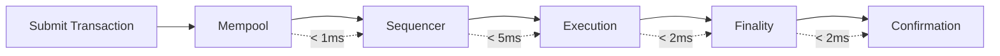

# MegaETH Network Setup

Configure the MegaETH network in your wallet to use MegaFi. This guide covers automatic setup through the interface and manual configuration for advanced users.

## At a Glance

- One-click network addition through MegaFi interface
- Works with MetaMask, Rainbow, and all EVM wallets
- Network automatically switches when needed
- Manual configuration available for custom setups
- No gas required to add network
- Configuration takes under 30 seconds

## Automatic Setup (Recommended)

The fastest way to add MegaETH to your wallet:

1. Connect your wallet on [megafi.app](https://megafi.app)
2. Click "Add Network" when prompted
3. Approve the network addition in your wallet
4. Network is added and automatically selected

MegaFi sends the complete network configuration to your wallet. No manual entry required.

## Manual Configuration

For advanced users or wallets that don't support automatic network addition:

### Network Parameters

```
Network Name: MegaETH
RPC URL: https://rpc.megaeth.io
Chain ID: [TO BE ANNOUNCED]
Currency Symbol: MEGA
Block Explorer: https://explorer.megaeth.io
```

> Contract addresses and chain parameters will be published at mainnet launch. Testnet parameters available in Discord.

### Adding Manually

**MetaMask**:
1. Open MetaMask extension
2. Click network dropdown (top center)
3. Select "Add Network"
4. Click "Add a network manually"
5. Enter parameters above
6. Click "Save"
7. Switch to MegaETH network

**Rainbow**:
1. Open Rainbow wallet settings
2. Navigate to "Networks"
3. Click "Add Network"
4. Enter parameters above
5. Confirm addition
6. Select MegaETH from network list

**Coinbase Wallet**:
1. Open wallet settings
2. Select "Active Networks"
3. Tap "Add Network"
4. Enter custom RPC details
5. Save configuration

## Network Verification

After adding MegaETH, verify correct configuration:

**Check Chain ID**: Ensure chain ID matches official MegaETH specification. Incorrect chain ID prevents transactions.

**Test RPC**: Send a test transaction or check balance. If RPC responds, configuration is correct.

**Block Explorer**: Visit [explorer.megaeth.io](https://explorer.megaeth.io) and search your address. You should see your MegaETH balances.

## Network Switching

### Automatic Switching

MegaFi automatically prompts network switch when needed:

- When you connect on a different network
- When you return after switching networks
- When network connection is lost and restored

Click "Switch Network" when prompted. Your wallet will change to MegaETH.

### Manual Switching

Switch networks manually through your wallet:

1. Click network dropdown in wallet
2. Select "MegaETH" from list
3. Network changes immediately

## RPC Endpoints

MegaETH provides multiple RPC endpoints for redundancy:

**Primary**: `https://rpc.megaeth.io` (lowest latency, load balanced)  
**Backup**: `https://rpc-backup.megaeth.io` (fallback if primary is unreachable)  
**Regional**: Regional endpoints available for specific geographic areas

Most users should use the primary endpoint. It automatically routes to the nearest server.

### Custom RPC

Advanced users can run their own MegaETH node and use a local RPC endpoint. This provides maximum privacy and reliability but requires technical expertise.

## Performance Characteristics

MegaETH network delivers exceptional performance:



**Total Time**: Sub-10ms from submission to finality. Compare this to 12-15 seconds on Ethereum mainnet.

**Throughput**: 100,000+ transactions per second. No congestion even during peak activity.

**Finality**: Immediate. Transactions are final once confirmed, not probabilistic.

## Gas Configuration

MegaETH uses $MEGA for gas. Configure gas settings for optimal costs:

### Default Settings

MegaFi automatically sets gas parameters:

- **Gas Limit**: Calculated per transaction type
- **Gas Price**: Set to network minimum
- **Priority Fee**: Optional, rarely needed

Most users never need to adjust gas settings.

### Custom Gas Settings

Advanced users can modify gas parameters:

**Low Priority**: Use minimum gas price. Transaction confirms within 10-50ms.

**Standard**: Default setting. Confirms in sub-10ms.

**High Priority**: Unnecessary on MegaETH. Network has ample capacity.

## Testnet Configuration

Test MegaFi features on testnet before using mainnet:

```
Network Name: MegaETH Testnet
RPC URL: https://testnet-rpc.megaeth.io
Chain ID: [TESTNET CHAIN ID]
Currency Symbol: MEGA
Block Explorer: https://testnet-explorer.megaeth.io
```

Testnet tokens have no value. Request testnet $MEGA from faucet.

## Troubleshooting

### Network Won't Add

**Wallet Locked**: Unlock wallet and try again.

**Old Wallet Version**: Update to latest wallet version. Older versions may not support custom networks.

**Browser Issues**: Clear cache and reload. Some browsers cache network lists.

### Can't Switch Networks

**Pending Transaction**: Cancel or confirm pending transaction on current network first.

**RPC Unreachable**: Check internet connection. Try backup RPC endpoint.

**Wrong Chain ID**: Remove network and re-add with correct parameters.

### Transactions Failing

**Insufficient Gas**: Ensure you have $MEGA for gas. Even $1 worth provides hundreds of transactions.

**Wrong Network**: Verify you're on MegaETH, not Ethereum mainnet or a different L2.

**RPC Timeout**: Switch to backup RPC endpoint if primary is slow.

## Network Security

### Official Endpoints

Only use official MegaETH RPC endpoints:

- `https://rpc.megaeth.io`
- `https://rpc-backup.megaeth.io`

Unofficial endpoints may log transaction data or inject malicious code.

### Verify Domain

When adding network through MegaFi:

1. Check URL is `megafi.app`
2. Look for HTTPS lock icon
3. Verify certificate is valid

Phishing sites may prompt fake network additions.

### Private Keys

Network configuration never requires private keys. If prompted for private key or seed phrase, you're on a phishing site.

## Mobile Wallet Setup

### WalletConnect

Most mobile wallets receive network configuration automatically through WalletConnect. No manual setup needed.

### Native Mobile Wallets

For wallets with built-in browsers:

1. Visit megafi.app in wallet browser
2. Connect wallet
3. Approve network addition when prompted

### Rainbow Mobile

Rainbow mobile app includes MegaETH by default. Simply enable it in network settings.

## FAQ

**Does adding a network cost gas?**  
No. Network configuration is stored locally in your wallet.

**Can I use MegaETH on multiple wallets?**  
Yes. Add the network to each wallet independently.

**What if MegaETH RPC goes down?**  
Use backup RPC endpoints. Multiple redundant servers ensure 99.99% uptime.

**How do I remove MegaETH network?**  
Open wallet settings, find MegaETH in networks list, and delete. Your on-chain positions remain intact.

## Next Steps

After configuring MegaETH:

1. [Bridge assets to MegaETH](../megaeth/bridge-guide.md)
2. [Make your first swap](first-swap.md)
3. Explore [MegaETH performance features](../megaeth/performance.md)

---

**Connected to the fastest chain.**

