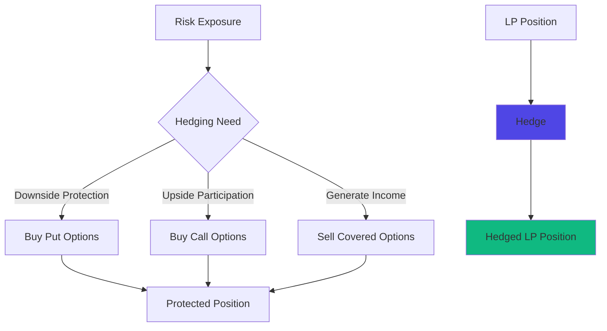

# Hedge

Advanced risk management tools including options trading and hedging strategies. Hedge enables sophisticated portfolio protection and yield enhancement through derivatives built on MegaETH's real-time infrastructure.

## At a Glance

- Trade options on major token pairs with sub-10ms execution
- Hedge liquidity positions against price movements and volatility
- Real-time Greeks calculations and risk metrics
- Automated position management and risk controls
- Composable with DEX and CLM
- Capital-efficient collateral requirements

## How It Works



Hedge provides derivatives instruments to manage exposure from DEX positions or general token holdings.

## Why Use Hedge?

### Protect Liquidity Positions

Liquidity providers face impermanent loss risk. Hedge enables protection:

```
Scenario: Provide liquidity to ETH/USDC pool
Risk: ETH price drops, causing IL

Solution: Buy ETH put options
- If ETH drops: Put gains offset IL
- If ETH rises: Small premium paid, but LP fees continue
- Net: Downside protected, upside preserved
```

### Generate Additional Yield

Sell options against holdings for premium income:

```
Scenario: Hold ETH long-term
Strategy: Sell covered calls

- Collect option premium: Additional 5-15% APY
- If price stays below strike: Keep premium and ETH
- If price exceeds strike: Sell ETH at profit + keep premium
```

### Speculate on Volatility

Trade options for leveraged exposure:

```
Scenario: Expect ETH volatility spike
Strategy: Buy straddle (call + put at same strike)

- If large move either direction: Profit from winning leg
- If price stays flat: Lose premiums
- Capital efficient volatility exposure
```

## Core Features

### Options Trading

**Call Options**: Right to buy token at strike price.

**Put Options**: Right to sell token at strike price.

**American Style**: Exercise anytime before expiration.

**European Style**: Exercise only at expiration.

Available expirations: Daily, weekly, monthly.

[Options trading guide →](options-trading.md)

### Real-Time Greeks

Track option risk metrics in real-time:

**Delta**: Price sensitivity. How much option value changes per $1 token move.

**Gamma**: Delta sensitivity. How delta changes as price moves.

**Theta**: Time decay. How much value lost per day.

**Vega**: Volatility sensitivity. How value changes with volatility.

**Rho**: Interest rate sensitivity. Usually minimal in DeFi.

MegaETH's continuous execution enables Greeks updates every transaction, not every block.

### Position Management

Automated risk controls:

**Stop Loss**: Automatically close losing positions.

**Take Profit**: Lock in gains at target levels.

**Delta Hedging**: Maintain delta-neutral positions automatically.

**Roll Positions**: Close expiring options and open new ones.

### Portfolio Hedging

Hedge entire portfolios with single operations:

```
Portfolio:
- 10 ETH
- 5 WBTC
- $50k in LP positions

Single hedge:
- Portfolio put option (basket)
- Protects entire portfolio
- More capital efficient than individual hedges
```

## Option Mechanics

### Buying Options

1. Select token pair (e.g., ETH/USDC)
2. Choose option type (call or put)
3. Select strike price
4. Choose expiration date
5. Enter size (number of contracts)
6. Review premium cost
7. Execute trade (sub-10ms)

Premium paid upfront. Maximum loss = premium paid.

### Selling Options

1. Select token pair
2. Choose option type
3. Set strike and expiration
4. Enter size
5. Review collateral requirements
6. Deposit collateral
7. Receive premium immediately

Collect premium upfront. Risk managed by collateral.

### Exercising Options

**Manual Exercise**:
- Click "Exercise" on in-the-money option
- Receive tokens (call) or USDC (put)
- Pay strike price (call) or deliver tokens (put)

**Auto-Exercise**:
- System exercises profitable options at expiration
- Optimal execution guaranteed
- No manual intervention needed

## Pricing Models

Options priced using adapted Black-Scholes model with DeFi modifications:

### Inputs

**Underlying Price**: Real-time token price from MegaPools.

**Strike Price**: Pre-defined exercise price.

**Time to Expiration**: Days until option expires.

**Implied Volatility**: Market's expectation of future volatility.

**Risk-Free Rate**: DeFi lending rates (e.g., USDC yield).

### On-Chain Pricing

Pricing happens on-chain in real-time:

```
Price Update: Every swap in MegaPool
Volatility Update: Every 100 swaps or 1 minute
Greeks Update: With each price update

Result: Sub-second pricing updates vs minutes on other chains
```

[Pricing details →](pricing-models.md)

## Hedging Strategies

### Protective Put

Buy put to protect holdings:

```
Position: Hold 10 ETH at $2,000
Hedge: Buy 10 ETH puts at $1,800 strike (30 days)
Cost: $50 premium per ETH = $500 total

Outcome:
- ETH drops to $1,500: Put value = $3,000, loss offset
- ETH rises to $2,500: Put expires worthless, participate in upside
- Max downside: $200/ETH + $50 premium = $250/ETH
```

### Covered Call

Sell call against holdings for income:

```
Position: Hold 10 ETH at $2,000
Strategy: Sell 10 ETH calls at $2,200 strike (30 days)
Income: $80 premium per ETH = $800 total

Outcome:
- ETH stays below $2,200: Keep ETH + $800 premium
- ETH rises above $2,200: Sell ETH at $2,200 (still profitable) + keep $800
- Additional yield: $800 / $20,000 = 4% monthly = 48% APY
```

### Collar

Combine protective put and covered call:

```
Position: Hold 10 ETH at $2,000
Buy: 10 ETH puts at $1,800 ($50 premium)
Sell: 10 ETH calls at $2,200 ($80 premium)
Net Credit: $30 per ETH = $300 total

Outcome:
- Downside capped at $1,800
- Upside capped at $2,200
- Net cost: Negative (received $300)
- Risk-free collar with credit received
```

### LP Hedging

Protect liquidity positions:

```
LP Position: $20k in ETH/USDC pool
Risk: IL if ETH moves significantly

Hedge: Buy straddle (call + put at $2,000)
Cost: $100 per ETH = $500 for 5 ETH worth

Outcome:
- Large move either direction: Option gains offset IL
- Small moves: LP fees > option premium
- Protected LP position with capped cost
```

[More strategies →](hedging-strategies.md)

## Risk Management

### Collateral Requirements

Selling options requires collateral:

**Covered Options**:
```
Sell ETH call: Hold 1 ETH per contract
Sell ETH put: Hold strike price worth of USDC per contract
```

**Naked Options** (advanced):
```
Risk-based margin calculated by system
Typically 130-150% of option value
Margin calls if value approaches collateral
```

### Position Limits

Prevent excessive risk:

**Per Account**:
- Maximum notional value
- Maximum contracts per expiration
- Maximum delta exposure

**Per Pool**:
- Open interest limits
- Prevents manipulation
- Ensures liquidity for exercise

### Liquidation Protection

Automated liquidation for undercollateralized positions:

```
Position: Sold 10 ETH puts at $2,000 strike
Collateral: $20,000 USDC
Maintenance: 120% = $24,000

If ETH drops to $1,800:
- Put value rises to $2,000 per contract = $20,000 total
- Collateral coverage: 100% (critical)
- System liquidates position before insolvency
```

[Risk controls →](risk-management.md)

## Hedge on MegaETH

### Real-Time Greeks

Traditional chains update Greeks every block (12 seconds). MegaETH updates continuously:

```
Traditional Chain:
Price: $2,000 (stale for 8 seconds)
Delta: 0.55 (calculated at last block)
Risk: Positions may be mishedged

MegaETH:
Price: $2,000.43 (real-time)
Delta: 0.5523 (recalculated every swap)
Risk: Perfect hedge maintenance
```

### Sub-10ms Exercise

Exercise and settle options instantly:

```
ITM Option at Expiration:
Submit exercise: 0ms
Verify position: 2ms
Calculate payout: 1ms
Transfer tokens: 5ms
Total: 8ms

Traditional: 15-30 seconds
```

### Dynamic Collateral

Real-time position monitoring enables efficient collateral:

```
Position value changes:
- Instant margin calculations
- No delayed liquidations
- Capital efficient collateral usage
```

### Arbitrage Resistance

Fast execution prevents option pricing arbitrage:

```
Mispriced option detected: 0ms
Arbitrageur submits trade: 5ms
Price already corrected: 10ms

Options stay efficiently priced
```

## Composability

### With DEX

Hedge LP positions automatically:

```
Strategy:
1. Provide liquidity to ETH/USDC
2. Buy protective puts from Hedge
3. LP fees help offset put premium
4. Downside protected LP position
```

### With CLM

Combine automated liquidity management with hedging:

```
Setup:
1. Deploy aggressive strategy mode (narrow zones)
2. Hedge with options to cap IL
3. Earn high fees with protected downside
```

## FAQ

**Are options cash-settled or physically-settled?**  
Physically-settled. You receive actual tokens, not cash equivalent.

**Can I close options before expiration?**  
Yes. Secondary market for buying and selling options anytime.

**What happens if I don't exercise ITM options?**  
System auto-exercises at expiration. You don't lose value.

**Are options audited?**  
Yes. All Hedge contracts undergo thorough security audits.

**Can I use options as collateral elsewhere?**  
Some lending protocols accept options as collateral. Check protocol support.

**What's the minimum trade size?**  
0.1 contracts (0.1 ETH notional). Low minimums enable retail access.

## Next Steps

Explore Hedge capabilities:

- [Options Trading](options-trading.md) - Trade calls and puts
- [Hedging Strategies](hedging-strategies.md) - Protect your positions
- [Risk Management](risk-management.md) - Understand risk controls
- [Pricing Models](pricing-models.md) - How options are priced

---

**Manage risk. Maximize returns.**

