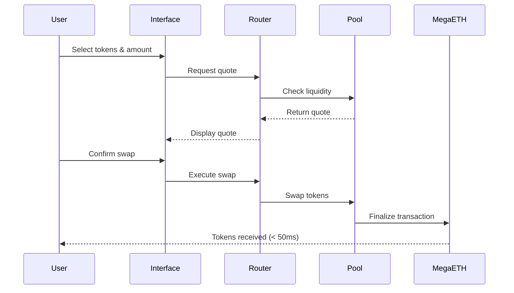

# Swapping

Exchange one token for another instantly through MegaPools. Swaps on MegaFi execute in under 50 milliseconds with minimal slippage and transparent pricing.

## At a Glance

- Swap any supported token pair instantly
- Sub-50ms execution from submission to finality
- Real-time quotes that update continuously
- Automatic route optimization for best prices
- Slippage protection on every trade
- Transaction costs under $0.005

## How Swapping Works



The process happens so fast you perceive it as instant.

## Swap Interface

Navigate to Swap page. You'll see:

**Input Section**: Token you're trading and amount.

**Output Section**: Token you're receiving and expected amount.

**Quote Details**: Exchange rate, price impact, fees, and minimum received.

**Settings**: Slippage tolerance, transaction deadline, routing options.

## Making a Swap

### 1. Select Input Token

Click token selector (top section). Choose the token you're swapping from. The interface displays:
- Your balance for each token
- Token symbol and name
- Token logo

Search by name, symbol, or paste contract address for unlisted tokens.

### 2. Enter Amount

Type amount in the input field. Options:
- Manual entry
- "Max" button (swaps full balance minus gas)
- Percentage buttons (25%, 50%, 75%, 100%)

The interface validates sufficient balance. Error displays if balance is insufficient.

### 3. Select Output Token

Click token selector (bottom section). Choose token you want to receive.

You cannot select the same token for input and output. The interface prevents this.

### 4. Review Quote

Quote generates automatically after selecting both tokens:

**Exchange Rate**: Current price (e.g., 1 ETH = 2000 USDC).

**Expected Output**: Amount you'll receive.

**Minimum Received**: Guaranteed minimum after slippage. Transaction reverts if output < this amount.

**Price Impact**: How your trade affects pool price. Higher for large trades.

**Route**: Path through pools (single or multi-hop).

**Fees**: Trading fee + gas cost breakdown.

Quotes update in real-time as pool conditions change.

### 5. Approve Token (First Time)

First time swapping a token requires approval:

1. Click "Approve [TOKEN]"
2. Confirm in wallet
3. Wait for confirmation (< 10ms)
4. "Swap" button activates

Approval is permanent. Subsequent swaps don't require re-approval.

### 6. Execute Swap

Click "Swap" button. Confirmation modal displays:
- Input and output amounts
- Exchange rate
- Price impact warning (if > 2%)
- Fees breakdown
- Minimum received

Review and click "Confirm Swap".

### 7. Confirm in Wallet

Wallet prompts transaction confirmation:
- Review gas cost (~ $0.001 - $0.005)
- Check recipient address (your wallet)
- Approve transaction

### 8. Transaction Complete

Swap executes and finalizes in 10-50ms:
- Success message displays
- Output tokens appear in wallet
- Transaction link to block explorer
- Add to transaction history

## Quote Details

### Exchange Rate

Current price between tokens:

```
1 ETH = 2000 USDC
or
1 USDC = 0.0005 ETH
```

Click the swap icon to toggle between formats.

Rate updates continuously as trades execute in the pool.

### Price Impact

How your trade affects the pool price:

**< 0.05%**: Excellent. Trade size appropriate for pool liquidity.

**0.05% - 0.5%**: Good. Normal price impact.

**0.5% - 2%**: Moderate. Consider splitting into smaller trades.

**> 2%**: High. Warning displays. You receive significantly worse price than current rate.

Price impact is separate from trading fees.

### Minimum Received

The worst-case output amount after slippage:

```
Expected output: 2000 USDC
Slippage tolerance: 0.5%
Minimum received: 1990 USDC
```

If execution price results in output < 1990 USDC, transaction reverts automatically.

### Trading Fee

Fee paid to liquidity providers:

- 0.05% for stable pairs
- 0.3% for standard pairs
- 1% for exotic pairs

Fee deducted from output amount. If swapping 1 ETH with 0.3% fee:
- Amount actually swapped: 1 ETH
- Output calculated on: 0.997 ETH
- LP fee: 0.003 ETH worth of value

Multi-hop swaps pay fees in each pool.

## Routing

MegaFi's router finds the optimal path for your swap:

### Direct Route

Single pool between tokens:

```
ETH --> [ETH/USDC Pool] --> USDC
```

Lowest fees and best price when direct pool exists.

### Multi-Hop Route

Multiple pools when no direct pool:

```
LINK --> [LINK/ETH Pool] --> ETH --> [ETH/USDC Pool] --> USDC
```

Router considers:
- Total fees across hops
- Price impact in each pool
- Gas costs (minimal on MegaETH)

Automatically selects most efficient path.

### Split Route

Large trades may split across multiple paths:

```
70% via: ETH --> USDC (0.3% pool)
30% via: ETH --> USDT --> USDC (0.05% pools)
```

Splitting reduces price impact by distributing the trade.

### Custom Routing

Enable Expert Mode to:
- See all possible routes
- Manually select preferred path
- Exclude specific pools
- Set custom hop limits

## Slippage Protection

Slippage tolerance protects against price movement during execution:

### Auto Slippage (Default)

MegaFi sets slippage automatically:
- 0.1% for stable pairs
- 0.5% for standard pairs
- 1% for exotic pairs

Suitable for most swaps.

### Custom Slippage

Set your own tolerance:

**Lower (0.1% - 0.3%)**:
- Better price guarantee
- May fail if market moves
- Suitable for stable pairs

**Medium (0.5% - 1%)**:
- Balanced protection
- Rarely fails
- Suitable for most pairs

**Higher (> 1%)**:
- Maximum success rate
- Accepts worse price
- Use for volatile pairs or large trades

### Why Slippage Matters (Even on MegaETH)

Although MegaETH executes in milliseconds, slippage protection still matters:

1. Protects against front-running (though minimized on MegaETH)
2. Guards against price manipulation attempts
3. Provides fallback if pool liquidity changes during submission

## Transaction Settings

### Deadline

How long transaction remains valid:

- Default: 30 minutes
- Range: 1 minute to 24 hours

On MegaETH's fast network, deadline rarely matters. Transaction either executes immediately or fails due to slippage.

### Gas Settings

MegaFi automatically sets optimal gas parameters. Advanced users can customize:

**Gas Limit**: Computation units allocated. Auto-calculated per swap type.

**Gas Price**: Cost per unit. Set to network minimum by default.

Priority fees unnecessary on MegaETH - ample capacity always available.

## Expert Mode

Enable in settings for advanced features:

**Disable Confirmation**: Skip confirmation modal. Swaps execute immediately.

**Custom Routes**: Manually select swap path.

**High Price Impact**: Allow swaps with > 5% price impact.

**Contract Recipient**: Send output to address other than your wallet.

Only enable if you understand the risks. Mistakes are immediate and irreversible.

## Transaction Status

After submitting swap:

**Submitted**: Transaction sent to MegaETH. Waiting for sequencer.

**Pending**: Sequencer processing. Typically < 5ms.

**Confirming**: Executing swap in pool. Typically < 5ms.

**Confirmed**: Swap complete. Tokens in your wallet.

**Failed**: Transaction reverted. Possible reasons below.

## Common Failure Reasons

### Slippage Exceeded

Price moved beyond your tolerance between quote and execution.

**Solution**: Increase slippage tolerance or try again immediately.

### Insufficient Liquidity

Pool doesn't have enough liquidity for your trade size.

**Solution**: Reduce trade size or wait for more liquidity.

### Approval Expired

Token approval was revoked or expired.

**Solution**: Re-approve token and retry swap.

### Balance Insufficient

Don't have enough input token.

**Solution**: Check balance and reduce amount.

### Gas Too Low

Insufficient $MEGA for gas (rare).

**Solution**: Obtain more $MEGA. Need only $0.005 worth.

## Swap Strategies

### Market Orders

Standard swaps at current market price:
- Use default slippage
- Execute immediately
- Accept current market conditions

### Limit Orders

Currently not supported natively. Use third-party limit order protocols built on MegaFi.

### Dollar Cost Averaging (DCA)

Execute multiple small swaps over time:
- Reduces price impact
- Averages entry price
- Can be automated via Strategy Layer

### Arbitrage

MegaETH's speed and low costs make arbitrage profitable:
- Monitor multiple pools
- Execute when price discrepancies appear
- Sub-10ms execution captures opportunities before others

Requires bot development. Consider rate limits and market conditions.

## Fees Summary

### Trading Fees

Paid to LPs:
- Stable pairs: 0.05%
- Standard pairs: 0.3%
- Exotic pairs: 1%

### Gas Fees

Paid to validators in $MEGA:
- Token approval: ~ $0.005
- Simple swap: ~ $0.001 - $0.003
- Multi-hop swap: ~ $0.003 - $0.005

### No Protocol Fees

MegaFi charges no additional protocol fee. 100% of trading fees go to LPs.

## FAQ

**How fast are swaps on MegaFi?**  
10-50 milliseconds from submission to finality.

**Can I cancel a swap after clicking confirm?**  
No. Execution is immediate. Double-check before confirming.

**What if price moves while I'm confirming in my wallet?**  
Slippage tolerance protects you. Transaction reverts if price moves beyond tolerance.

**Why do I need to approve tokens?**  
ERC-20 standard requires approval before contracts can access your tokens. One-time per token.

**Can I swap tokens not listed in the interface?**  
Yes. Paste contract address in token selector. Ensure it's a legitimate token address.

**Do I need $MEGA for gas?**  
Yes, but amount is minimal. $1 worth provides 200+ swaps.

## Next Steps

After mastering swaps:

- [Provide liquidity](providing-liquidity.md) to earn fees from swaps
- Explore [Strategy Layer](../strategy-layer/overview.md) for automated trading
- Learn about [fees and rewards](fees-and-rewards.md)

---

**Instant execution. Every time.**

