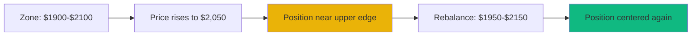

# Automated Rebalancing

Understand how strategies automatically adjust Liquidity Zones to maintain optimal capital efficiency and maximize fee earnings on MegaFi.

## At a Glance

- Rebalancing adjusts Liquidity Zones to keep positions active and efficient
- Triggered by price movements, volatility changes, or optimization opportunities
- Executes in sub-10ms on MegaETH
- Gas costs under $0.01 per rebalance make frequent adjustments profitable
- Algorithms optimize for net return after gas costs
- Manual override available for advanced users

## What Is Rebalancing?

Rebalancing means closing your current liquidity position and opening a new one with different Liquidity Zone boundaries:

```
Before Rebalancing:
ETH Price: $2,100
Your Zone: $1,900 - $2,100
Status: Near upper edge

After Rebalancing:
ETH Price: $2,100
Your Zone: $2,000 - $2,200
Status: Centered, optimal for continued earning
```

Goal: Keep your position active and earning fees as market conditions change.

## Why Rebalance?

### Price Drift

As price moves, your position drifts toward zone edge:



Without rebalancing, position would soon exit range and stop earning.

### Optimization

Even if position is active, a different zone might earn more fees:

```
Current Zone: $1,900 - $2,100 (wide)
Trading Activity: 80% of volume between $1,950 - $2,050 (narrow range)

Rebalance to: $1,950 - $2,050
Result: Same capital earns 3x more fees by focusing on active area
```

### Volatility Adaptation

Market volatility changes. Zones should adjust:

**Low Volatility**: Tighten zones for higher efficiency.

**High Volatility**: Widen zones to stay active through swings.

## Rebalancing Process

### 1. Trigger Detection

Algorithm continuously monitors for rebalancing triggers:

**Price Triggers**:
- Price within X% of zone boundary
- Price moved Y% from zone center
- Price exited zone entirely

**Market Triggers**:
- Volatility increased/decreased significantly
- Volume distribution shifted
- Better zone identified with >Z% fee improvement

**Time Triggers**:
- Minimum cooldown period elapsed
- Maximum time since last rebalance

Parameters vary by Strategy Mode.

### 2. Opportunity Analysis

Before rebalancing, algorithm calculates:

**Expected Benefit**:
```
Better zone projects $10/day more fees
Current zone projects $8/day
Benefit: $2/day improvement
```

**Cost**:
```
Remove liquidity: $0.003
Add liquidity: $0.005
Opportunity cost during tx: $0.002
Total: $0.01
```

**Net Benefit**:
```
Daily improvement: $2
Cost: $0.01
Payback: 0.005 days (7 minutes)
Annual benefit: $730

Decision: REBALANCE
```

### 3. Zone Calculation

Algorithm determines optimal new zone:

**Inputs**:
- Current price
- Recent price history
- Volatility metrics
- Volume distribution
- Strategy Mode parameters

**Output**:
- New lower bound
- New upper bound
- Expected improvement

[Zone calculation details →](range-optimization.md)

### 4. Execution

Rebalancing executes as single atomic transaction:

```solidity
1. Remove liquidity from old position
2. Collect accumulated fees
3. Calculate token amounts for new zone
4. Add liquidity to new zone
5. Update position tracking
```

Total time: Sub-10ms on MegaETH.

### 5. Verification

Post-rebalance checks:

- New position created successfully
- Liquidity amount matches expectation
- Zone boundaries correct
- Fees collected and tracked

If verification fails, revert entire transaction.

## Rebalancing Strategies

### Reactive Rebalancing

Wait for specific triggers, then respond:

```
IF price within 10% of zone edge
THEN rebalance to center on current price
```

**Pros**: Predictable, low frequency, clear logic.

**Cons**: May miss optimization opportunities.

**Used By**: Conservative Mode.

### Proactive Rebalancing

Anticipate price movements and rebalance early:

```
IF trend detected AND current zone not aligned with trend
THEN adjust zone asymmetrically toward expected direction
```

**Pros**: Positions optimally before moves occur.

**Cons**: Wrong predictions waste gas.

**Used By**: Aggressive Mode with trend indicators.

### Threshold Rebalancing

Rebalance when improvement exceeds threshold:

```
CALCULATE expected fee improvement
IF improvement > threshold (e.g., 20%)
THEN rebalance to better zone
```

**Pros**: Optimizes continuously, not just on boundaries.

**Cons**: More complex logic, more frequent rebalancing.

**Used By**: Balanced and Dynamic Modes.

### Time-Based Rebalancing

Rebalance on schedule regardless of price:

```
Every 24 hours:
  Calculate optimal zone
  IF different from current AND beneficial
  THEN rebalance
```

**Pros**: Predictable gas costs.

**Cons**: May rebalance unnecessarily or miss urgent needs.

**Used By**: Custom strategies (not default modes).

## Gas Optimization

Strategies minimize gas costs:

### Batching

When possible, batch multiple operations:

```
Single Transaction:
- Remove liquidity from Position A
- Remove liquidity from Position B
- Collect fees from both
- Add liquidity to new positions A & B

Gas Saved: ~40% vs separate transactions
```

### Threshold Filtering

Only rebalance when benefit >> cost:

```
Minimum Net Benefit Thresholds:
Conservative: $5 improvement needed
Balanced: $2 improvement needed
Aggressive: $0.50 improvement needed

With $0.01 gas cost, even aggressive mode needs 50x return on gas
```

### Cooldown Periods

Prevent over-trading:

```
Conservative: 12 hours minimum between rebalances
Balanced: 1 hour minimum
Aggressive: 30 minutes minimum

Prevents reacting to noise or temporary price spikes
```

## Impermanent Loss

Rebalancing affects impermanent loss:

### IL from Rebalancing

Each rebalance may realize IL:

```
Original Position:
1 ETH + $2,000 USDC (at $2,000/ETH)

Price rises to $2,200:
Position now 0.91 ETH + $2,200 USDC (auto-rebalanced by pool)

Rebalance:
Remove: 0.91 ETH + $2,200 USDC = $4,202 total
Holding would be: 1 ETH + $2,000 USDC = $4,200 total

IL Realized: -$2 (pool rebalancing) + $2 (fee earnings) = $0 net

Add to new zone: 0.91 ETH + $2,200 USDC
```

Frequent rebalancing can increase realized IL.

### IL Mitigation

Strategies include IL management:

**Fee Offset**: Only rebalance when fees > realized IL.

**Wide Zones**: Conservative mode minimizes rebalances and IL.

**Trend Alignment**: Asymmetric zones reduce rebalancing against trend.

**Stop Loss**: Exit position if IL exceeds threshold.

## Manual Rebalancing

Override automated strategy:

### When to Manual Rebalance

**Strong Conviction**: You predict major price movement.

**Strategy Limitation**: Algorithm doesn't account for external event.

**Emergency**: Need to close position immediately.

### How to Manual Rebalance

1. Click position in Strategy Layer
2. Select "Manual Rebalance"
3. Set new zone boundaries
4. Review expected outcome
5. Confirm transaction

**Warning**: Manual rebalance may deviate from strategy optimization. Use carefully.

## Rebalancing Analytics

Track rebalancing performance:

### Metrics

**Rebalance Count**: Total number of rebalances.

**Rebalance Frequency**: Average time between rebalances.

**Gas Costs**: Cumulative gas spent on rebalancing.

**Improvement Per Rebalance**: Average fee increase from each rebalance.

**Success Rate**: % of rebalances that improved position.

### Visualization

Interface shows:

- Rebalance history timeline
- Zone width over time
- Price vs zone boundaries chart
- Fees earned between rebalances

Analyze what's working and what isn't.

## Advanced Rebalancing

### Multi-Leg Rebalancing

Adjust multiple positions simultaneously:

```
Position A: ETH/USDC
Position B: WBTC/ETH

Rebalance both in single transaction:
- Lower gas costs
- Coordinated zone adjustment
- Maintain portfolio balance
```

### Cross-Pool Rebalancing

Shift capital between pools:

```
IF ETH/USDC volume declining AND WBTC/ETH volume increasing
THEN remove some from ETH/USDC, add to WBTC/ETH
```

Dynamically allocate capital to highest-earning opportunities.

### Asymmetric Rebalancing

Adjust zones based on expected direction:

```
Current: $2,000
Bullish Bias: $2,000 - $2,400 (favors upside)
Bearish Bias: $1,600 - $2,000 (favors downside)

As price moves in expected direction, position stays active longer
```

## FAQ

**How often will my position rebalance?**  
Depends on mode. Conservative: 1-2x/month. Balanced: 8-12x/month. Aggressive: 30-50x/month.

**Can I see rebalancing before it happens?**  
Not currently. Strategies rebalance automatically when conditions met.

**What if I disagree with a rebalance?**  
Switch to manual mode or choose different Strategy Mode.

**Does rebalancing guarantee better performance?**  
No. It optimizes based on algorithms, but markets are unpredictable.

**Can rebalancing lose money?**  
Each rebalance has small cost. If done too frequently without sufficient benefit, cumulative costs could exceed gains.

**How do I know if rebalancing is working?**  
Compare net APR (after gas) to pool average or manual management.

## Next Steps

Understand rebalancing mechanics:

- [Range Optimization](range-optimization.md) - How zones are calculated
- [Performance Tracking](performance-tracking.md) - Monitor rebalancing effectiveness
- [Strategy Modes](strategy-modes.md) - Choose rebalancing frequency

---

**Adaptive optimization.**

