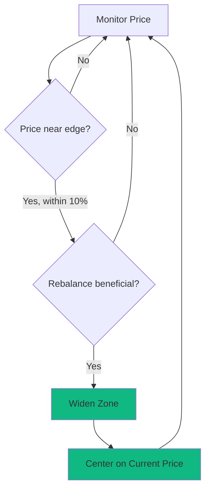
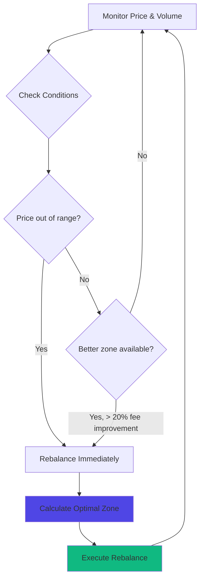
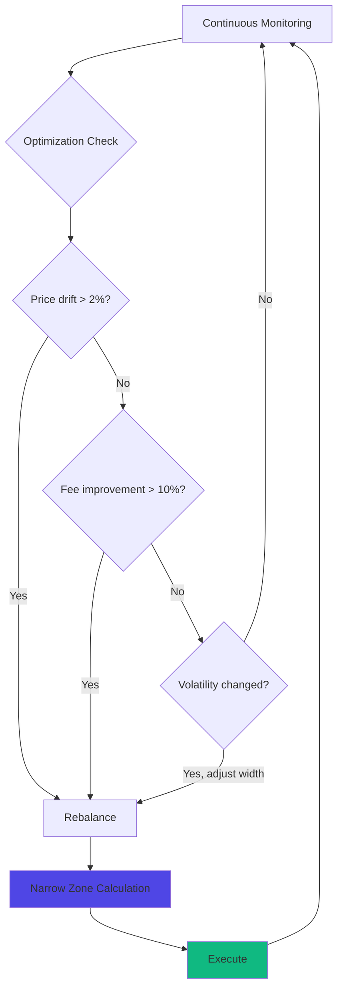
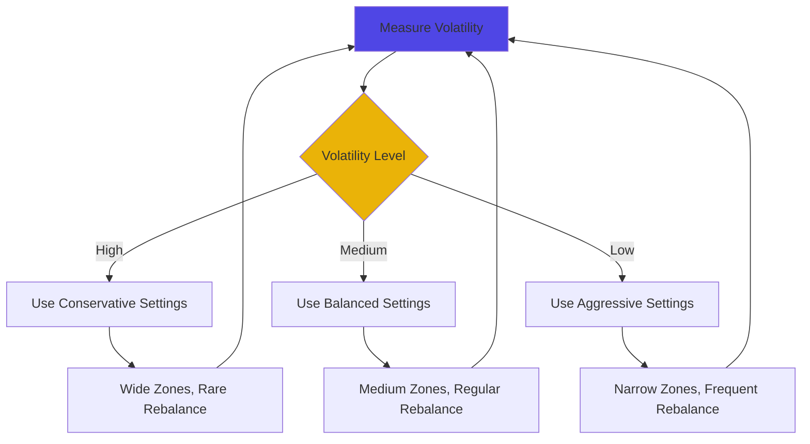

# Strategy Modes

Pre-configured algorithmic strategies for automated liquidity management. Each mode optimizes for different goals, risk profiles, and market conditions.

## At a Glance

- Four core modes: Conservative, Balanced, Aggressive, Dynamic
- Each mode uses different Liquidity Zone widths and rebalancing rules
- Modes adapt to pool characteristics automatically
- Switch modes anytime without withdrawing liquidity
- All modes optimize for net return after gas costs
- Backtesting available for all modes

## Mode Comparison

| Feature | Conservative | Balanced | Aggressive | Dynamic |
|---------|-------------|----------|------------|---------|
| Zone Width | ±20-30% | ±10-15% | ±3-7% | Variable |
| Rebalance Freq | Low | Medium | High | Adaptive |
| Active Time | 90-95% | 80-90% | 60-80% | 75-90% |
| Capital Efficiency | 3-5x | 5-8x | 10-15x | 6-12x |
| Gas Costs | Lowest | Moderate | Higher | Moderate |
| Complexity | Simple | Moderate | High | Highest |
| Best For | Passive | Most Users | Active | Advanced |

## Conservative Mode

### Overview

Maximize position active time with minimal rebalancing. Prioritizes stability over maximum efficiency.

### Characteristics

**Wide Zones**: ±20-30% from current price.

**Infrequent Rebalancing**: Only when price approaches zone boundaries (within 10% of edge).

**Low Gas**: Minimal rebalancing costs due to low frequency.

**Predictable**: Consistent earnings with few surprises.

### How It Works



Algorithm maintains wide zones that rarely need adjustment.

### Rebalancing Rules

**Trigger**: Price within 10% of zone boundary.

**Action**: Remove liquidity, create new position centered on current price with same width.

**Threshold**: Only rebalance if expected fee improvement > $5.

**Cooldown**: Minimum 12 hours between rebalances.

### Ideal Conditions

**Volatile Markets**: Wide zones stay active through price swings.

**Low Volume Pools**: Rare rebalancing keeps gas costs low relative to fees.

**Passive Investors**: Set-and-forget approach.

**Large Positions**: Wide zones reduce IL compared to narrow zones.

### Expected Performance

```
Pool: ETH/USDC (0.3% fee)
Volume: $5M daily
Position: $10,000

Zone Width: ±25% ($1,500 - $2,500 for $2,000 ETH)
Active Time: 95%
Rebalances: 1-2 per month
Gas Costs: $0.02 per month

Monthly Fees: $150
Net APR: ~18%
```

### Customization

Adjustable parameters:

**Zone Width**: 15% to 40% (default: 25%)

**Rebalance Distance**: 5% to 15% from edge (default: 10%)

**Minimum Benefit**: $2 to $20 (default: $5)

## Balanced Mode

### Overview

Optimize capital efficiency while maintaining reasonable active time. Best all-around strategy for most users.

### Characteristics

**Medium Zones**: ±10-15% from current price.

**Regular Rebalancing**: When price moves beyond zone or when optimization improves fees significantly.

**Moderate Gas**: Balanced cost-benefit ratio.

**Flexible**: Adapts to both stable and volatile periods.

### How It Works



Balances responsiveness with cost efficiency.

### Rebalancing Rules

**Trigger 1**: Price moves outside current zone.

**Trigger 2**: Alternative zone offers > 20% fee improvement.

**Action**: Calculate optimal zone based on recent volatility and volume distribution.

**Threshold**: Expected fee improvement > $2 after gas costs.

**Cooldown**: Minimum 1 hour between rebalances.

### Ideal Conditions

**Standard Markets**: Normal volatility and volume.

**Popular Pairs**: ETH/USDC, WBTC/ETH, etc.

**Medium Capital**: $1,000 - $100,000 positions.

**Most Users**: Default choice for typical LPs.

### Expected Performance

```
Pool: ETH/USDC (0.3% fee)
Volume: $5M daily
Position: $10,000

Zone Width: ±12% ($1,760 - $2,240 for $2,000 ETH)
Active Time: 85%
Rebalances: 8-12 per month
Gas Costs: $0.10 per month

Monthly Fees: $220
Net APR: ~26%
```

### Customization

Adjustable parameters:

**Zone Width**: 8% to 20% (default: 12%)

**Fee Improvement Threshold**: 10% to 50% (default: 20%)

**Minimum Benefit**: $1 to $10 (default: $2)

**Volatility Lookback**: 1-7 days (default: 3 days)

## Aggressive Mode

### Overview

Maximize capital efficiency through narrow zones and frequent rebalancing. Highest potential returns with active management.

### Characteristics

**Narrow Zones**: ±3-7% from current price.

**Frequent Rebalancing**: Multiple times per day when needed.

**Higher Gas**: More rebalancing operations.

**High Efficiency**: Capital works hardest when in range.

### How It Works



Constantly optimizes for maximum fee capture.

### Rebalancing Rules

**Trigger 1**: Price moves > 2% from zone center.

**Trigger 2**: Alternative zone offers > 10% fee improvement.

**Trigger 3**: Volatility change > 30%.

**Action**: Calculate tightest viable zone based on recent price action and gas costs.

**Threshold**: Expected benefit > $0.50 after gas.

**Cooldown**: Minimum 30 minutes between rebalances.

**Max Frequency**: 24 rebalances per day.

### Ideal Conditions

**Stable Markets**: Low volatility enables narrow zones to stay active.

**High Volume Pools**: Frequent trades maximize narrow zone benefits.

**Active Managers**: Users comfortable with frequent adjustments.

**Medium Positions**: $5,000 - $50,000 where gas is negligible.

### Expected Performance

```
Pool: ETH/USDC (0.3% fee)
Volume: $5M daily
Position: $10,000

Zone Width: ±5% ($1,900 - $2,100 for $2,000 ETH)
Active Time: 70%
Rebalances: 30-50 per month
Gas Costs: $0.50 per month

Monthly Fees: $350 (when active)
Net APR: ~42%
```

Higher returns but requires favorable conditions.

### Customization

Adjustable parameters:

**Zone Width**: 2% to 10% (default: 5%)

**Rebalance Distance**: 1% to 5% (default: 2%)

**Fee Improvement Threshold**: 5% to 25% (default: 10%)

**Max Daily Rebalances**: 10 to 48 (default: 24)

### Risks

**Higher IL**: Narrow zones suffer more from price divergence.

**Inactive Periods**: Position goes out of range more frequently.

**Gas Costs**: More rebalances means higher cumulative gas.

**Market Sensitivity**: Poor performance in high volatility.

## Dynamic Mode

### Overview

Adaptive strategy that adjusts zone width based on market volatility. Combines benefits of all other modes by switching between them automatically.

### Characteristics

**Variable Zones**: 3% to 30% depending on volatility.

**Intelligent Rebalancing**: Adapts frequency to market conditions.

**Market Aware**: Expands during volatility, contracts during stability.

**Complex**: Most sophisticated algorithm.

### How It Works



Algorithm automatically selects optimal mode for current conditions.

### Rebalancing Rules

**Volatility Calculation**: Rolling 24-hour standard deviation of prices.

**Mode Selection**:
- High volatility (> 5% daily): Conservative mode
- Medium volatility (2-5% daily): Balanced mode
- Low volatility (< 2% daily): Aggressive mode

**Transition**: Gradual zone width adjustment over 1 hour.

**Threshold**: Mode-specific rebalancing rules apply.

### Ideal Conditions

**Changing Markets**: Transitions between stable and volatile periods.

**Uncertain Conditions**: When you don't know which mode to use.

**Experienced Users**: Understand tradeoffs of different approaches.

**Medium-Large Positions**: $10,000+ where optimization matters.

### Expected Performance

```
Pool: ETH/USDC (0.3% fee)
Volume: $5M daily
Position: $10,000

Zone Width: Variable (5% to 25%)
Active Time: 82%
Rebalances: 15-25 per month
Gas Costs: $0.25 per month

Monthly Fees: $240
Net APR: ~29%
```

Adapts performance to market conditions.

### Customization

Adjustable parameters:

**Volatility Lookback**: 12-48 hours (default: 24 hours)

**Volatility Thresholds**: Custom definitions of high/medium/low

**Transition Speed**: How quickly zones adjust (default: 1 hour)

**Min/Max Zone Width**: Bounds for adaptive range

## Switching Modes

### How to Switch

1. Open position in Strategy Layer
2. Click "Change Strategy Mode"
3. Select new mode
4. Review expected changes
5. Confirm switch

### What Happens

**Immediate Rebalance**: Position rebalances to match new mode's zone width.

**Parameter Update**: New rebalancing rules apply going forward.

**Gas Cost**: Single rebalance transaction (~ $0.01).

**History**: Performance tracking continues across mode change.

### When to Switch

**Conservative → Balanced**: Market stabilizing, want more efficiency.

**Balanced → Aggressive**: Low volatility period, maximize returns.

**Aggressive → Conservative**: Volatility increasing, preserve capital.

**Any → Dynamic**: Uncertain conditions, let algorithm decide.

## Performance Comparison

Backtest results (ETH/USDC, Q4 2024):

```
Manual Management:
Total Fees: $1,200
Gas Costs: $150 (Ethereum) / $0.50 (MegaETH)
Net: $1,050 (Ethereum) / $1,199.50 (MegaETH)

Conservative Mode:
Total Fees: $1,400
Gas Costs: $0.02
Net: $1,399.98
Improvement: +33% (Ethereum), +17% (MegaETH)

Balanced Mode:
Total Fees: $1,850
Gas Costs: $0.10
Net: $1,849.90
Improvement: +76% (Ethereum), +54% (MegaETH)

Aggressive Mode (stable period):
Total Fees: $2,400
Gas Costs: $0.50
Net: $2,399.50
Improvement: +129% (Ethereum), +100% (MegaETH)

Dynamic Mode:
Total Fees: $2,100
Gas Costs: $0.25
Net: $2,099.75
Improvement: +100% (Ethereum), +75% (MegaETH)
```

Performance varies by market conditions.

## FAQ

**Can I create custom modes?**  
Not yet. Custom strategies coming in future release.

**Which mode should I start with?**  
Balanced mode for most users. Conservative if risk-averse. Aggressive if experienced.

**Do modes work on all pools?**  
Yes, but performance varies. Check backtests for specific pools.

**Can I pause a strategy?**  
Yes. Position remains active but stops rebalancing. Resume anytime.

**What if a mode performs poorly?**  
Switch modes or exit strategy. No lock-in.

**Are there fees to use Strategy Modes?**  
No protocol fees. Only gas costs for rebalancing.

## Next Steps

Learn more about strategies:

- [Automated Rebalancing](automated-rebalancing.md) - Technical details
- [Range Optimization](range-optimization.md) - Zone calculation algorithms
- [Performance Tracking](performance-tracking.md) - Monitor returns

---

**Choose your approach.**

