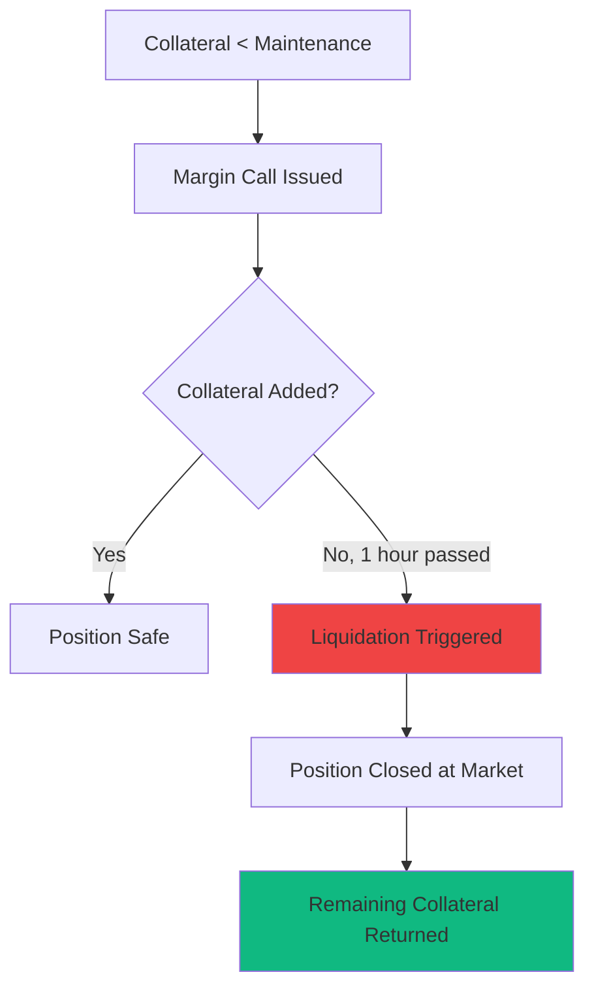

# Risk Management

Understand and control risk in the Risk Layer. Learn about position sizing, collateral requirements, liquidations, and automated risk controls that protect your capital.

## At a Glance

- Position limits prevent excessive risk exposure
- Collateral requirements ensure solvency
- Automated liquidations protect system integrity
- Stop-loss and take-profit orders manage positions
- Real-time risk metrics track exposure
- Portfolio-level risk monitoring

## Risk Metrics

### Key Measurements

**Position Value**: Current market value of all option positions.

**Notional Exposure**: Total underlying value controlled by options.

```
Example:
10 ETH call contracts at $2,000/ETH
Notional: 10 × $2,000 = $20,000
Position Value: $1,000 (premium value)
```

**Delta Exposure**: Net directional risk.

```
Long 10 calls (delta 0.5 each): +5 ETH delta
Short 5 puts (delta -0.4 each): +2 ETH delta
Net Delta: +7 ETH
```

**Gamma Risk**: Delta change sensitivity.

```
High Gamma: Position delta changes rapidly with price
Low Gamma: Position delta relatively stable
```

**Theta**: Daily time decay.

```
Portfolio Theta: -$50
Losing $50/day to time if price unchanged
```

**Vega**: Volatility exposure.

```
Portfolio Vega: +500
If IV rises 1%, portfolio gains $500
If IV falls 1%, portfolio loses $500
```

### Portfolio Greeks

Aggregate metrics across all positions:

```
Total Delta: +15 ETH (net long equivalent)
Total Gamma: +2.5 (moderate sensitivity)
Total Theta: -$75/day (time working against)
Total Vega: +1,200 (long volatility)
```

Interface displays portfolio-level Greeks in real-time.

## Position Limits

### Account Limits

Prevent excessive concentration:

**Maximum Notional**: $500k per account (adjustable based on collateral).

**Maximum Contracts per Expiration**: 1,000 contracts.

**Maximum Delta**: ±100 ETH equivalent.

**Maximum Short Gamma**: -10 (prevents unlimited risk scenarios).

Limits prevent single accounts from dominating markets or taking excessive risk.

### Per-Pool Limits

Protect overall system:

**Open Interest Cap**: Maximum contracts outstanding.

**Delta Limits**: Prevents one-sided market.

**Concentration Limits**: Max % of pool held by single account.

When limits approached, new positions restricted until open interest reduces.

## Collateral Management

### Collateral Requirements

Different positions need different collateral:

**Long Options**:
```
Collateral: Premium paid upfront
Risk: Limited to premium
Additional Margin: None
```

**Covered Options**:
```
Sell Covered Call:
- Collateral: 1 ETH per contract
- Risk: Opportunity cost if assigned

Sell Cash-Secured Put:
- Collateral: Strike price in USDC per contract
- Risk: Buy at strike if assigned
```

**Naked Options**:
```
Sell Naked Call/Put:
- Initial Margin: 130-200% of current value
- Maintenance Margin: 120% of current value
- Risk: Significant if price moves adversely
```

### Margin Calculations

Dynamic margin based on risk:

```
Sold 10 ETH $2,000 calls
ETH Price: $1,900
Call Value: $30 each = $300 total

Initial Margin: $300 × 1.5 = $450
Maintenance Margin: $300 × 1.2 = $360

Current Collateral: $500
Status: Adequately collateralized
```

### Margin Calls

When collateral insufficient:

```
Position Value Increases:
ETH rises to $2,050
Call Value: $80 each = $800 total
Required Maintenance: $800 × 1.2 = $960
Current Collateral: $500

Margin Call: Deposit $460+ within 1 hour
Or: Position automatically reduced
```

Interface alerts before margin call occurs.

## Liquidation Process

### When Liquidations Occur

Position liquidated when:

1. Collateral < Maintenance Margin
2. Grace period (1 hour) expires
3. No additional collateral deposited

### Liquidation Mechanics



System sells position at market to restore solvency.

### Liquidation Costs

```
Position Value: $10,000
Collateral: $11,500
Maintenance: $12,000

Liquidation:
- Close position at market: $10,200 (slippage)
- Liquidation fee (5%): $510
- Total Cost: $10,710
- Returned: $11,500 - $10,710 = $790

You keep remaining collateral after liquidation
```

### Avoiding Liquidation

**Monitor Positions**: Check margin status regularly.

**Set Alerts**: Get notified when margin ratio < 1.5.

**Over-Collateralize**: Keep extra margin buffer.

**Use Stop-Loss**: Close positions before liquidation level.

**Reduce Position Size**: Cut exposure when margin tight.

## Automated Risk Controls

### Stop-Loss Orders

Automatically close losing positions:

```
Setup:
Position: Long 10 ETH $2,000 calls at $100 each
Stop-Loss: $50 (50% loss)

Execution:
If calls drop to $50: Automatically sell
Loss Capped: $500 (vs unlimited without stop)
```

**Trailing Stop-Loss**:
```
Position at $100
Trailing Stop: $20 below highest

Price rises to $150:
Stop moves to $130

Price drops to $130:
Position sold, lock in $30 profit per contract
```

### Take-Profit Orders

Lock in gains automatically:

```
Position: Long 10 calls at $80 each
Take-Profit: $150 (87.5% gain)

If calls reach $150:
Automatically sell
Profit secured: $700
```

### Position Hedging

Automatic hedge when risk exceeds threshold:

```
Delta Exposure: +20 ETH
Delta Limit: ±10 ETH
Trigger: Auto-hedge excess

Action:
System sells 10 ETH delta in options
Brings portfolio to +10 ETH delta
Risk: Controlled within limits
```

## Risk Scenarios

### Scenario Analysis

See how positions perform under various conditions:

```
Current: ETH $2,000
Portfolio: Mixed options position

Scenario 1: ETH drops to $1,800
- Portfolio Value: $8,500
- P&L: -$1,500
- Greeks: Delta -5, Gamma +1

Scenario 2: ETH rises to $2,200
- Portfolio Value: $12,000
- P&L: +$2,000
- Greeks: Delta +8, Gamma -0.5

Scenario 3: Volatility doubles
- Portfolio Value: $11,500
- P&L: +$1,500
- All else equal
```

Run scenarios before entering positions.

### Stress Testing

Test portfolio against extreme moves:

**Flash Crash (-30% in 1 hour)**:
```
Impact: Protective puts gain significantly
Risk: Short positions may liquidate
Recommendation: Maintain high collateral buffer
```

**Volatility Spike (IV doubles)**:
```
Impact: Long vol positions profit
Risk: Short vol positions lose
Recommendation: Monitor vega exposure
```

**Low Liquidity Event**:
```
Impact: Wider spreads, higher slippage
Risk: Liquidations at unfavorable prices
Recommendation: Don't max out leverage
```

## Portfolio-Level Risk

### Correlation Risk

Multiple positions may move together:

```
Portfolio:
- Long ETH calls
- Long WBTC calls
- Long several alt coin calls

Correlation: 0.8 (highly correlated)

Risk: All positions lose if crypto market drops
Mitigation: Add uncorrelated hedges or reduce size
```

### Concentration Risk

Too much exposure to single asset or strategy:

```
Portfolio Value: $50,000
ETH Option Exposure: $45,000 (90%)

Risk: Over-concentrated in ETH
Recommendation: Limit single asset to 50% max
```

### Liquidity Risk

Ability to exit positions:

```
Position: 100 contracts in low-volume option
Daily Volume: 20 contracts
Exit Time: 5 days to fully close

Risk: Forced to hold or accept poor prices
Mitigation: Size based on daily volume
```

## Risk Limits Best Practices

### Conservative Risk Profile

```
Max Notional: 1x account value
Max Delta: ±20% of portfolio
Max Naked Exposure: 0% (covered only)
Collateral Buffer: 2x maintenance
Leverage: 1x max
```

### Moderate Risk Profile

```
Max Notional: 3x account value
Max Delta: ±50% of portfolio
Max Naked Exposure: 30% of portfolio
Collateral Buffer: 1.5x maintenance
Leverage: 2x max
```

### Aggressive Risk Profile

```
Max Notional: 5x account value
Max Delta: ±100% of portfolio
Max Naked Exposure: 50% of portfolio
Collateral Buffer: 1.25x maintenance
Leverage: 3x max
```

Choose based on experience and risk tolerance.

## Monitoring and Alerts

### Real-Time Monitoring

Dashboard shows:

**Portfolio Health**:
- Collateral ratio
- Margin available
- Liquidation distance

**Risk Metrics**:
- Current Greeks
- P&L (realized and unrealized)
- Position concentration

**Market Conditions**:
- Implied volatility
- Volume trends
- Liquidity depth

### Alert Configuration

Set notifications for:

**Margin Alerts**:
- Collateral < 150% maintenance
- Approaching liquidation (< 125%)
- Margin call issued

**Position Alerts**:
- P&L exceeds ±X%
- Position size limit reached
- Stop-loss/take-profit triggered

**Market Alerts**:
- Volatility spikes/drops
- Large price movements
- Liquidity drops below threshold

## FAQ

**What happens if I get liquidated?**  
Position closed at market, remaining collateral returned minus liquidation fee.

**Can I add collateral during margin call?**  
Yes. 1-hour grace period to add collateral before liquidation.

**Are liquidation fees high?**  
5% of position value. Avoid by maintaining adequate collateral.

**Can I check my liquidation price?**  
Yes. Interface shows exact price where liquidation would occur.

**What if market moves too fast for liquidation?**  
System prioritizes protecting solvency. Positions close as quickly as possible.

**Can I set custom risk limits?**  
Yes. Set personal limits stricter than system limits for extra safety.

## Next Steps

Manage risk effectively:

- [Options Trading](options-trading.md) - Understand position risks
- [Hedging Strategies](hedging-strategies.md) - Reduce portfolio risk
- [Pricing Models](pricing-models.md) - Value risk accurately

---

**Know your risk. Control your fate.**

