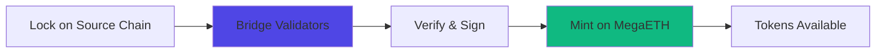

# Bridge Guide

Complete guide to bridging assets to MegaETH from Ethereum mainnet and other chains. Learn how to move tokens safely and efficiently.

## At a Glance

- Bridge from Ethereum mainnet, Arbitrum, Base, or Optimism
- 5-15 minute bridge time from Ethereum
- 3-8 minute bridge time from other L2s
- Official bridge is safest option
- Third-party bridges available for speed/convenience
- Bridge fees minimal (< $1 typically)

## Official MegaETH Bridge

### Supported Routes

Bridge supports multiple chains:

**From Ethereum Mainnet**:
- Bridge time: 5-15 minutes
- Cost: $2-10 (Ethereum gas)
- Security: Highest (official bridge)

**From Arbitrum**:
- Bridge time: 3-8 minutes
- Cost: $0.50-2 (Arbitrum gas)
- Security: High

**From Base**:
- Bridge time: 3-8 minutes
- Cost: $0.30-1.50 (Base gas)
- Security: High

**From Optimism**:
- Bridge time: 4-10 minutes
- Cost: $0.40-2 (Optimism gas)
- Security: High

### Supported Assets

Bridge any standard ERC-20 token:

**Native Tokens**:
- ETH (wraps to WETH on MegaETH)
- USDC
- USDT
- DAI
- WBTC

**Other ERC-20s**:
- Most standard tokens supported
- Custom tokens may require manual addition
- Check supported token list

## Step-by-Step Bridging

### From Ethereum Mainnet

**Step 1: Access Bridge**

Visit [bridge.megaeth.io](https://bridge.megaeth.io) or click "Bridge" on MegaFi.

**Step 2: Connect Wallet**

1. Click "Connect Wallet"
2. Select your wallet (MetaMask, etc.)
3. Approve connection
4. Ensure on Ethereum mainnet

**Step 3: Select Token and Amount**

1. Click token selector
2. Choose token to bridge (e.g., ETH, USDC)
3. Enter amount
4. See estimated fees and time

**Step 4: Review Details**

```
From: Ethereum Mainnet
To: MegaETH
Token: ETH
Amount: 1.0 ETH
Fee: ~$5 (Ethereum gas)
Time: ~10 minutes
Receive: 1.0 ETH on MegaETH (minus fee)
```

**Step 5: Initiate Bridge**

1. Click "Bridge"
2. Approve token (if first time)
3. Confirm bridge transaction in wallet
4. Wait for Ethereum confirmation (1-2 minutes)

**Step 6: Wait for Processing**

Bridge contract processes:

```
1. Ethereum tx confirms: 1-2 min
2. Bridge validates: 1-2 min
3. MegaETH mint: 1-2 min
4. Tokens arrive: 3-5 min

Total: 6-11 minutes typically
```

Progress tracked on bridge interface.

**Step 7: Verify Receipt**

1. Tokens appear in MegaETH wallet
2. Check balance on MegaFi
3. Verify on [explorer.megaeth.io](https://explorer.megaeth.io)

### From Other L2s

Process similar but faster and cheaper:

**From Arbitrum**:
```
Time: 3-8 minutes
Cost: $0.50-2
Process: Arbitrum tx → Bridge → MegaETH mint
```

**From Base**:
```
Time: 3-8 minutes
Cost: $0.30-1.50
Process: Base tx → Bridge → MegaETH mint
```

Steps identical to Ethereum bridging.

## Bridge Architecture

### How It Works



**Lock**: Tokens locked in bridge contract on source chain.

**Validate**: Validators confirm lock transaction.

**Sign**: Multi-sig approval from validator set.

**Mint**: Equivalent tokens minted on MegaETH.

**Complete**: Tokens available for use.

### Security Model

Bridge security mechanisms:

**Multi-Signature**: Requires multiple validators to approve.

**Timelock**: Delays prevent instant exploits.

**Monitoring**: Continuous monitoring for anomalies.

**Limits**: Daily and per-transaction limits prevent large losses.

**Audits**: Bridge contracts thoroughly audited.

## Bridging Back to Ethereum

### Withdrawal Process

Move tokens from MegaETH back to Ethereum:

**Step 1: Initiate Withdrawal**

1. Visit bridge interface
2. Select "Withdraw to Ethereum"
3. Choose token and amount
4. Submit withdrawal request

**Step 2: Challenge Period**

```
Optimistic rollup security:
Withdrawal request: Immediate
Challenge period: 7 days
Finalization: After 7 days

Your tokens locked during challenge period
```

**Step 3: Finalize on Ethereum**

After 7 days:

1. Return to bridge
2. Click "Finalize Withdrawal"
3. Pay Ethereum gas ($10-30)
4. Receive tokens on Ethereum

**Fast Withdrawal** (via liquidity providers):

```
Standard: 7 days, cheap
Fast: < 1 hour, small fee (1-2%)

Liquidity providers advance funds on Ethereum
You pay small premium for speed
```

## Third-Party Bridges

### Alternative Options

Other bridges support MegaETH:

**Bridge Aggregators**:
- Automatically find best route
- May offer better rates
- Useful for cross-chain paths

**Liquidity Networks**:
- Faster than official bridge
- Small fee (0.5-2%)
- Good for common tokens

**Considerations**:
- Security varies by bridge
- Official bridge is safest
- Third-party bridges useful for convenience

### Using Third-Party Bridges

General process (varies by bridge):

1. Visit bridge website
2. Connect wallet
3. Select source and destination chains
4. Choose token and amount
5. Review quote (amount, fee, time)
6. Execute bridge
7. Receive tokens

Always verify bridge is legitimate before using.

## Costs

### Bridge Fees

```
Ethereum → MegaETH:
Protocol fee: $0
Gas cost: $2-10 (Ethereum gas)
Total: $2-10

Other L2 → MegaETH:
Protocol fee: $0
Gas cost: $0.30-2 (source chain gas)
Total: $0.30-2

MegaETH → Ethereum:
Protocol fee: $0
Finalization gas: $10-30 (Ethereum gas)
Total: $10-30 (or 1-2% for fast bridge)
```

### Minimizing Costs

Tips to reduce bridge costs:

**Bridge Larger Amounts**: Fixed costs amortize better over larger amounts.

**Bridge from L2s**: Cheaper than Ethereum mainnet.

**Use Official Bridge**: No protocol fees (third-party bridges charge 0.5-2%).

**Wait Standard Time**: Fast withdrawals cost 1-2% premium.

## Troubleshooting

### Bridge Taking Too Long

**Expected Times**:
- Ethereum: 5-15 minutes
- Other L2s: 3-8 minutes

**If Delayed**:
1. Check bridge status page
2. Verify source transaction confirmed
3. Wait up to 30 minutes
4. Contact support if > 30 minutes

### Tokens Not Received

**Checklist**:
1. Verify source transaction confirmed
2. Check correct MegaETH address
3. Wait full expected time
4. Check bridge transaction ID
5. Verify on explorer

**If Still Missing**:
- Contact bridge support with tx hash
- Check if token requires manual claim
- Verify no error in bridge logs

### Wrong Amount Received

**Possible Causes**:
- Bridge fee deducted
- Price slippage (if swap involved)
- Gas deducted from ETH bridges

**Verify**:
- Check bridge transaction details
- Compare expected vs actual
- Review fee breakdown

## Best Practices

### Security

**Use Official Bridge**: Safest option for large amounts.

**Verify Addresses**: Double-check recipient address.

**Start Small**: Test with small amount first.

**Bookmark Official Site**: Avoid phishing sites.

**Check Transaction**: Verify details before confirming.

### Efficiency

**Bridge Once**: Avoid multiple small bridges.

**Choose Right Time**: Bridge when source chain gas is low.

**Use L2 Sources**: Cheaper and faster than Ethereum.

**Plan Ahead**: Standard withdrawals take 7 days.

## FAQ

**How long does bridging take?**  
5-15 minutes from Ethereum, 3-8 minutes from other L2s.

**Can I bridge any token?**  
Most standard ERC-20 tokens supported. Check supported list.

**What if bridge fails?**  
Tokens remain on source chain. Retry transaction.

**Is bridging safe?**  
Official bridge is audited and secure. Use caution with third-party bridges.

**Can I cancel a bridge?**  
No. Once initiated, bridge completes or fails. Cannot cancel mid-process.

**Do I need $MEGA before bridging?**  
No. But bridge small amount of ETH too for gas on MegaETH.

## Next Steps

After bridging to MegaETH:

- [First Swap](../getting-started/first-swap.md) - Start using MegaFi
- [Gas Fees](gas-fees.md) - Understand MegaETH costs
- [Overview](overview.md) - Learn about MegaETH

---

**Bridge to speed.**

