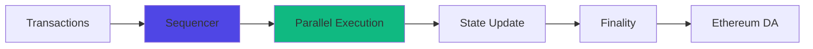

# Real-Time Execution

Deep dive into MegaETH's continuous execution model. Understand how real-time processing enables unprecedented performance for DeFi applications.

## At a Glance

- Continuous transaction processing (no block batching)
- Sub-millisecond state updates
- Immediate finality (< 10ms)
- No artificial delays from block times
- Enables true real-time DeFi applications
- Significantly reduces MEV and front-running

## Block-Based vs Continuous Execution

### Traditional Block-Based Model

Most blockchains use discrete blocks:

```
Time:     0s      12s      24s      36s
          |-------|--------|--------|
Blocks:   Block 1  Block 2  Block 3

Transaction Flow:
Submit at 5s → Wait → Included in Block 2 (12s) → Wait → Finality (24s)
Total Delay: 19 seconds
```

Transactions queue until next block.

### MegaETH Continuous Model

MegaETH processes transactions immediately:

```
Time:     0ms     10ms     20ms     30ms
          |-------|--------|--------|
Events:   Tx1✓    Tx2✓     Tx3✓     Tx4✓

Transaction Flow:
Submit at 0ms → Process (5ms) → Finality (10ms)
Total Delay: 10 milliseconds
```

No waiting for blocks. Immediate processing.

## How It Works

### Sequencer Architecture



**Sequencer**: Receives and orders transactions continuously.

**Parallel Execution**: Multiple transactions execute simultaneously where possible.

**State Update**: State changes apply immediately.

**Finality**: Transaction confirmed in < 10ms.

**Data Availability**: Transaction data posted to Ethereum for security.

### Transaction Lifecycle

Detailed flow from submission to finality:

**Step 1: Submission (0ms)**
```
User signs transaction
Wallet broadcasts to RPC
RPC forwards to sequencer
```

**Step 2: Reception (1-2ms)**
```
Sequencer receives transaction
Validates signature and nonce
Adds to processing queue
```

**Step 3: Execution (3-5ms)**
```
Transaction executes against current state
State changes calculated
Events emitted
```

**Step 4: Finalization (2-3ms)**
```
State changes committed
Transaction marked final
Confirmation broadcast
```

**Step 5: Data Availability (varies)**
```
Transaction data batched
Posted to Ethereum mainnet
Permanent record established
```

Total user-perceived time: < 10ms (Step 1-4).

## State Management

### Continuous State Updates

State updates in real-time:

```
Traditional:
State N → [wait 12s] → State N+1 → [wait 12s] → State N+2

MegaETH:
State 0 → [< 1ms] → State 1 → [< 1ms] → State 2 → [< 1ms] → ...
```

No batching delay. State always current.

### Parallel State Access

Multiple transactions can execute simultaneously:

```
Transaction A: Updates Pool 1
Transaction B: Updates Pool 2
Transaction C: Reads Pool 1

A and B execute in parallel (different state)
C waits for A (same state)
```

Maximizes throughput without conflicts.

### State Consistency

Ensuring consistent state across the network:

**Sequencer Authority**: Single sequencer orders transactions (prevents conflicts).

**Deterministic Execution**: Same inputs always produce same outputs.

**Verification**: Validators can verify execution independently.

**Fraud Proofs**: Incorrect execution can be challenged on Ethereum.

## Implications for DeFi

### Price Discovery

Real-time pricing eliminates stale data:

```
Traditional:
Swap executes → Wait for block → Price updates (12s later)
Arbitrage window: 12 seconds

MegaETH:
Swap executes → Price updates immediately (< 1ms)
Arbitrage window: < 1 millisecond
```

Prices stay efficient.

### Liquidity Management

Continuous rebalancing becomes viable:

```
Traditional:
Price moves 1% → Wait for block → Rebalance (cost $50)
Decision: Wait for larger move to justify cost

MegaETH:
Price moves 0.1% → Rebalance immediately (cost $0.01)
Decision: Rebalance frequently for optimization
```

Capital efficiency increases dramatically.

### Options Greeks

Greeks update in real-time:

```
Traditional:
Price changes → Greeks stale for 12s → Update

MegaETH:
Price changes → Greeks update < 1ms → Always accurate
```

Enables precise hedging and risk management.

### User Experience

Operations feel instant:

```
User Action → Response Time

Traditional: 12-30 seconds (perceivable wait)
MegaETH: 10-50ms (feels instant)
```

No loading screens. No waiting.

## MEV and Front-Running

### Reduced MEV Surface

Continuous execution minimizes MEV:

**Traditional Chain MEV**:
```
1. User submits swap
2. Bot sees transaction in mempool
3. Bot submits higher-gas front-run
4. Block includes: Bot tx, User tx
5. Bot profits, user loses
```

**MegaETH MEV Protection**:
```
1. User submits swap
2. Sequencer receives and orders
3. Execution in < 10ms
4. No time for bots to react
5. User gets fair price
```

MEV still exists but significantly reduced.

### Fair Ordering

Sequencer orders transactions fairly:

- First-come-first-served within milliseconds
- No prioritization by gas price
- Minimal opportunity for manipulation

### Slippage Protection

Built-in protection mechanisms:

- Real-time price feeds
- Immediate execution
- Minimal price drift
- Slippage tolerance enforced

## Technical Details

### Consensus Mechanism

MegaETH uses optimistic rollup model:

**Execution**: Sequencer executes optimistically.

**Settlement**: Transactions posted to Ethereum.

**Verification**: Validators can verify execution.

**Disputes**: Fraud proofs submitted to Ethereum if execution incorrect.

**Finality**: Economic finality immediate, absolute finality after Ethereum confirmation.

### Data Availability

Transaction data stored on Ethereum:

**Batch Size**: Transactions batched every few seconds.

**Compression**: Data compressed for efficiency.

**Cost**: DA costs amortized across many transactions.

**Verification**: Anyone can reconstruct state from Ethereum data.

### Decentralization

Balancing speed with decentralization:

**Sequencer**: Centralized for speed (single point of ordering).

**Execution Verification**: Decentralized (anyone can verify).

**Settlement**: Fully decentralized (Ethereum mainnet).

**Future**: Plans for decentralized sequencer set.

## Performance Characteristics

### Latency Distribution

Transaction confirmation times:

```
< 5ms: 10% of transactions
5-10ms: 70% of transactions
10-15ms: 15% of transactions
15-20ms: 4% of transactions
> 20ms: 1% of transactions (outliers)
```

Median latency: 8ms.

### Throughput Scaling

How throughput relates to latency:

```
10k TPS: 7ms average latency
50k TPS: 9ms average latency
100k TPS: 12ms average latency
150k TPS: 28ms average latency
```

Linear scaling until capacity, then graceful degradation.

### Failure Modes

What happens when systems stressed:

**Normal Operation**: < 10ms confirmation.

**Heavy Load**: 10-30ms confirmation, no failures.

**Overload**: Queueing occurs, 30-100ms, some transactions may timeout.

**Recovery**: System recovers quickly when load reduces.

## Developer Considerations

### Building for Real-Time

Take advantage of continuous execution:

**Assume Fresh State**: State is always current.

**Optimize for Parallelism**: Design for parallel execution.

**Real-Time Events**: React to events immediately.

**No Block Alignment**: Don't design around block times.

### Common Patterns

Patterns enabled by real-time execution:

**Continuous Arbitrage**:
```
Listen for price discrepancies
Execute arbitrage immediately (< 10ms)
Profitable even for tiny discrepancies
```

**Live Rebalancing**:
```
Monitor positions continuously
Rebalance when beneficial (cost negligible)
Maintain optimal capital efficiency
```

**Dynamic Pricing**:
```
Update prices in real-time
No stale quotes
Users always see current rates
```

## FAQ

**Is continuous execution really necessary?**  
For high-performance DeFi, yes. Enables strategies and UX impossible with blocks.

**How is MEV prevented?**  
Not completely prevented, but significantly reduced by speed.

**Can validators verify execution?**  
Yes. Execution is deterministic and can be replayed from Ethereum data.

**What if sequencer goes down?**  
Transactions halt temporarily. Funds remain safe. Backup sequencers can take over.

**Is this truly decentralized?**  
Execution is centralized for speed, but settlement and verification are decentralized.

**Could this work on other chains?**  
Architecture requires significant changes. Not easily portable to existing chains.

## Next Steps

Explore MegaETH capabilities:

- [Performance](performance.md) - Detailed metrics
- [Gas Fees](gas-fees.md) - Cost structure
- [Overview](overview.md) - Architecture overview

---

**Real-time blockchain. Real possibilities.**

