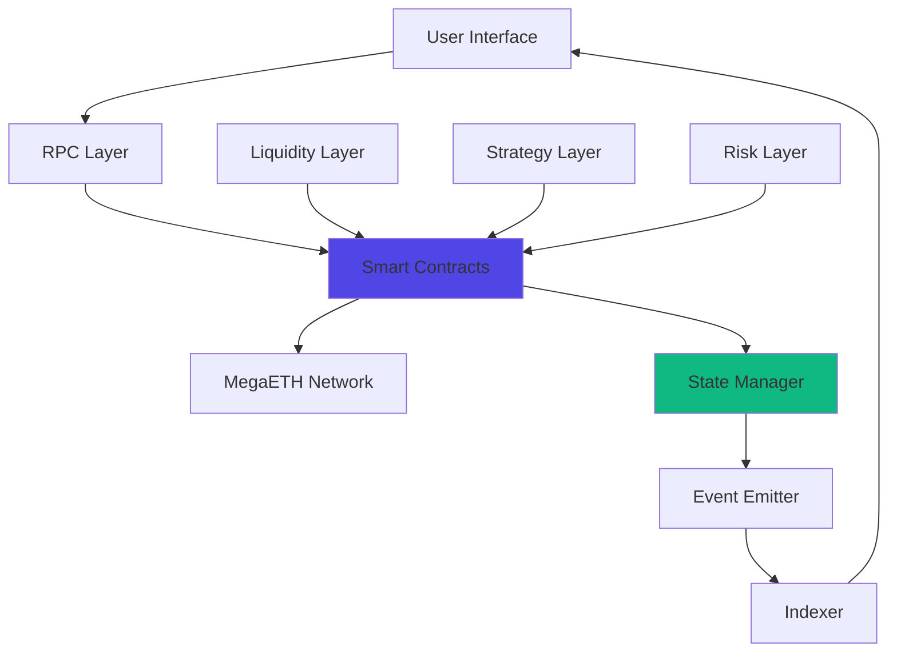

# Architecture

Technical overview of MegaFi's system architecture. Understand how components interact to deliver real-time DeFi on MegaETH.

## At a Glance

- Three-layer architecture: Liquidity, Strategy, Risk
- Smart contracts deployed on MegaETH
- Real-time state synchronization
- Modular design for composability
- Event-driven architecture
- Optimized for MegaETH's continuous execution

## System Overview



## Core Components

### Liquidity Layer

**MegaPool Contracts**: Core AMM implementation with concentrated liquidity.

```
Components:
- Pool Factory
- Pool Implementation
- Position Manager (NFT)
- Router
- Quoter
```

**Key Features**:
- Concentrated liquidity zones
- Real-time price updates
- Fee accrual per transaction
- LP NFT representation

[Smart Contracts documentation →](smart-contracts.md)

### Strategy Layer

**Automation Engine**: Manages algorithmic liquidity strategies.

```
Components:
- Strategy Manager
- Rebalance Oracle
- Zone Calculator
- Execution Engine
```

**Key Features**:
- Multiple strategy modes
- Automated rebalancing
- Performance tracking
- Risk management

### Risk Layer

**Options Protocol**: Handles options trading and settlement.

```
Components:
- Option Factory
- Pricing Oracle
- Collateral Manager
- Settlement Engine
```

**Key Features**:
- American and European options
- Real-time Greeks calculation
- Automated exercise
- Margin management

## Data Flow

### Transaction Lifecycle

```
1. User submits transaction via Interface
2. Wallet signs transaction
3. RPC receives and validates
4. Transaction forwarded to MegaETH sequencer
5. Sequencer orders and executes
6. Smart contract state updates
7. Events emitted
8. Indexer captures events
9. Interface updates UI
10. User sees confirmation

Total time: 10-50ms
```

### State Synchronization

Real-time state updates:

```
State Change → Event Emission → WebSocket Push → UI Update

Traditional:
State Change → Wait for block → Poll → UI Update (12s+)

MegaETH:
State Change → Immediate event → Push → UI Update (< 100ms)
```

### Event Architecture

Event-driven updates:

```
Smart Contract Events:
- Swap
- AddLiquidity
- RemoveLiquidity
- Rebalance
- OptionTrade
- Exercise

Indexer captures all events
Database stores historical data
API serves to frontends
WebSocket pushes real-time updates
```

## Smart Contract Architecture

### Contract Hierarchy

```
Factory Contracts
  ├── MegaPool Factory
  ├── Strategy Factory
  └── Option Factory

Core Contracts
  ├── MegaPool (per pair/fee)
  ├── Position Manager (NFTs)
  ├── Router (swap routing)
  ├── Strategy Manager
  └── Option Contract

Peripheral Contracts
  ├── Quoter
  ├── Multicall
  ├── Oracle Aggregator
  └── Periphery Helper
```

### Upgradeability

Proxy pattern for upgrades:

```
User → Proxy Contract → Implementation Contract

Proxy: Immutable, stores state
Implementation: Upgradeable logic

Upgrades via governance (future)
Current: Admin multi-sig control
```

### Access Control

Role-based permissions:

```
Roles:
- Owner: Deploy, upgrade contracts
- Operator: Execute admin functions
- Strategy: Rebalance positions
- Oracle: Update prices
- User: Standard operations
```

## Integration Architecture

### Frontend Integration

```
React Application
  ├── Web3 Provider (ethers.js)
  ├── Contract ABIs
  ├── State Management (Redux)
  ├── WebSocket Connection
  └── API Client

Connects to:
- MegaETH RPC
- Indexer API
- WebSocket Server
```

### Backend Services

```
Services:
- Indexer: Event processing
- API Server: REST endpoints
- WebSocket Server: Real-time updates
- Analytics: Data aggregation
- Monitoring: Health checks
```

### Third-Party Integration

SDK for external developers:

```
MegaFi SDK
  ├── Swap Functions
  ├── Liquidity Functions
  ├── Strategy Functions
  ├── Options Functions
  └── Utility Functions

Easy integration for:
- Wallets
- Aggregators
- Analytics platforms
- Other protocols
```

[Integration Guide →](integration-guide.md)

## Performance Optimizations

### MegaETH-Specific

Optimizations for continuous execution:

**State Access**: Minimized storage reads/writes.

**Event Emission**: Efficient logging without excess gas.

**Batch Operations**: Multi-call support for gas efficiency.

**Parallel Execution**: State designed for parallel access.

[MegaETH Optimizations →](megaeth-optimizations.md)

### Gas Optimizations

Standard Solidity optimizations:

- Packed storage slots
- Uint256 for most variables
- View functions where possible
- Efficient loops

However, with sub-cent gas, optimizations less critical than on expensive chains.

## Security Architecture

### Multi-Layer Security

```
Layer 1: Input Validation
Layer 2: Access Control
Layer 3: Reentrancy Guards
Layer 4: Overflow Protection
Layer 5: Oracle Manipulation Protection
Layer 6: Pause Mechanisms
```

### Audit Coverage

All components audited:

- Smart contracts: 3 independent audits
- Frontend: Security review
- Backend: Penetration testing
- Infrastructure: DevSecOps

[Security Details →](security-audits.md)

### Emergency Procedures

Incident response:

```
Detection → Assessment → Action → Communication

Actions Available:
- Pause contracts
- Emergency withdrawal
- Parameter updates
- Contract upgrades (if critical)
```

## Monitoring and Observability

### Metrics Tracked

Real-time monitoring:

```
Contract Metrics:
- Transaction success rate
- Gas usage
- State size
- Event emissions

Network Metrics:
- RPC latency
- Block time
- Queue depth
- Error rates

Business Metrics:
- TVL
- Volume
- User count
- APRs
```

### Alerting

Automated alerts for:

- Contract anomalies
- Performance degradation
- Security events
- Threshold breaches

## Deployment Architecture

### Environments

```
Development:
- Local testnet
- Rapid iteration
- Full logging

Staging:
- MegaETH testnet
- Pre-production testing
- Public access

Production:
- MegaETH mainnet
- Battle-tested code
- Monitored 24/7
```

### Deployment Process

```
1. Code changes
2. Unit tests
3. Integration tests
4. Staging deployment
5. Verification
6. Production deployment
7. Monitoring
8. Post-deployment validation
```

### Rollback Procedures

If issues detected:

```
Immediate: Pause affected contracts
Investigation: Identify root cause
Decision: Fix forward or rollback
Execution: Deploy fix or revert
Validation: Verify resolution
Communication: Update users
```

## Future Architecture

Planned improvements:

**Decentralized Sequencing**: Multiple sequencers for increased decentralization.

**Cross-Chain**: Native bridges to other chains.

**Governance**: Decentralized protocol governance.

**Layer 3**: Application-specific rollups on MegaETH.

## FAQ

**Is the architecture open source?**  
Smart contracts are open source. Frontend and backend will be open-sourced gradually.

**Can I build on top of MegaFi?**  
Yes. Use SDK or interact with contracts directly.

**How are upgrades handled?**  
Via proxy pattern. Governance will control upgrades eventually.

**What happens if MegaETH goes down?**  
Transactions halt but funds remain safe. Resume when network returns.

**Are there API rate limits?**  
Yes. Public API: 100 req/min. Higher limits available for partners.

## Next Steps

Dive deeper into technical details:

- [Smart Contracts](smart-contracts.md) - Contract specifications
- [SDK Reference](sdk-reference.md) - Developer SDK
- [Integration Guide](integration-guide.md) - Build on MegaFi

---

**Built for speed. Designed for scale.**

