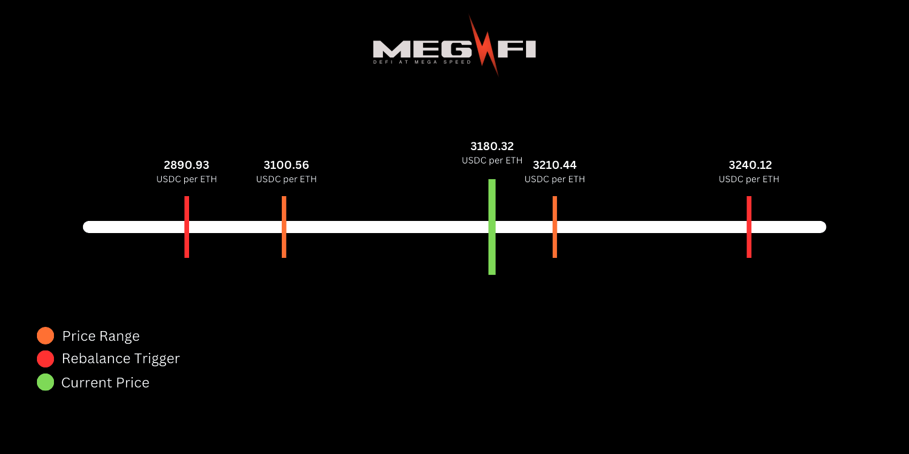
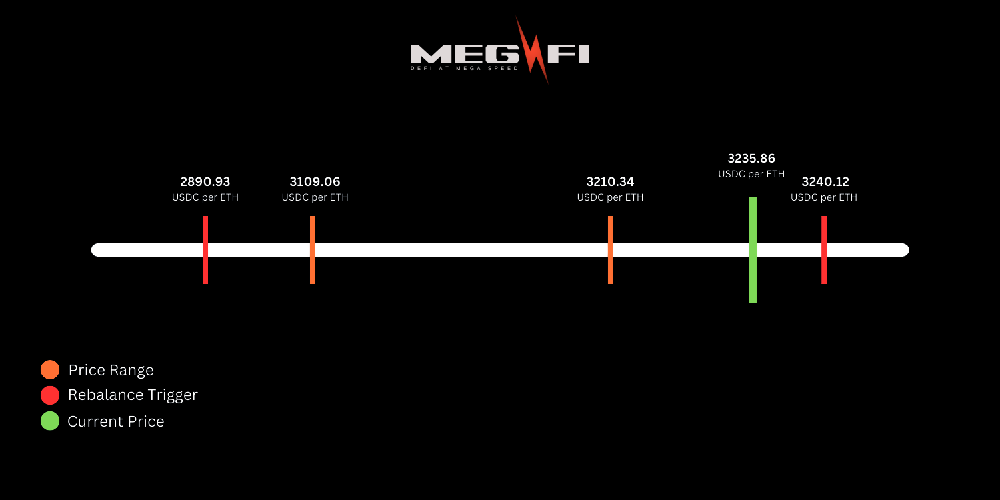
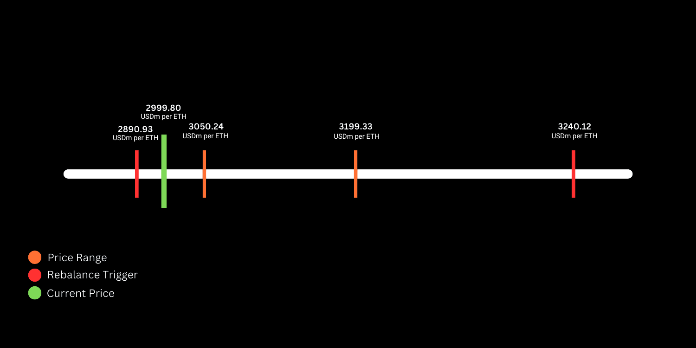

# Automated Rebalancing

Define how LPs want their liquidity to respond to price changes. Auto-Pools offers a set of auto-rebalance intents that helps users dictate how they want the rebalancing mechanism to work for them.

## At a Glance

- Two rebalancing types: Trailing and Active
- Market modes determine rebalancing direction
- Rebalance triggers provide cushion during market swings
- Rebalance count limits prevent excessive rebalancing
- Bot monitors positions every 5 minutes
- Executes in sub-10ms on MegaETH

## Auto-Rebalance Intents

Following are the auto-rebalance intents offered by Auto-Pools:

- Market modes
- Rebalance types
- Rebalance triggers
- Rebalance count

## Auto-Rebalance Types

After selecting a market mode, you have to choose a rebalancing type.

### How Do I Choose a Rebalancing Type?

Based on your expertise, market understanding, and risks associated with each rebalancing mechanism, select one of the two rebalancing types.

### Understanding Divergence Loss

When the price of tokens in a liquidity pool diverges from the price at the time of deposit, it incurs a loss to the LP called Divergence Loss (DL) or Impermanent Loss (IL). If you withdraw or rebalance your liquidity position at these prices or when your position is out of the market's current price range, it becomes a permanent loss. It especially happens with the volatile token prices.

> **Hedge Against IL**: You can protect your Auto-Pools positions against impermanent loss by buying put options through [Hedge](../hedge/overview.md). Options provide downside protection while your LP position continues earning fees. Fees from Auto-Pools can help offset option premiums, making hedging economically viable.

## Trailing Rebalancing

Trailing rebalancing works by trailing the market price before executing the rebalance. It does so to wait for the market price to come back to the previous range as it goes out of range usually for a very short time. It also prevents unnecessary divergence loss by quickly swapping tokens in the pool and keeping the LP position in the range.

When the TWAP of pool, for example TWAP of USDC per ETH in an $ETH/$USDC pool, hits the rebalancing threshold on either side of the price range, Auto-Pools will put that position right behind the new price. This means that it will not swap your assets to bring it back to the range essentially saving from greater loss of buying your asset on a higher price or selling on a lower price.

Let's understand this by an example of a pool ETH/USDC.

### Scenario 1: When $ETH Price Goes Above the Range

Your liquidity position trails the current $ETH price as it increases and goes out of range. It is suitable for bullish market trends so you would be able to capture more of the upside.

#### Example: Trailing Rebalancing in Auto-Pools ($ETH/$USDC Pool) - Bull Mode

Let's walk through a scenario using the $ETH/$USDC pool to understand how trailing rebalancing works in Bull Mode.

**Intents You Setup Initially:**

Price Range for the strategy:
- Minimum Price: 3100.56 $USDC per $ETH
- Maximum Price: 3210.44 $USDC per $ETH

Rebalance Triggers (Cushion):
- Min Trigger: 2890.93 $USDC per $ETH
- Max Trigger: 3240.12 $USDC per $ETH

Current TWAP Price:
- 3180.32 $USDC per $ETH

**What Happens When the $ETH Price Increases?**

Let's say the price of $ETH rises to 3235.86 $USDC per $ETH.

**Rebalancing Action:**
The rebalancing mechanism adjusts the price range to trail just behind the new price.

New Price Range: 3109.06 – 3210.34 $USDC per $ETH

This ensures your liquidity is positioned optimally for the updated market price.

**If $ETH's price continues to rise and touches the maximum rebalance trigger (3240.12 $USDC per $ETH):**

**Rebalancing Execution:**
The system swaps $ETH for $USDC, rebalancing your position automatically.

**What Happens When the $ETH Price Falls Back?**

If the price of $ETH falls back into the original price range (3100.56 – 3210.44 $USDC per $ETH):

**No Rebalancing Required:**
The system does not take action since the price remains within the predefined range. Your liquidity stays intact without unnecessary adjustments.

### Scenario 2: When $ETH Price Drops Below the Range

Your liquidity position trails the current $ETH price as it decreases and goes out of range. It is suitable for bearish market trends so you can protect yourself against decreasing prices.

#### Example: Trailing Rebalancing in Auto-Pools ($ETH/$USDC Pool) - Bear Mode

Let's walk through a scenario using the $ETH/$USDC pool to understand how trailing rebalancing works in Bear Mode.

**Intents You Setup Initially:**

Price Range for strategy:
- Minimum Price: 3100.56 $USDC per $ETH
- Maximum Price: 3210.44 $USDC per $ETH

Rebalance Triggers (Cushion):
- Min Trigger: 2890.93 $USDC per $ETH
- Max Trigger: 3240.12 $USDC per $ETH

Current TWAP Price:
- 3180.32 $USDC per $ETH

**What Happens When the $ETH Price Decreases?**

Let's say the price of $ETH falls to 2999.8 $USDC per $ETH.

**Rebalancing Action:**
The rebalancing mechanism adjusts the price range to trail just behind the new price.

New Price Range: 3050.24 – 3199.33 $USDC per $ETH

This ensures your liquidity is positioned optimally for the updated market price.

**If $ETH's price continues to fall and touches the minimum rebalance trigger (2890.93 $USDC per $ETH):**

**Rebalancing Execution:**
The system swaps $USDC for $ETH, rebalancing your position automatically.

**What Happens When the $ETH Price Rises Back?**

If the price of $ETH rises back into the original price range (3100.56 – 3210.44 $USDC per $ETH):

**No Rebalancing Required:**
The system does not take action since the price remains within the predefined range. Your liquidity stays intact without unnecessary adjustments.

### Scenario 3: When $ETH Price Fluctuates Below & Above the Range

Your liquidity position trails the current $ETH price as it increases or decreases or goes out of range. It is suitable for markets with little or no clear trend, that is, highly volatile so you can capture maximum fees.

### Scenario 4: When $ETH Price Remains Static

Your liquidity position remains fixed and does not trail the changing $ETH price. This mode is best used with other parameters like liquidity distribution.

### Trailing Rebalancing Benefits

Trailing rebalancing mechanism makes sure your position is always within the active price range so that you can keep earning fees and yields from trading volume and avoid DL as much as possible.

Since it works by trailing the market price instead of rebalancing the position right away. Therefore, it prevents unnecessary divergence losses.

**Bot Monitoring**: The intent bot monitors the liquidity positions every 5 minutes. If the position is out-of-range (has left the price range and rebalance triggers limits), rebalancing will be executed according to the strategy preferences based on the updated price.

## Active Rebalancing

Active rebalancing adjusts your liquidity position within the market's price range by actively adjusting the distribution of tokens in your liquidity pool. It ensures your position is always within the active price range to keep earning fees and yields from trading volume.

Let's understand this by an example of a pool ETH/USDC. ETH has a volatile price and it could go up or down.

### Scenario 1: When $ETH price goes above the range

When the price of $ETH goes above the maximum price range, your position will go out of range and will stop generating fees and yields. Auto-Pools will actively rebalance your position by converting your $ETH to $USDC partially since its price increased to bring your LP position back to the range.

### Scenario 2: When $ETH price drops below the range

When the price of $ETH drops below the minimum price range, your position will go out of range and will stop generating fees and yields. Auto-Pools will actively rebalance your position by converting your $USDC to $ETH partially since its price decreased to bring your LP position back to the range.

### Scenario 3: When $ETH price fluctuates below and above the range

Your liquidity position rebalances actively with the current $ETH price as it increases or decreases or goes out of range.

## Set a Price Range

Auto-Pools doesn't limit you to a fixed price range or ratio while defining auto-rebalance intents.

You can define the minimum and maximum price range around the current price. You can make it in a custom ratio according to your assets and investment mindset.

## Rebalance Triggers

The rebalance triggers are the minimum and maximum price within or around the price range you set. Setting rebalance triggers provides a cushion during market swings.

### In Case of Active Rebalancing

With active rebalancing, as soon as the price touches the trigger or threshold or goes out of the price range, it swaps the assets to rebalance the position.

### In Case of Trailing Rebalancing

With trailing rebalancing it's different. When you set a rebalance trigger outside the price ranges, you dictate that at what prices rebalancing of your liquidity position should happen when the current price changes. Here's how it benefits:

- It is a high-level customization that helps you minimize unnecessary losses.
- It also prevents spammed rebalancing during market volatility.
- As an LP, you can speculate if the market bounces back to your main range until your set trigger of resistance or support.

## Rebalance Count

Determine how many times you want the algorithm to rebalance your liquidity position before it pauses rebalancing.

This helps LPs make a deterministic decision by rethinking their intent after the set number of rebalances as the market may change in nature.

It also helps prevent changes in their liquidity position too many times thus protecting from bigger losses which usually happen in active rebalancing.

## FAQ

**How often will my position rebalance?**  
The intent bot monitors positions every 5 minutes. Rebalancing occurs when conditions are met based on your selected mode and rebalancing type.

**What's the difference between Trailing and Active rebalancing?**  
Trailing rebalancing trails the market price before executing, preventing unnecessary divergence loss. Active rebalancing immediately swaps assets to bring position back in range.

**Can I set custom rebalance triggers?**  
Yes. You can set minimum and maximum triggers within or around your price range to provide cushion during market swings.

**What happens after reaching rebalance count?**  
Rebalancing pauses after reaching your set count, allowing you to reassess your strategy as market conditions may have changed.

**Does rebalancing guarantee better performance?**  
No. It optimizes based on algorithms, but markets are unpredictable.

**How do I know if rebalancing is working?**  
Monitor your position's active time and fee earnings. Compare to manual management or pool averages.

**Can I hedge my position against impermanent loss?**  
Yes. You can buy put options through [Hedge](../hedge/overview.md) to protect against downside risk and impermanent loss. Options work alongside your Auto-Pools strategy, providing protection while you continue earning fees. Fees earned can help offset option premiums.

## Next Steps

Understand rebalancing mechanics:

- [Strategy Modes](strategy-modes.md) - Choose your market mode
- [Range Optimization](range-optimization.md) - Set price ranges
- [Performance Tracking](performance-tracking.md) - Monitor rebalancing effectiveness
- [Hedge](../hedge/overview.md) - Protect positions with options

---

**Adaptive optimization.**
