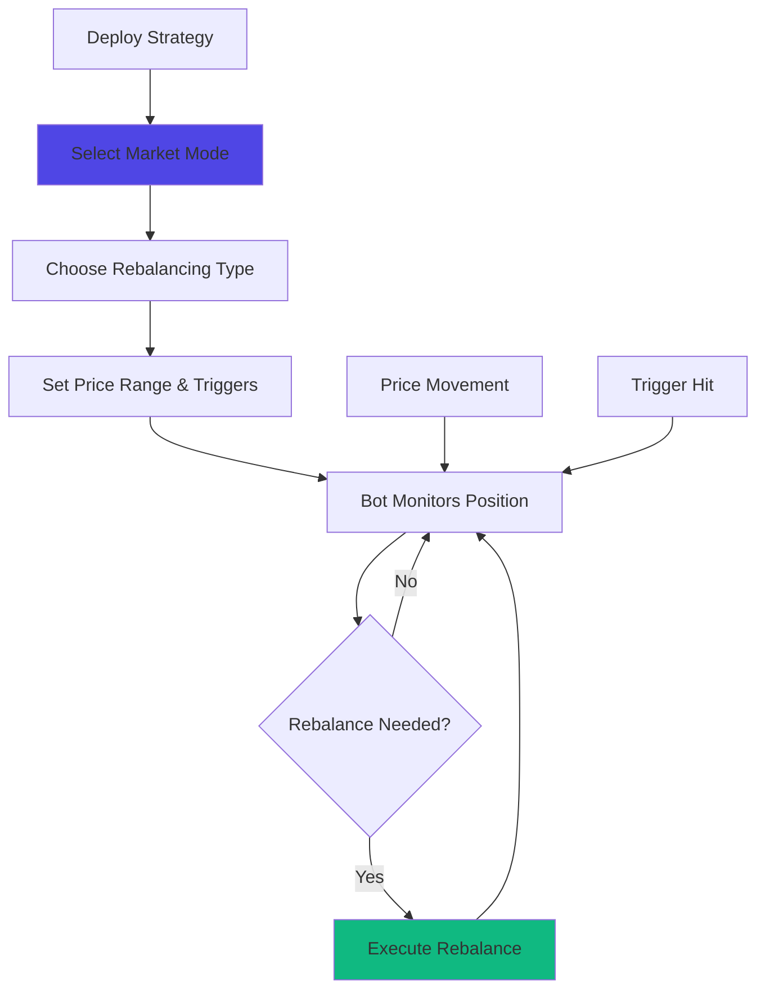

# Auto-Pools

Automated liquidity management directly connected to DEX. Auto-Pools deploys algorithmic strategies that rebalance Liquidity Zones, maximize capital efficiency, and adapt to changing market conditions.

## At a Glance

- Automated Liquidity Zone management with zero manual intervention
- Four market modes: Bull, Bear, Dynamic, Static
- Two rebalancing types: Trailing and Active
- Continuous rebalancing enabled by MegaETH's low gas costs
- Real-time performance tracking and analytics
- Composable with DEX and Hedge

## How It Works



Strategy algorithms run continuously, analyzing market conditions and adjusting your positions automatically. MegaETH's ultra-low gas costs (~ $0.01 per rebalance) make frequent adjustments economically viable.

## Why Use Auto-Pools?

### Manual Management Challenges

Managing concentrated liquidity manually is complex:

- Requires constant price monitoring
- Need to calculate optimal zones
- Must rebalance when price moves
- Time-intensive and prone to human error
- Emotional decisions during volatility

### Auto-Pools Benefits

**Automation**: Strategies work 24/7 without human input.

**Optimization**: Algorithms calculate mathematically optimal zones.

**Speed**: Rebalance in milliseconds when conditions change.

**Consistency**: No emotional decisions. Pure math.

**Scalability**: Manage multiple positions simultaneously.

## Strategy Modes

Selecting the right market mode for your intent is the first step in automating your rebalancing strategy. Market modes allow LPs to choose the direction of rebalancing giving them greater control over their liquidity.

### Bull Mode

Best for bull market. This mode functions like a dynamic range order that follows the price of the tokenB asset up. Rebalance will happen on the right side of the price. This strategy is for LPs who expect ETH to go up.

**Best For**: Bull markets, expecting ETH to go up.

[Details →](strategy-modes.md#bull-mode)

### Bear Mode

Best for bear market. This mode functions like a dynamic range order that follows the price of the tokenA asset up. Rebalance will happen on the left side of the price. This strategy is for LPs who expect ETH to go down.

**Best For**: Bear markets, expecting ETH to go down.

[Details →](strategy-modes.md#bear-mode)

### Dynamic Mode

Best for sideways (volatile) market. This mode functions like a dynamic range order that follows the pool price right and left, keeping liquidity as active as possible. This is how ALMs work, best for volatile markets with no clear direction.

**Best For**: Sideways/volatile markets with no clear trend.

[Details →](strategy-modes.md#dynamic-mode)

### Static Mode

Best for advanced liquidity strategies. This mode features static ticks that you can use to define your own custom liquidity strategy. Static liquidity used for building more sophisticated LP strategies.

**Best For**: Advanced users who want full control over position.

[Details →](strategy-modes.md#static-mode)

## Rebalancing Types

After selecting a market mode, you choose a rebalancing type:

### Trailing Rebalancing

Trailing rebalancing works by trailing the market price before executing the rebalance. It prevents unnecessary divergence loss by quickly swapping tokens in the pool and keeping the LP position in the range.

**Best For**: Minimizing divergence loss, waiting for price to return to range.

[Details →](automated-rebalancing.md#trailing-rebalancing)

### Active Rebalancing

Active rebalancing adjusts your liquidity position within the market's price range by actively adjusting the distribution of tokens in your liquidity pool. It ensures your position is always within the active price range.

**Best For**: Immediate rebalancing when price goes out of range.

[Details →](automated-rebalancing.md#active-rebalancing)

## Key Features

### Continuous Rebalancing

Traditional chains make frequent rebalancing unprofitable:

```
Ethereum Mainnet:
Rebalance cost: $100
Need $50+ fee improvement to justify
Rebalance frequency: Weekly or less

MegaETH:
Rebalance cost: $0.01
Need $0.50+ fee improvement to justify
Rebalance frequency: Hourly or more
```

MegaETH enables true continuous optimization.

### Real-Time Adjustments

Strategies adjust positions in real-time:

- Bot monitors positions every 5 minutes
- Price moves trigger rebalancing automatically
- No waiting for off-chain keepers or block confirmations

### Multi-Position Management

Deploy strategies across multiple positions:

```
Position 1: ETH/USDC (Bull Mode)
Position 2: WBTC/ETH (Dynamic Mode)
Position 3: USDC/USDT (Static Mode)
```

Each position runs its own strategy independently.

### Performance Analytics

Track strategy performance in detail:

- APR over time
- Rebalancing frequency and costs
- Zone width adjustments
- Fee earnings

Compare manual vs automated performance.

[Performance tracking →](performance-tracking.md)

## Deploying a Strategy

### Select Market Mode

1. Navigate to Auto-Pools
2. Browse available modes (Bull, Bear, Dynamic, Static)
3. Review characteristics of each
4. Select mode matching your market view

### Choose Rebalancing Type

Select either:
- Trailing Rebalancing: Trails price before executing
- Active Rebalancing: Immediately swaps to bring position in range

### Set Price Range

Define the minimum and maximum price range around the current price. You can make it in a custom ratio according to your assets and investment mindset.

### Set Rebalance Triggers

Set minimum and maximum triggers within or around your price range. This provides a cushion during market swings and prevents spammed rebalancing during volatility.

### Set Rebalance Count

Determine how many times you want the algorithm to rebalance your liquidity position before it pauses rebalancing. This helps you reassess your strategy as market conditions may change.

### Choose Pool and Amount

Select:
- Token pair
- Fee tier
- Initial capital amount

Strategy creates initial position with optimal zone.

### Confirm Deployment

Review:
- Strategy mode
- Rebalancing type
- Pool details
- Price range and triggers
- Gas estimates

Approve and deploy. Strategy activates immediately.

## Architecture

Auto-Pools is built on a base vault architecture with module contracts that manage user liquidity according to selected intents.

Key components:
- Base Vault: Manages all pools and strategies
- Strategy Contracts: Separate vaults for each strategy
- Fee-Sharing Mechanisms: Compounding and non-compounding
- Bot Monitoring: Off-chain bots trigger rebalancing transactions

[Architecture details →](architecture.md)

## Composability

Strategies integrate with other MegaFi layers:

### With DEX

Strategies build on top of MegaPools:
- Use same liquidity positions
- Manage Liquidity Zones automatically
- Collect and compound fees

### With Hedge

Combine strategies with hedging:

```
Auto-Pools: Earn fees from LP position
Hedge: Buy put option for downside protection
```

Fees help offset option premiums. Protection limits downside.

[Hedge integration →](../hedge/hedging-strategies.md)

## Strategy on MegaETH

MegaETH's unique properties enable sophisticated strategies:

### Sub-10ms Execution

Strategies rebalance faster than market can arbitrage:

```
1. Bot detects need to rebalance: 0ms
2. Calculate new zone: 1ms
3. Remove old position: 5ms
4. Add new position: 8ms
5. Total: 14ms
```

Position updates before most traders perceive price movement.

### Ultra-Low Costs

Gas costs enable profitability impossible elsewhere:

```
Profitable rebalance on Ethereum:
Need $50+ fee improvement (gas cost)
Opportunity frequency: 1-2x per week

Profitable rebalance on MegaETH:
Need $0.50+ fee improvement (gas cost)
Opportunity frequency: 10-20x per day
```

100x more rebalancing opportunities become economically viable.

### Real-Time Data

Continuous state updates provide perfect market data:

- No stale prices from block delays
- Instant volatility calculations
- Real-time volume tracking

Algorithms make better decisions with better data.

## FAQ

**Are strategies audited?**  
Not yet. Security audits are planned before mainnet launch. Current deployments are for testing only.

**Can I withdraw from a strategy anytime?**  
Yes. No lock periods. Exit whenever you want.

**Do strategies guarantee profits?**  
No. Strategies optimize management but can't eliminate market risk or IL.

**What happens if MegaETH goes down?**  
Strategies pause during outages. Resume automatically when network returns.

**Can I modify strategy parameters after deployment?**  
Some parameters are adjustable. Others require closing and redeploying.

**Do strategies work during high volatility?**  
Yes. Dynamic mode specifically designed for volatile markets.

**How often does the bot check my position?**  
The intent bot monitors liquidity positions every 5 minutes.

## Next Steps

Explore Auto-Pools components:

- [Strategy Modes](strategy-modes.md) - Choose your market mode
- [Automated Rebalancing](automated-rebalancing.md) - Trailing and Active rebalancing
- [Architecture](architecture.md) - How Auto-Pools works
- [Performance Tracking](performance-tracking.md) - Monitor strategy returns

---

**Set it and forget it.**
