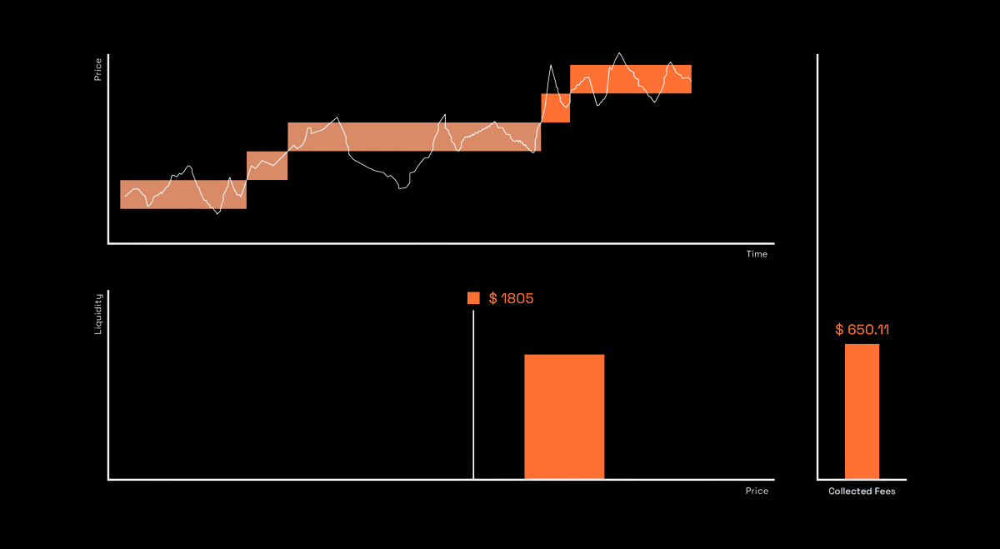
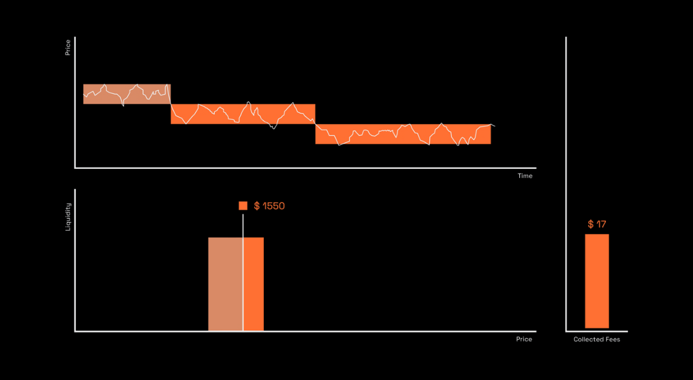
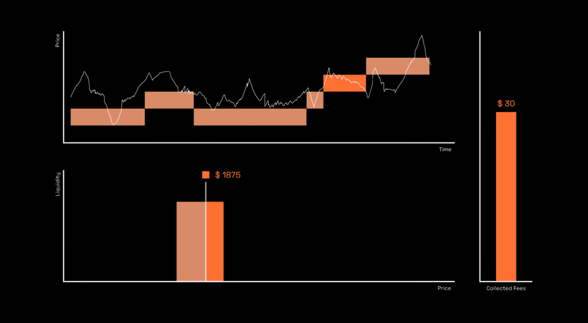
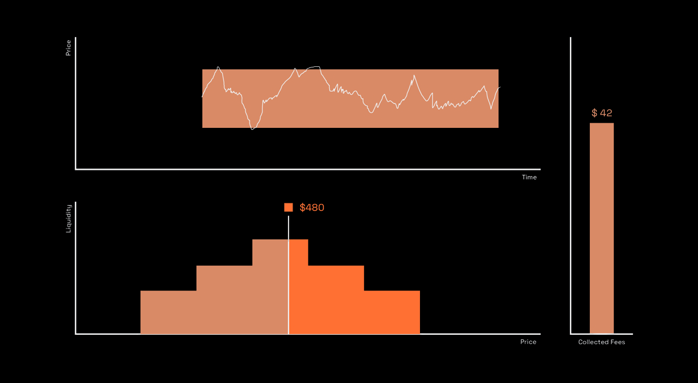

# Strategy Modes

Selecting the right market mode for your intent is the first step in automating your rebalancing strategy. Market modes allow LPs to choose the direction of rebalancing giving them greater control over their liquidity. Based on the macro market trends, there are four modes that an LP can select from.

## At a Glance

- Four market modes: Bull, Bear, Dynamic, Static
- Each mode optimizes for different market conditions and trends
- Modes determine rebalancing direction and behavior
- Switch modes anytime without withdrawing liquidity
- All modes work with both Trailing and Active rebalancing types

## Mode Comparison

| Mode | Description | Best For | Rebalance Direction |
|------|-------------|----------|---------------------|
| Bull | Position trails price as asset rises | Bull markets, expecting ETH to go up | Right side of price |
| Bear | Position trails price as asset declines | Bear markets, expecting ETH to go down | Left side of price |
| Dynamic | Position trails price in both directions | Sideways/volatile markets, no clear trend | Both directions |
| Static | Position remains fixed | Advanced strategies, custom liquidity | No trailing |

## Bull Mode

### Overview

Best for bull market. This mode functions like a dynamic range order that follows the price of the tokenB asset up. Rebalance will happen on the right side of the price. This strategy is for LPs who expect ETH to go up.

### Characteristics

**Trailing Behavior**: Position trails the current pool price as the asset price rises, optimizing for upward market trends.

**Rebalance Direction**: Rebalancing occurs on the right side of the price range.

**Market Condition**: Optimized for bullish market trends.

**Use Case**: When you expect the tokenB asset (ETH) to increase in value relative to tokenA (USDC).

### How It Works

In Bull Mode, when the price of ETH increases and goes out of range, your liquidity position trails the current ETH price upward. This allows you to capture more of the upside during bullish market trends.

The rebalancing mechanism adjusts the price range to trail just behind the new price, ensuring your liquidity is positioned optimally for the updated market price.

## Bear Mode

### Overview

Best for bear market. This mode functions like a dynamic range order that follows the price of the tokenA asset up. Rebalance will happen on the left side of the price. This strategy is for LPs who expect ETH to go down.

### Characteristics

**Trailing Behavior**: Position trails the current pool price when the asset price is declining, ideal for downward market trends.

**Rebalance Direction**: Rebalancing occurs on the left side of the price range.

**Market Condition**: Optimized for bearish market trends.

**Use Case**: When you expect the tokenB asset (ETH) to decrease in value relative to tokenA (USDC).

### How It Works

In Bear Mode, when the price of ETH decreases and goes out of range, your liquidity position trails the current ETH price downward. This helps protect yourself against decreasing prices during bearish market trends.

The rebalancing mechanism adjusts the price range to trail just behind the new price, ensuring your liquidity is positioned optimally for the updated market price.

## Dynamic Mode

### Overview

Best for sideways (volatile) market. This mode functions like a dynamic range order that follows the pool price right and left, keeping liquidity as active as possible. This is how ALMs work, best for volatile markets with no clear direction.

### Characteristics

**Trailing Behavior**: Position trails the current pool price in both upward and downward directions, making it suitable for markets with little to no clear trend.

**Rebalance Direction**: Rebalancing occurs in both directions as price moves.

**Market Condition**: Optimized for volatile, sideways markets.

**Use Case**: When market conditions are uncertain or highly volatile with no clear directional trend.

### How It Works

In Dynamic Mode, your liquidity position trails the current ETH price as it increases or decreases or goes out of range. This mode is suitable for markets with little or no clear trend, that is, highly volatile so you can capture maximum fees.

The position adapts to price movements in both directions, keeping your liquidity active and earning fees regardless of whether price moves up or down.

## Static Mode

### Overview

Best for advanced liquidity strategies. This mode features static ticks that you can use to define your own custom liquidity strategy. Static liquidity used for building more sophisticated LP strategies.

### Characteristics

**Trailing Behavior**: Position remains fixed and does not trail the changing prices of the underlying assets, offering a more stable approach.

**Rebalance Direction**: No automatic trailing. Position remains at defined ticks.

**Market Condition**: For advanced users who want full control.

**Use Case**: When you want to define custom liquidity strategies with specific price ranges that don't automatically adjust.

### How It Works

In Static Mode, your liquidity position remains fixed and does not trail the changing ETH price. This mode is best used with other parameters like liquidity distribution.

You define the exact price range (ticks) where you want your liquidity to remain, and the position will not automatically rebalance based on price movements.

## Choosing a Mode

### Bull Mode
Choose when:
- You expect ETH price to rise
- Market shows bullish trends
- You want to capture upside potential

### Bear Mode
Choose when:
- You expect ETH price to fall
- Market shows bearish trends
- You want protection against downside

### Dynamic Mode
Choose when:
- Market is volatile with no clear direction
- You want maximum fee capture
- Market conditions are uncertain

### Static Mode
Choose when:
- You want full control over position
- Building advanced strategies
- Combining with other liquidity intents

## Mode Details

| No. | Mode | Description | Example |
|-----|------|-------------|---------|
| 1 | Bull | Best for bull market. This mode functions like a dynamic range order that follows the price of the tokenB asset up. | Rebalance will happen on the right side of the price. This strategy is for LPs who expect ETH to go up. |
| 2 | Bear | Best for bear market. This mode functions like a dynamic range order that follows the price of the tokenA asset up. | Rebalance will happen on the left side of the price. This strategy is for LPs who expect ETH to go down. |
| 3 | Dynamic | Best for sideways (volatile) market. This mode functions like a dynamic range order that follows the pool price right and left, keeping liquidity as active as possible. | This is how ALMs work, best for volatile markets with no clear direction. |
| 4 | Static | Best for advanced liquidity strategies. This mode features static ticks that you can use to define your own custom liquidity strategy. | Static liquidity used for building more sophisticated LP strategies. |

Note: tokenA = USDC, tokenB = ETH

## Switching Modes

### How to Switch

1. Open position in Auto-Pools
2. Click "Change Strategy Mode"
3. Select new mode
4. Review expected changes
5. Confirm switch

### What Happens

**Immediate Rebalance**: Position rebalances to match new mode's behavior.

**Parameter Update**: New rebalancing rules apply going forward.

**Gas Cost**: Single rebalance transaction (~ $0.01).

**History**: Performance tracking continues across mode change.

## FAQ

**Can I create custom modes?**  
Not yet. Custom strategies coming in future release.

**Which mode should I start with?**  
Dynamic mode for most users. Bull if bullish, Bear if bearish. Static for advanced users.

**Do modes work on all pools?**  
Yes, but performance varies by market conditions.

**Can I pause a strategy?**  
Yes. Position remains active but stops rebalancing. Resume anytime.

**What if a mode performs poorly?**  
Switch modes or exit strategy. No lock-in.

**Are there fees to use Strategy Modes?**  
No protocol fees. Only gas costs for rebalancing.

## Next Steps

Learn more about strategies:

- [Automated Rebalancing](automated-rebalancing.md) - Trailing and Active rebalancing types
- [Architecture](architecture.md) - How strategies work under the hood
- [Performance Tracking](performance-tracking.md) - Monitor returns

---

**Choose your approach.**
