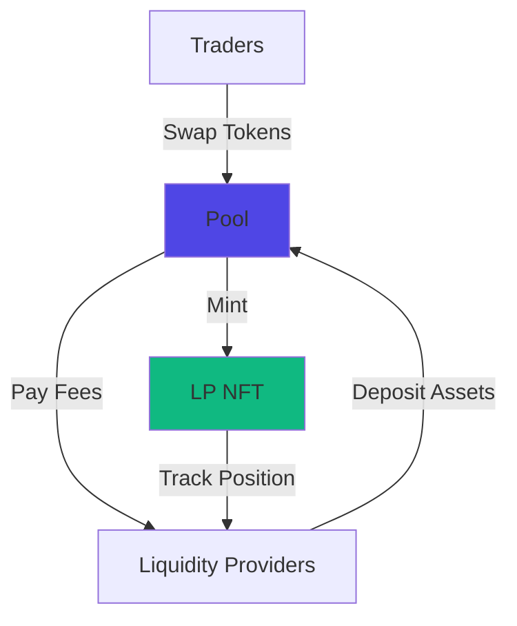

# DEX

The trading core of MegaFi. DEX enables instant token swaps and efficient capital deployment through Pools powered by concentrated liquidity.

## At a Glance

- Swap tokens with sub-50ms execution and minimal slippage
- Provide liquidity in custom Ticks for maximum capital efficiency
- Earn trading fees from every swap through your pool
- LP positions represented as transferable NFTs
- Real-time pool updates enable continuous capital optimization
- Up to 95% capital utilization vs 60-70% on traditional AMMs

## How It Works

Pools use concentrated liquidity to improve capital efficiency. Unlike traditional constant-product pools where liquidity is spread across all prices, concentrated liquidity lets you focus capital in specific price ranges.



**Traders** swap tokens through Pools, paying a small fee on each trade.

**Liquidity Providers** deposit token pairs into pools, earning a portion of trading fees.

**LP NFTs** represent each liquidity position, tracking your specific Tick and accumulated fees.

## Key Concepts

### Pools

Token pair pools that facilitate swaps. Each Pool contains two tokens (e.g., ETH/USDC) and executes swaps between them.

Pools use an automated market maker formula to price tokens. As trades occur, prices adjust automatically to maintain balance.

[Learn more →](megapools.md)

### Ticks

Custom price ranges where you concentrate your liquidity. By providing liquidity only in ticks where trading occurs, you earn more fees per dollar of capital.

Choose wide ticks for stable, predictable earnings or narrow ticks for higher returns with more active management.

[Learn more →](ticks.md)

### LP NFTs

Your liquidity position is represented as an NFT. Each NFT tracks:
- Which pool you're providing to
- Your Tick boundaries
- Accumulated fees
- Liquidity amount

LP NFTs are transferable. You can sell, trade, or hold them like any NFT.

[Learn more →](lp-nfts.md)

### Fee Tiers

Different pools have different fee structures:

- **0.05%**: Stable pairs (USDC/USDT, DAI/USDC)
- **0.3%**: Standard pairs (ETH/USDC, WBTC/ETH)
- **1%**: Exotic pairs (low liquidity or volatile tokens)

Higher fees compensate for higher risk and volatility.

[Learn more →](fees-and-rewards.md)

## Core Features

### Instant Swaps

MegaETH's real-time execution enables swaps that finalize in under 50 milliseconds. No waiting for block confirmations. No front-running risk.

[Swap guide →](swapping.md)

### Capital Efficiency

Concentrated liquidity achieves 30-50% higher capital utilization than traditional AMMs. Your assets work harder, earning more fees per dollar deployed.

### Real-Time Updates

Pool prices, liquidity positions, and fee accrual update continuously. MegaETH processes state changes in real-time, not in 12-second intervals.

This enables features impossible on block-based chains:
- Liquidity zones that adjust based on price movement
- Real-time fee accrual tracking
- Instant position rebalancing

 

## For Traders

Use DEX to:

**Swap Tokens**: Trade any supported token pair with minimal slippage and instant execution.

**Compare Prices**: Real-time quotes show exact output before you trade.

**Route Optimization**: Swaps automatically route through best path, including multi-hop routes.

**Low Fees**: Transaction costs under $0.005. Trading fees typically 0.3%.

[Trading guide →](swapping.md)

## For Liquidity Providers

Provide liquidity to:

**Earn Trading Fees**: Collect a portion of fees from every swap through your pool.

**Custom Ticks**: Choose where to concentrate liquidity for optimal returns.

**Automated Management**: Use [Auto-Pools](../auto-pools/overview.md) preset configurations to automate tick selection and rebalancing, maximizing active time and fee earnings without constant monitoring.

**Flexible Withdrawal**: Remove liquidity anytime. No lock periods or penalties.

[LP guide →](providing-liquidity.md)

## Capital Efficiency Comparison

Traditional AMMs spread liquidity across all prices:

```
Price Range: $0 to $∞
Useful Liquidity: 20-30%
Capital Efficiency: Low
```

MegaFi concentrated liquidity focuses capital where trades happen:

```
Price Range: $1,800 to $2,200 (example for ETH)
Useful Liquidity: 90-95%
Capital Efficiency: High
```

Result: Same fee earnings with 50-70% less capital deployed.

## MegaETH Advantages

DEX leverages MegaETH's unique capabilities:

**Sub-10ms Finality**: Swaps execute and finalize before traditional chains process a single block.

**100k+ TPS**: No congestion. Swaps execute immediately even during peak activity.

**Continuous Processing**: Pool state updates in real-time, not at block intervals. Enables live rebalancing and instant arbitrage correction.

**Ultra-Low Costs**: Gas fees under $0.005 per transaction. Profitable to rebalance positions multiple times daily.

 

## Getting Started

### As a Trader

1. [Connect wallet](../getting-started/overview.md)
2. [Make your first swap](swapping.md)
3. Explore available pools and routes

### As a Liquidity Provider

**Manual Management:**
1. Choose a token pair with good volume
2. Select your Tick based on price expectations
3. [Deposit liquidity](providing-liquidity.md) and receive LP NFT
4. Monitor fees and rebalance as needed

**Automated Management:**
1. Choose a token pair with good volume
2. [Deposit liquidity](providing-liquidity.md) and receive LP NFT
3. Enable [Auto-Pools](../auto-pools/overview.md) with preset configurations
4. Select strategy mode (Bull, Bear, Dynamic, or Static)
5. Let Auto-Pools handle tick selection and rebalancing automatically

While manual management gives you full control, Auto-Pools offers preset configurations that automate the entire process, ensuring your positions stay active and earning fees 24/7.

 

## Risk Considerations

Providing liquidity involves risks:

**Impermanent Loss**: When token prices diverge, your position value may be lower than simply holding the tokens. More pronounced with volatile pairs.

**Smart Contract Risk**: Smart contracts are in development and have not yet been audited. Use testnet deployments with caution.

**Liquidity Risk**: In low-liquidity pools, your trades may experience higher slippage.

**Price Risk**: Token prices fluctuate. Your liquidity position value changes with market conditions.

Understand these risks before providing significant liquidity. Consider starting with small amounts.

## Technical Architecture

Pools are deployed as smart contracts on MegaETH. Key components:

**Pool Contracts**: Store liquidity and execute swaps. One contract per token pair and fee tier.

**Position Manager**: Tracks LP NFTs and manages position metadata.

**Router**: Finds optimal swap routes and executes multi-hop trades.

**Oracle**: Provides price data for improved routing and MEV protection.

[Technical details →](../technical/architecture.md)

## Performance Metrics

Real-world DEX performance on MegaETH:

- **Swap Latency**: 10-50ms (submission to finality)
- **Pool Update Frequency**: Continuous (real-time state changes)
- **Capital Efficiency**: 90-95% useful liquidity
- **Slippage**: < 0.05% on major pairs
- **Uptime**: > 99.99%
- **Gas Cost**: $0.001 - $0.005 per transaction

## FAQ

**What's the minimum liquidity I can provide?**  
No minimum. Even small amounts earn fees, though gas costs are more significant for tiny positions.

**Can I remove liquidity anytime?**  
Yes. No lock periods. Withdraw whenever you want.

**How often are fees paid?**  
Fees accumulate continuously with every swap. Collect them when you withdraw liquidity or manually claim.

**What happens if price moves outside my zone?**  
Your liquidity becomes inactive (all one token). You stop earning fees until price returns to your zone. Consider wider zones or automated rebalancing.

**Are LP NFTs transferable?**  
Yes. They're standard ERC-721 tokens. Sell or transfer like any NFT.

## Next Steps

Dive deeper into DEX components:

- [Pools](pools.md) - Pool mechanics and pricing
- [Ticks](ticks.md) - Range selection strategies
- [Swapping](swapping.md) - Execute trades
- [Providing Liquidity](providing-liquidity.md) - Become an LP
- [LP NFTs](lp-nfts.md) - Manage positions
- [Fees and Rewards](fees-and-rewards.md) - Understand earnings

---

**The most efficient liquidity on any chain.**

