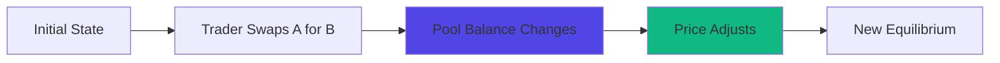

# Pools

Token pair liquidity pools that enable instant swaps on MegaFi. Pools use concentrated liquidity to achieve superior capital efficiency compared to traditional constant-product pools.

## At a Glance

- One pool per token pair and fee tier combination
- Concentrated liquidity model for capital efficiency
- Real-time price updates as trades execute
- Multiple fee tiers (0.05%, 0.3%, 1%) for different pair types
- Permissionless pool creation for any ERC-20 pair
- Liquidity aggregated across all provider positions

## Pool Structure

Each Pool consists of:

**Token Pair**: Two ERC-20 tokens that can be swapped (e.g., ETH/USDC).

**Fee Tier**: The trading fee percentage charged on swaps.

**Liquidity**: Total assets deposited by liquidity providers.

**Price**: Current exchange rate between the tokens, determined by pool balance and trades.

**Tick Spacing**: Granularity of Ticks. Lower tick spacing allows more precise ranges.

## How Pricing Works

Pools determine prices algorithmically based on pool reserves:



**Before Swap**: Pool has X amount of Token A and Y amount of Token B. Price = Y / X.

**Swap Occurs**: Trader deposits Token A, receives Token B.

**After Swap**: Pool now has more Token A, less Token B. Price adjusts automatically.

This constant feedback mechanism ensures prices track market conditions.

### Price Formula

Pools use the constant product formula with concentrated liquidity adjustments:

```
x * y = k (where k is constant within a Tick)
```

However, unlike simple constant-product AMMs, this formula applies only within active Ticks. When price moves between ticks, the formula parameters update.

## Fee Tiers

Different pool types use different fee tiers:

### 0.05% Fee Tier

**Use Case**: Stablecoin pairs and highly correlated assets.

**Examples**: USDC/USDT, DAI/USDC, stETH/ETH

**Rationale**: Low volatility means less impermanent loss risk. Lower fees attract more volume.

**Tick Spacing**: 10 (allows very precise Ticks)

### 0.3% Fee Tier

**Use Case**: Standard token pairs.

**Examples**: ETH/USDC, WBTC/ETH, LINK/ETH

**Rationale**: Balanced fee that compensates for moderate volatility while staying competitive.

**Tick Spacing**: 60

### 1% Fee Tier

**Use Case**: Exotic or low-liquidity pairs.

**Examples**: New tokens, long-tail assets, highly volatile pairs

**Rationale**: Higher fee compensates liquidity providers for increased risk and lower volume.

**Tick Spacing**: 200

## Pool Creation

Anyone can create a new Pool:

1. Select two tokens
2. Choose fee tier
3. Set initial price
4. Add initial liquidity

The first liquidity provider sets the pool's starting price. Arbitrageurs quickly correct mispriced pools.

### Requirements

- Both tokens must be ERC-20 compliant
- Pool doesn't already exist for this pair and fee tier
- Initial liquidity must be added
- Small gas cost (~ $0.01)

## Liquidity Distribution

Within a Pool, liquidity is distributed across different Ticks:

```
Price:     $1800        $2000        $2200        $2400
           |            |            |            |
Provider A: [========================================]  (wide tick)
Provider B:              [===========]                 (narrow tick)
Provider C:         [======================]           (medium tick)
```

Each provider chooses their own zone. Total pool liquidity equals the sum of all active positions at the current price.

## Real-Time Updates

MegaETH's architecture enables true real-time pool updates:

**Traditional Chains**: Pool state updates every 12 seconds (block time). Price can drift between updates.

**MegaETH**: Pool state updates continuously as trades execute. Price always reflects the latest trade.

This eliminates toxic arbitrage opportunities and reduces MEV extraction.

## Pool Statistics

Each Pool displays key metrics:

**Total Value Locked (TVL)**: Combined value of both tokens in the pool.

**24h Volume**: Trading volume over past 24 hours.

**24h Fees**: Total fees collected by LPs in past 24 hours.

**APR**: Annualized percentage return based on current fee rate.

**Liquidity Distribution**: Chart showing where liquidity is concentrated.

**Price History**: Historical price chart with volume overlay.

## Multi-Pool Routing

When no direct pool exists between two tokens, swaps route through multiple pools:


Example: Swapping LINK for USDC routes through LINK/ETH and ETH/USDC pools.

MegaFi's router automatically finds the most efficient path, considering:
- Total fees across all hops
- Price impact in each pool
- Gas costs (minimal on MegaETH)

## Concentrated Liquidity Advantages

Traditional constant-product pools spread liquidity across all prices:

**Capital Efficiency**: Low. Most liquidity sits at prices that never trade.

**Fee Earnings**: Distributed equally regardless of where trading occurs.

**Flexibility**: None. LPs can't customize ranges.

Pools with concentrated liquidity:

**Capital Efficiency**: High. Liquidity concentrates where trades happen.

**Fee Earnings**: Focused. Active zones earn more per dollar of capital.

**Flexibility**: Full. Each LP chooses their optimal zone.

Result: 5-10x higher capital efficiency for well-positioned liquidity.

## Pool Security

Pools include several security features:

**Reentrancy Guards**: Prevent reentrancy attacks during swaps and liquidity modifications.

**Price Bounds**: Trades revert if price moves beyond expected bounds (slippage protection).

**Oracle Integration**: Secondary price feeds detect and prevent price manipulation.

**Security**: Smart contract audits planned before mainnet launch.

[Security details →](../technical/security-audits.md)

## Pool Analytics

Track pool performance through the interface:

**Volume Charts**: Historical trading volume by day, week, or month.

**Fee Charts**: Fees earned over time.

**Liquidity Charts**: How liquidity distribution changes over time.

**Price Charts**: Historical price with technical indicators.

**LP Leaderboard**: Top liquidity providers by earnings.

## Creating a Pool

To create a new Pool:

1. Navigate to "Pools" → "Create Pool"
2. Select Token A and Token B
3. Choose fee tier based on pair characteristics
4. Set initial price (important - sets starting exchange rate)
5. Add initial liquidity to activate pool
6. Confirm transaction

Initial liquidity provider pays gas but receives LP NFT representing position.

## Adding to Existing Pools

To add liquidity to an existing pool:

1. Browse pools or search for specific pair
2. Click "Add Liquidity"
3. Select Tick boundaries
4. Enter token amounts
5. Confirm transaction

[Detailed guide →](providing-liquidity.md)

> **Automate Management**: While you can manually add and manage liquidity, [Auto-Pools](../auto-pools/overview.md) offers preset configurations that automatically manage your positions. Set your strategy mode and tick preferences once, and Auto-Pools handles rebalancing 24/7 to maximize your active time and fee earnings.

## Pool Economics

Pool profitability depends on several factors:

**Volume**: Higher volume means more fees collected.

**Volatility**: Higher volatility increases impermanent loss but may increase volume.

**Liquidity**: More liquidity means lower fees per LP but less slippage for traders.

**Fee Tier**: Higher fees mean more per trade but may reduce volume.

Optimal pools balance these factors based on token characteristics.

## Performance on MegaETH

Pools leverage MegaETH's capabilities:

**Continuous Price Updates**: No price drift between blocks.

**Sub-10ms Swaps**: Trades execute and finalize before traditional chains process one block.

**Profitable Arbitrage**: Ultra-low gas costs make even tiny arbitrage profitable, keeping prices efficient.

**Real-Time Rebalancing**: LPs can adjust positions multiple times per day economically.

## FAQ

**Can I provide liquidity to just one side of a pool?**  
No. You must provide both tokens in proportion to the current price.

**What happens if no one creates a pool for the pair I want?**  
Create it yourself. Pool creation is permissionless.

**Can multiple pools exist for the same token pair?**  
Yes, if they use different fee tiers. For example, ETH/USDC can have 0.05%, 0.3%, and 1% pools simultaneously.

**How are trading fees split among liquidity providers?**  
Proportionally based on liquidity contributed and time that liquidity was active.

**Do I need both tokens to swap?**  
No. To swap Token A for Token B, you only need Token A.

**Should I manage my liquidity manually or use Auto-Pools?**  
Manual management gives you full control and is suitable for active traders. [Auto-Pools](../auto-pools/overview.md) offers preset configurations that automate tick selection and rebalancing, making it ideal for users who want to maximize returns without constant monitoring. Auto-Pools works with your existing LP NFTs and can be enabled or disabled anytime.

## Next Steps

Learn more about Pool components:

- [Ticks](ticks.md) - Select optimal ranges
- [Providing Liquidity](providing-liquidity.md) - Become an LP
- [Fees and Rewards](fees-and-rewards.md) - Maximize earnings
- [Auto-Pools](../auto-pools/overview.md) - Automate liquidity management

---

**Engineered for efficiency.**

