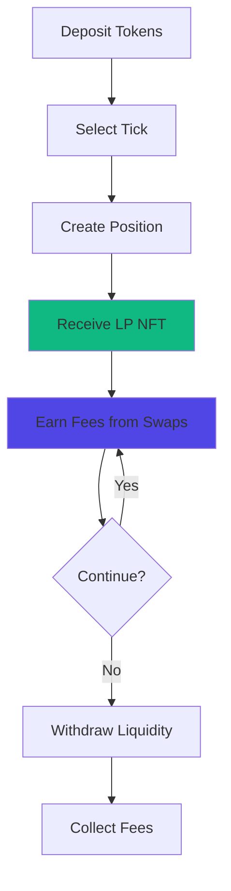

# Providing Liquidity

Earn trading fees by depositing token pairs into Pools. Liquidity providers enable swaps and receive a portion of fees from every transaction.

## At a Glance

- Deposit token pairs to earn fees from swaps
- Choose custom Ticks for optimal capital efficiency
- Receive LP NFT representing your position
- Withdraw liquidity anytime with no lock periods
- Collect fees when withdrawing or manually claim
- Real-time fee accrual tracking

## How It Works



You deposit equal value of both tokens, select a Tick, and receive an LP NFT. As traders swap through your tick, you earn fees automatically.

## Prerequisites

Before providing liquidity:

- Wallet connected to MegaFi
- Both tokens of the pair available on MegaETH
- Small amount of $MEGA for gas
- Understanding of impermanent loss risk

## Choosing a Pool

Select a pool based on:

### Volume

Higher volume means more fee earnings:

```
High volume (> $10M daily): Major pairs (ETH/USDC, WBTC/ETH)
Medium volume ($1M - $10M daily): Popular tokens
Low volume (< $1M daily): Long-tail or new tokens
```

Check 24h volume statistics in pool info.

### Volatility

Higher volatility increases impermanent loss:

**Low Volatility**: Stablecoin pairs (USDC/USDT). Minimal IL, lower fees.

**Medium Volatility**: Blue chip pairs (ETH/WBTC). Balanced IL and fees.

**High Volatility**: Alt-token pairs. Higher IL risk, higher potential fees.

### Fee Tier

Match fee tier to volatility:

- 0.05%: Stable pairs
- 0.3%: Standard pairs
- 1%: Exotic pairs

Higher fees compensate for higher risk.

### Liquidity

More liquidity means:
- Lower fees per LP (split among more providers)
- Less slippage for traders
- More stable price
- Lower price impact risk

Less liquidity means:
- Higher fees per LP
- Higher trader slippage
- More volatile price
- Higher price impact risk

## Adding Liquidity

### Step 1: Select Pool

Navigate to Pools page. Find desired token pair or click "Create Position".

If pool doesn't exist, you can create it.

### Step 2: Choose Tick

Define price range for your liquidity:

**Full Range**: Entire price spectrum (like traditional AMM).
- Pros: Always active, no management needed
- Cons: Very low capital efficiency

**Wide Range** (e.g., ±50%):
- Pros: Active most of the time, minimal rebalancing
- Cons: Moderate capital efficiency

**Medium Range** (e.g., ±15%):
- Pros: Good balance of efficiency and active time
- Cons: Requires occasional rebalancing

**Narrow Range** (e.g., ±5%):
- Pros: Maximum capital efficiency
- Cons: Frequent rebalancing needed

The interface shows:
- Current price
- Suggested ranges based on volatility
- Your selected range visualized
- Expected APR for the range

[Tick strategies →](ticks.md)

> **Tip**: While you can manually select and manage ticks, [Auto-Pools](../auto-pools/overview.md) offers preset configurations that automatically select optimal ticks and rebalance positions 24/7. This maximizes your active time and fee earnings without constant monitoring.

### Step 3: Enter Amounts

Enter amount of first token. The interface automatically calculates required amount of second token based on:
- Current pool price
- Your selected Tick

Amounts must be proportional to current price. You cannot provide single-sided liquidity.

### Step 4: Review Position

Interface displays:

**Token Amounts**: How much of each token you're depositing.

**Value**: Total USD value of position.

**Current Price**: Pool exchange rate.

**Zone Boundaries**: Your lower and upper bounds.

**Share of Pool**: Your percentage of total liquidity in this zone.

**Estimated APR**: Projected annual return based on current volume and fees.

### Step 5: Approve Tokens

If first time providing these tokens, approve them:

1. Click "Approve [TOKEN A]"
2. Confirm in wallet
3. Wait for confirmation (< 10ms)
4. Click "Approve [TOKEN B]"
5. Confirm in wallet
6. Wait for confirmation

Both tokens require separate approvals.

### Step 6: Add Liquidity

Click "Add Liquidity" button. Confirm transaction in wallet.

Transaction includes:
- Depositing both tokens
- Minting LP NFT
- Registering position in pool

Gas cost: ~ $0.005 - $0.01

### Step 7: Receive LP NFT

After confirmation:
- LP NFT appears in your wallet
- Position shows in "Your Positions" tab
- Fee accrual begins immediately

The NFT represents your entire position including accumulated fees.

## Managing Positions

### View Position Details

Click any position to see:

**Tokens**: Amount of each token in position.

**Value**: Current USD value.

**Unclaimed Fees**: Fees earned but not yet collected.

**APR**: Actual earning rate over position lifetime.

**Zone Status**: Active (green) or Out of Range (red).

**Price Chart**: Current price vs your zone boundaries.

### Add to Existing Position

Increase liquidity in existing zone:

1. Click "Add Liquidity" on position
2. Enter additional amounts
3. Confirm transaction

Fees and liquidity combine in the same LP NFT.

### Remove Partial Liquidity

Withdraw portion of position:

1. Click "Remove Liquidity"
2. Select percentage (25%, 50%, 75%, or custom)
3. Review tokens received
4. Confirm transaction

Fees are collected proportionally to amount removed.

### Collect Fees

Claim accumulated fees without removing liquidity:

1. Click "Collect Fees" on position
2. Review fee amounts
3. Confirm transaction

Fees sent to your wallet. Position remains active.

### Close Position

Remove all liquidity and collect all fees:

1. Click "Remove Liquidity"
2. Select 100%
3. Confirm transaction

LP NFT remains in wallet but represents zero liquidity.

## Fee Earnings

### How Fees Accumulate

Every swap through your Tick generates fees:

```
Swap: 1 ETH for 2000 USDC
Trading fee: 0.3% = $6
Your zone contains: 10% of active liquidity
Your fee: $0.60
```

Fees accumulate automatically in your position.

### Fee Display

Position interface shows:

**Unclaimed Fees**: Total fees earned, awaiting collection.

**APR**: Annual return based on:
- Fees earned / Position value
- Time position was active
- Extrapolated to annual rate

**Daily Fees**: Average daily fee earnings.

**Fee History**: Chart of fees earned over time.

### Collecting Fees

Two ways to collect:

**Manual Collection**: Click "Collect Fees" anytime. Gas cost ~ $0.003.

**Automatic Collection**: Fees automatically collected when removing liquidity.

Uncollected fees remain safe in the position. No rush to collect unless you need the funds.

### Fee Optimization

Maximize fee earnings:

**Position Near Current Price**: Zones around current price earn most fees.

**High Volume Pools**: More swaps = more fees.

**Appropriate Fee Tier**: Match fee tier to volatility.

**Active Management**: Rebalance when zone becomes inactive.

> **Automate Management**: [Auto-Pools](../auto-pools/overview.md) can automate active management with preset configurations. Set your strategy mode (Bull, Bear, Dynamic, or Static) and let the system handle rebalancing automatically, ensuring your position stays active and earning fees.

## Impermanent Loss

Understand IL before providing liquidity:

### What Is Impermanent Loss?

When token prices diverge, your position value may be lower than simply holding the tokens:

```
Start:
1 ETH = $2000
Position: 1 ETH + 2000 USDC = $4000 total

Later:
1 ETH = $3000
Position: 0.816 ETH + 2449 USDC = $3897 total
Holding: 1 ETH + 2000 USDC = $5000 total

Impermanent Loss: $1103 (22%)
```

IL occurs because the pool rebalances as price moves, selling the appreciating token and buying the depreciating one.

### When IL Matters

**Price Returns**: If price returns to starting point, IL disappears (hence "impermanent").

**Fees Offset**: Fee earnings often offset IL, especially in high-volume pools.

**Divergence**: IL increases as prices diverge. Worse for volatile pairs.

### Minimizing IL

**Choose Correlated Pairs**: ETH/WBTC moves together. Lower IL.

**Stable Pairs**: USDC/USDT has minimal IL.

**Wide Zones**: Full-range positions have lower IL than concentrated positions.

**Active Management**: Rebalance to mitigate IL effects.

### IL Calculator

MegaFi interface includes IL calculator:
- Enter starting prices
- Enter current prices
- See projected IL
- Compare with fee earnings

Use before deploying large positions.

## Risk Management

### Start Small

Begin with small amounts:
- Learn how positions work
- Experience fee earnings
- Understand IL firsthand

Scale up after gaining confidence.

### Diversify

Spread liquidity across:
- Multiple pools
- Different volatilities
- Various fee tiers
- Different zone widths

Diversification reduces risk.

### Monitor Regularly

Check positions:
- Daily: For narrow zones
- Weekly: For medium zones
- Monthly: For wide zones

Rebalance when:
- Position goes out of range
- Rebalancing cost < 5% of expected benefit
- Market conditions change significantly

### Use Strategies

While you can manage positions manually, [Auto-Pools](../auto-pools/overview.md) offers preset configurations that automate liquidity management:

- **Continuous rebalancing**: Positions automatically adjust when price moves
- **Strategy modes**: Choose Bull, Bear, Dynamic, or Static based on market conditions
- **Dynamic tick adjustment**: Ticks automatically optimize based on volatility
- **24/7 monitoring**: No need to constantly check positions
- **Preset configs**: Pre-configured strategies for different market conditions

Auto-Pools works with your existing LP NFTs and positions, making it easy to transition from manual to automated management.

## Position on MegaETH

Providing liquidity on MegaETH offers unique advantages:

### Ultra-Low Rebalancing Costs

Gas costs ~ $0.008 to rebalance position. Makes frequent adjustments economically viable.

Compare to Ethereum mainnet:
- Remove liquidity: $50
- Add liquidity: $75
- Total: $125

MegaETH enables active position management that's unprofitable elsewhere.

### Real-Time Fee Tracking

Fees update continuously. See earnings accumulate in real-time, not after 12-second blocks.

### Profitable Small Positions

Low gas costs make even $100 positions profitable. On Ethereum, small positions lose money to gas fees.

### Instant Execution

Add or remove liquidity in sub-10ms. No waiting for confirmations.

## Advanced Strategies

### Layered Positions

Multiple positions with different zones:

```
Position 1 (narrow): $1900 - $2100 (high efficiency)
Position 2 (medium): $1800 - $2200 (backup)
Position 3 (wide): $1600 - $2400 (insurance)
```

Balances maximum efficiency with risk management.

### Hedge with Options

Open opposite positions in Hedge:
- Long LP position: Earn fees
- Long put option: Protect against downside

Fee earnings help offset option premiums.

[Hedge →](../hedge/overview.md)

## FAQ

**How much can I earn providing liquidity?**  
Varies by pool. High-volume standard pairs typically earn 10-50% APR. Stable pairs earn 5-15%.

**Is there a minimum deposit?**  
No minimum, but consider gas costs. Positions < $100 may see gas costs reduce net earnings.

**Can I withdraw anytime?**  
Yes. No lock periods. Remove liquidity instantly whenever you want.

**What if price moves outside my zone?**  
You stop earning fees until price returns. Your liquidity converts entirely to one token. No loss occurs, but position is inactive.

**Do I need to claim fees regularly?**  
No. Fees remain safe in your position. Claim when convenient or when removing liquidity.

**Can I transfer my LP NFT?**  
Yes. LP NFTs are standard ERC-721 tokens. Transfer or sell them like any NFT.

## Next Steps

After providing liquidity:

- [Understand LP NFTs](lp-nfts.md) and position management
- [Optimize fee earnings](fees-and-rewards.md)
- [Deploy automated strategies](../auto-pools/strategy-modes.md)
- [Learn about impermanent loss](ticks.md#capital-efficiency)

---

**Your capital working 24/7.**

