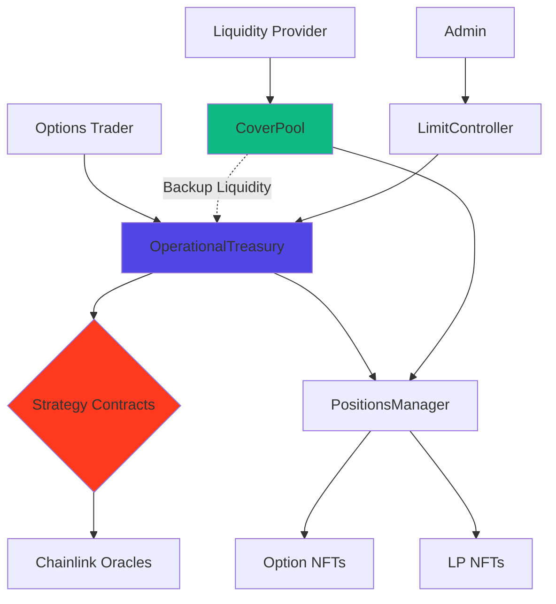

# Architecture

Technical overview of MegaFi's system architecture. Understand how pool-based options trading works with USDC-only liquidity and epoch-based profit distribution.

## At a Glance

- USDC-only architecture for simplified risk management
- Pool-based liquidity model with OperationalTreasury and CoverPool
- 7-day epoch system for fair profit distribution
- Options as ERC721 NFTs for composability
- Real-time pricing via Chainlink oracles
- Optimized for MegaETH's continuous execution

## System Overview



## USDC-Only Architecture

### Core Concept

MegaFi uses a single-asset model for simplicity and transparency:

```
Traditional Options Platforms:
- Multiple collateral types
- Complex conversion mechanisms
- Impermanent loss risks
- Price exposure to multiple assets

MegaFi:
- USDC only
- No conversion needed
- No impermanent loss (for options)
- Pure 1:1 accounting
```

### Benefits

**For Traders**:
- Simple premium calculation (USDC)
- Simple profit settlement (USDC)
- No token price risk
- Easy to understand P&L

**For LPs**:
- Deposit USDC, earn USDC
- No impermanent loss from token conversion
- Transparent 1:1 accounting
- Predictable returns

**For Protocol**:
- Simplified liquidity management
- Clear solvency metrics
- Easy risk calculations
- Reduced attack surface

## Core Components

### OperationalTreasury

**Purpose**: Central hub managing option lifecycle.

```
Responsibilities:
1. Accept option purchases
2. Lock liquidity for options
3. Manage premium collection
4. Execute settlements
5. Coordinate with CoverPool
```

**Key State**:
```
- Current USDC balance
- Total locked liquidity
- Locked premium amounts
- Per-strategy locked amounts
- Benchmark reserve target
```

**Safety Checks**:
```
Before Option Purchase:
√ Strategy approved?
√ Duration valid?
√ Sufficient liquidity?
√ Strategy limit not exceeded?
```

[Smart Contracts →](../technical/smart-contracts.md)

### CoverPool

**Purpose**: LP liquidity pool providing backup USDC and profit distribution.

```
Responsibilities:
1. Accept LP deposits
2. Provide backup liquidity to Treasury
3. Calculate and distribute profits
4. Manage epoch cycles
5. Handle LP withdrawals
```

**Key State**:
```
- Total USDC deposited
- Total shares issued
- Cumulative profit per share
- Current epoch number
- Withdrawal queue
```

**Profit Distribution**:
```
Weekly Profits:
70% → LPs (via CoverPool)
20% → Treasury (benchmark growth)
10% → Protocol (development)
```

### Strategy Contracts

**Purpose**: Implement pricing and payoff logic for option types.

```
8+ Strategy Types:
- HegicStrategyCall (ETH, BTC)
- HegicStrategyPut (ETH, BTC)
- HegicStrategyStraddle (ETH, BTC)
- HegicStrategyStrangle (ETH, BTC)
- HegicStrategySpreadCall
- HegicStrategySpreadPut
- Inverse strategies
```

**Each Strategy Provides**:
```
1. Premium calculation (Black-Scholes)
2. Payoff calculation
3. Exercise validation
4. Strategy-specific parameters
```

**Integration**:
```
Strategy → Chainlink Oracle
  ↓
Current Price
  ↓
Black-Scholes Calculation
  ↓
Premium (positivePNL)
Max Loss (negativePNL)
```

### PositionsManager

**Purpose**: ERC721 NFT manager for all positions.

```
Manages:
- Option NFTs (trader positions)
- LP NFTs (provider positions)

Benefits:
- Transferable positions
- Composable with DeFi
- Standard ERC721 interface
- On-chain ownership proof
```

### LimitController

**Purpose**: Enforce per-strategy exposure limits.

```
Configuration Example:
ETH Call: 50,000 USDC max
ETH Put: 50,000 USDC max
BTC Call: 30,000 USDC max

Prevents over-concentration
Admin configurable
Checked on every purchase
```

## Actor Flows

### Options Trader Flow

```
Purchase Flow:
1. Trader selects strategy + parameters
2. Frontend calls strategy.calculateNegativepnlAndPositivepnl()
3. Premium displayed
4. Trader approves USDC
5. Trader calls treasury.buy()
6. Premium transferred to Treasury
7. Liquidity locked (negativePNL)
8. Option NFT minted to trader
9. Position active

Exercise Flow:
1. Option enters exercise window (1h before expiry)
2. Trader calls treasury.payOff()
3. Strategy calculates profit
4. Treasury checks balance
5. If insufficient: CoverPool.payOut(deficit)
6. Profit transferred to trader
7. NFT burns
8. Liquidity unlocked

Auto-Exercise Flow:
1. Option reaches expiration
2. System checks if ITM
3. If profitable: Automatically execute payOff()
4. Transfer profit to holder
5. Clean up state
```

### Liquidity Provider Flow

```
Provide Flow:
1. LP approves USDC
2. LP calls coverPool.provide(amount, positionId)
3. Check within entry window (first 5 days of epoch)
4. USDC transferred to CoverPool
5. Share calculated: (amount × totalShare) / totalUSDC
6. LP NFT minted or updated
7. LP earns from premiums

Earn Flow (continuous):
1. Options traders pay premiums → Treasury
2. Options exercised → Payouts from Treasury
3. Weekly: Admin calculates net profit
4. Profit distribution:
   - 70% transferred to CoverPool
   - 20% retained in Treasury
   - 10% protocol fee
5. CoverPool updates cumulativeProfit
6. LP's earnings accrue automatically

Claim Flow:
1. LP calls coverPool.claim(positionId)
2. Calculate claimable: buffered + new profits
3. Transfer USDC to LP
4. Update LP's cumulative point
5. Reset buffered amount

Withdraw Flow (2-step):
Step 1 - Request:
1. LP calls coverPool.withdraw(positionId, amount)
2. Check within withdrawal window (first 5 days)
3. Mark shares for withdrawal in current epoch
4. Wait for epoch to close (minimum 7 days)

Step 2 - Complete:
1. Epoch closes (admin calls fixProfit())
2. LP calls coverPool.withdrawEpoch(positionId, [epochs])
3. Calculate USDC + profits to return
4. Transfer funds to LP
5. Reduce LP's share
```

## Epoch System

### 7-Day Profit Cycles

```
Epoch Timeline:

Day 0 (Monday):      Epoch starts
Day 0-5:             Entry/Exit window OPEN
                     - LPs can deposit
                     - LPs can request withdrawals
Day 5-7:             Entry/Exit window CLOSED
                     - No deposits allowed
                     - No withdrawal requests allowed
Day 7 (Monday):      Admin calls fixProfit()
                     - Calculate net profit
                     - Update cumulativeProfit
                     - Close current epoch
                     - Start next epoch
                     Cycle repeats
```

### Why Epochs?

**Fair Profit Distribution**:
```
Without epochs:
- LPs could deposit right before profit distribution
- Claim profits without bearing risk
- Withdraw immediately (gaming)

With epochs:
- Must be in pool during active period
- Cannot instant withdraw
- Fair share based on time in pool
```

**Capital Stability**:
```
Two-step withdrawal ensures:
- Liquidity remains stable
- Options can be backed reliably
- No bank run scenarios
- Predictable liquidity
```

### Epoch Mechanics

**fixProfit() Function**:
```
Called weekly by admin:

1. Calculate profit:
   profit = balance - profitTokenBalance

2. Update cumulative:
   cumulativeProfit += (profit / totalShare)

3. Close current epoch:
   epoch[currentEpoch].cumulativePoint = cumulativeProfit

4. Process withdrawals:
   - Calculate each withdrawal's share of profits
   - Mark USDC available for claim

5. Start next epoch:
   currentEpoch++
   epoch[currentEpoch].start = block.timestamp
```

## Transaction Lifecycle

### Option Purchase

```
Step-by-Step:

1. User Interface:
   - User enters parameters (amount, duration)
   - Frontend queries strategy premium
   - Display quote to user

2. Approval:
   - User approves USDC spending
   - Transaction confirmed

3. Purchase:
   - User calls treasury.buy()
   - Treasury validates request
   - Strategy.create() called
   - Returns: expiration, positivePNL, negativePNL

4. Treasury Actions:
   - Transfer premium (positivePNL) from user
   - Lock liquidity (negativePNL) internally
   - Update lockedByStrategy mapping
   - Update totalLocked

5. NFT Minting:
   - PositionsManager.mint(holder)
   - Store option data in LockedLiquidity struct
   - Return option ID

6. Event Emission:
   - Emit Acquired event
   - Contains: optionId, strategy, holder, amount, premium

7. Indexer Capture:
   - Event captured by indexer
   - Stored in database
   - Available for frontend query

8. UI Update:
   - WebSocket pushes update
   - Portfolio refreshes
   - Position displayed

Total Time: 10-50ms on MegaETH
```

### Option Exercise

```
Step-by-Step:

1. Exercise Window Opens:
   - 1 hour before expiry
   - User can manually exercise

2. Manual Exercise:
   - User calls treasury.payOff(optionId, account)
   - Or: Auto-exercise at expiration if ITM

3. Treasury Actions:
   - Verify within window or at expiry
   - Get LockedLiquidity data
   - Call strategy.payOffAmount(optionId)

4. Strategy Calculation:
   - Query Chainlink for current price
   - Calculate profit: max(0, currentPrice - strike)
   - Return profit amount

5. Settlement:
   - Check Treasury balance
   - If balance ≥ profit: Pay directly
   - If balance < profit:
     * deficit = profit - balance
     * Call coverPool.payOut(deficit)
     * CoverPool transfers USDC
   - Transfer full profit to account

6. Cleanup:
   - Unlock liquidity (negativePNL)
   - Update totalLocked
   - Update lockedByStrategy
   - Burn or mark NFT as exercised

7. Event Emission:
   - Emit Paid event
   - Contains: optionId, account, amount

Total Time: 10-100ms on MegaETH
```

## Data Flow

### Real-Time State Updates

```
MegaETH Advantage:

Traditional Blockchain (12s blocks):
Action → Wait for block → Event emitted → Query → UI Update
Total: 12+ seconds

MegaETH (<10ms finality):
Action → Immediate finality → Event emitted → WebSocket push → UI Update
Total: 50-100ms

Result: Near-instant feedback
```

### Event Architecture

```
Smart Contract Events:
├── Treasury Events
│   ├── Acquired (option purchased)
│   ├── Paid (option exercised)
│   └── Expired (option expired)
├── CoverPool Events
│   ├── Provided (LP deposited)
│   ├── Withdrawn (LP withdrew)
│   ├── Paid (LP claimed profits)
│   └── EpochClosed (epoch ended)
└── Transfer Events (ERC721)
    ├── Transfer (NFT moved)
    ├── Approval (NFT approved)
    └── ApprovalForAll (operator approved)

Indexer Pipeline:
1. Listen to all events
2. Parse event data
3. Store in database
4. Update aggregates
5. Push via WebSocket
6. Serve via API
```

## Security Architecture

### Multi-Layer Protection

```
Layer 1 - Input Validation:
- Parameter bounds checking
- Address validation
- Amount sanity checks

Layer 2 - Access Control:
- Role-based permissions
- Owner-only functions
- Treasury-only functions

Layer 3 - Reentrancy Guards:
- nonReentrant modifiers
- Checks-Effects-Interactions pattern

Layer 4 - Liquidity Safety:
- Strategy limits
- Treasury balance checks
- CoverPool backup

Layer 5 - Time Constraints:
- Exercise windows
- Epoch boundaries
- Expiration enforcement

Layer 6 - Oracle Protection:
- Chainlink price feeds
- Staleness checks
- Multiple data sources
```

### Solvency Guarantees

```
Protocol Solvency Formula:

Available = Treasury Balance + CoverPool Available
Required = Total Locked + Locked Premium + Benchmark

Invariant: Available ≥ Required

Checked on:
- Every option purchase
- Every withdrawal from Treasury
- Every admin operation

If violated: Transaction reverts
```

## Performance Optimizations

### MegaETH-Specific

**Continuous Execution**:
```
Traditional: Batch transactions every 12s
MegaETH: Process transactions continuously

Benefit: No queueing, instant execution
```

**Real-Time Greeks**:
```
Traditional: Greeks stale between blocks
MegaETH: Greeks update continuously

Benefit: Accurate risk metrics always
```

**Instant Settlement**:
```
Exercise option:
0ms: Submit transaction
5ms: Execute payoff calculation
8ms: Transfer USDC
10ms: Confirmed

Traditional: 15-30 seconds minimum
```

### Gas Optimizations

**Storage Packing**:
```solidity
struct LockedLiquidity {
    LockedLiquidityState state;  // 1 byte
    IHegicStrategy strategy;     // 20 bytes
    uint128 negativepnl;         // 16 bytes
    uint128 positivepnl;         // 16 bytes
    uint32 expiration;           // 4 bytes
}
// Optimized to 3 storage slots
```

**View Functions**:
```solidity
// Zero gas cost
function calculateNegativepnlAndPositivepnl(...)
    external
    view
    returns (uint128, uint128);
```

**Batch Operations**:
```
Multicall support:
- Query multiple positions
- Execute multiple claims
- Save gas vs individual calls
```

## Monitoring and Observability

### Key Metrics

**Protocol Health**:
```
- Treasury USDC balance
- CoverPool USDC balance
- Total locked liquidity
- Available liquidity
- Number of active options
- Number of active LPs
```

**Risk Metrics**:
```
- Per-strategy utilization
- Largest single position
- Options approaching expiry
- Pending withdrawals
- Epoch progress
```

**Business Metrics**:
```
- Total Value Locked (TVL)
- Daily volume
- Premium collected
- Options exercised
- LP profits distributed
```

### Alerts

```
Critical Alerts:
- Liquidity approaching limits
- Large option purchases
- Treasury balance low
- CoverPool backup activated
- Unusual activity patterns

Info Alerts:
- Epoch ending soon
- Exercise windows opening
- New LP deposits
- Profit distribution completed
```

## Future Enhancements

**Planned Improvements**:

- Additional strategy types
- Cross-chain options
- Automated market making
- Decentralized limit adjustment
- Governance integration
- Advanced risk management

## FAQ

**Why USDC-only?**  
Simplicity, no impermanent loss, transparent accounting, reduced risk.

**Can I use other stablecoins?**  
Not currently. USDC is the single accepted collateral.

**What if USDC depegs?**  
Protocol uses USDC as unit of account. Depeg affects all positions equally.

**How does CoverPool prevent losses?**  
Strategy limits, benchmark reserves, and LP risk-sharing ensure solvency.

**Can epochs be changed?**  
Duration is 7 days minimum (hardcoded constant). Admin can adjust window size.

**Are contract names final?**  
Yes. Names like "HegicStrategy" and "OperationalTreasury" are the actual deployed contract names from the audited codebase.

## Next Steps

Explore technical details:

- [Smart Contracts](../technical/smart-contracts.md) - Contract specifications
- [Contract Addresses](../technical/contract-addresses.md) - Deployed addresses
- [Security Audits](../technical/security-audits.md) - Security information

---

**Built for speed. Designed for simplicity.**

