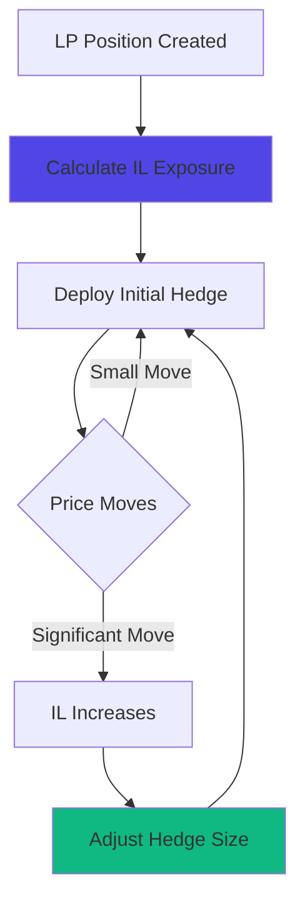

# Hedging Strategies

Protect your portfolio from adverse price movements using options-based hedging strategies. Learn how to hedge liquidity positions, token holdings, and manage overall portfolio risk.

## At a Glance

- Hedge LP positions against impermanent loss
- Protect token holdings from downside
- Generate income while maintaining protection
- Combine multiple strategies for complex risk profiles
- Automated hedging available through CLM integration
- Real-time hedge effectiveness tracking

## Why Hedge?

### Risk Without Hedging

```
LP Position: $20k in ETH/USDC
ETH drops 30%: $2,000 → $1,400

Impermanent Loss: -$1,800
LP Fees Earned: +$200
Net Loss: -$1,600

Unhedged portfolio suffers full IL
```

### Risk With Hedging

```
LP Position: $20k in ETH/USDC
Hedge: Buy 5 ETH puts at $1,800 for $250

ETH drops 30%: $2,000 → $1,400

Impermanent Loss: -$1,800
LP Fees Earned: +$200
Put Option Gain: +$2,000
Hedge Cost: -$250
Net: +$150

Hedged portfolio protected and profitable
```

## Core Hedging Strategies

### Protective Put

Buy put options to protect holdings:

**Use Case**: Hold tokens long-term but want downside protection.

**Setup**:
```
Hold: 10 ETH at $2,000
Buy: 10 ETH $1,800 puts (30 days)
Cost: $50 per contract = $500
```

**Payoff**:
```
ETH at $1,500:
- Holding loss: -$5,000
- Put gain: +$3,000
- Net cost: $500 premium
- Total loss: -$2,500 (50% protected)

ETH at $2,500:
- Holding gain: +$5,000
- Put expires: -$500
- Net gain: +$4,500
```

**When to Use**:
- Uncertain short-term outlook
- Want to hold through volatility
- Can afford protection cost (2.5% in this example)

### Covered Call

Sell call options against holdings for income:

**Use Case**: Generate yield on holdings you're willing to sell at higher price.

**Setup**:
```
Hold: 10 ETH at $2,000
Sell: 10 ETH $2,200 calls (30 days)
Income: $80 per contract = $800
```

**Payoff**:
```
ETH at $1,800:
- Holding loss: -$2,000
- Call premium: +$800
- Net loss: -$1,200 (income cushioned fall)

ETH at $2,100:
- Holding gain: +$1,000
- Call premium: +$800
- Net gain: +$1,800

ETH at $2,500:
- Capped at $2,200
- Gain: $2,000
- Plus premium: +$800
- Total: +$2,800
- Missed: $3,000 vs unhedged
```

**When to Use**:
- Neutral to slightly bullish
- Comfortable capping upside
- Want to generate income (4% monthly in this example)

### Collar

Combine protective put and covered call for zero or low-cost protection:

**Use Case**: Free or low-cost downside protection in exchange for capping upside.

**Setup**:
```
Hold: 10 ETH at $2,000
Buy: 10 ETH $1,800 puts for $50 each = $500
Sell: 10 ETH $2,200 calls for $80 each = $800
Net Credit: $300 received
```

**Payoff**:
```
ETH at $1,500:
- Floor at $1,800 (put protection)
- Max loss: $2,000 - $1,800 = $200 per ETH
- Plus net credit: $30 per ETH
- Net: -$170 per ETH loss
- Received $300 to protect $20k position

ETH at $2,100:
- Holding gain: $1,000
- Plus net credit: $300
- Total: +$1,300

ETH at $2,500:
- Capped at $2,200
- Gain: $2,000
- Plus credit: $300
- Total: +$2,300
```

**When to Use**:
- Want protection but premium too expensive
- Comfortable with range-bound returns
- Ideal when put premiums high (can finance with calls)

## LP-Specific Hedging

### Hedging Impermanent Loss

LP positions face IL. Options can offset:

**Scenario**:
```
LP Position: $20k in ETH/USDC (10 ETH equiv at $2,000)
Risk: IL if ETH price moves significantly
```

**Strategy 1: Straddle Hedge**
```
Buy: 5 ETH $2,000 call
Buy: 5 ETH $2,000 put
Cost: $195 per set × 5 = $975

Protection: IL offset by option gains
Works for moves in either direction
```

**Strategy 2: Asymmetric Hedge**
```
If bullish bias:
Buy: 3 ETH $1,800 puts (downside protection)
Cost: $150

Let upside run (no cap)
Cheaper than straddle
```

**Strategy 3: Ratio Hedge**
```
Buy: 10 ETH $1,900 puts
Sell: 5 ETH $1,700 puts
Net Cost: $250

Protected down to $1,900
Partial protection down to $1,700
Lower cost than outright puts
```

### Dynamic LP Hedging

Adjust hedge as position evolves:



**Rules**:
- Rehedge when IL > $500
- Maintain hedge ratio: $1 hedge per $20 IL exposure
- Roll expiring hedges automatically

Automated through CLM integration.

## Portfolio Hedging

### Multi-Asset Portfolio

Hedge entire portfolio efficiently:

**Portfolio**:
```
10 ETH at $2,000 = $20,000
5 WBTC at $40,000 = $200,000
$50,000 in LP positions
Total: $270,000
```

**Strategy: Coordinated Hedging**
```
Instead of hedging each asset separately:
Buy protective puts on largest holdings
Coordinate strikes and expirations
Use covered calls to offset costs

Protection: Major portfolio components
Cost: More efficient than uncoordinated approach
Benefit: Simplified management
```

**Strategy: Tail Risk Hedge**
```
Buy OTM puts on largest holdings:
5 ETH $1,500 puts (25% OTM): $150
3 WBTC $30,000 puts (25% OTM): $300
Total: $450

Protects against catastrophic loss
Cheap (0.17% of portfolio)
Lets normal volatility play out
```

### Beta-Weighted Hedging

Hedge based on portfolio beta:

```
Portfolio Beta vs ETH: 0.7
Portfolio Value: $100,000
Effective ETH Exposure: $70,000 (35 ETH equiv)

Hedge:
Buy 35 ETH puts at desired strike
Hedges portfolio as if it were 35 ETH
More efficient than individual asset hedges
```

## Advanced Strategies

### Portfolio Rebalancing with Options

Use options to adjust portfolio exposure:

```
Scenario: Portfolio too heavy in ETH
Want to reduce exposure without selling

Strategy: Sell covered calls on portion of ETH
- Generate income from premium
- Reduce upside exposure
- Maintain long-term position

If assigned: ETH sold at profit
If not assigned: Keep premium and ETH
```

**Note**: Advanced strategies like delta hedging, gamma scalping, and volatility arbitrage require sophisticated trading infrastructure and may be added in future releases. Current focus is on accessible hedging strategies for all users.

## Hedge Monitoring

### Key Metrics

**Hedge Ratio**: Hedge value / Position value
```
Target: 0.5 - 1.0 (50-100% hedged)
< 0.3: Underhedged
> 1.2: Overhedged
```

**Hedge Effectiveness**: % of loss offset by hedge
```
Position Loss: -$1,000
Hedge Gain: -$800
Effectiveness: 80%

Target: > 70%
```

**Cost Efficiency**: Hedge cost / Protection provided
```
Annual Cost: $600
Protection: $20,000 position
Cost: 3% annual
```

### Rebalancing Hedges

When to adjust:

**Price Moves Significantly**: Delta changes, adjust hedge size.

**Volatility Changes**: IV up = more expensive hedges, consider adjusting.

**Time Decay**: Theta erodes value, roll to later expiration.

**Position Size Changes**: Added/removed assets, adjust hedge accordingly.

## Cost Management

### Reducing Hedge Costs

**1. Use Spreads Instead of Outright**:
```
Protective Put: $500
Put Spread (buy $1,800, sell $1,600): $300
Savings: $200 (40% cheaper)
Trade-off: Protection only down to $1,600
```

**2. Finance with Income**:
```
Buy puts: -$500
Sell calls: +$800
Net: +$300 (paid to hedge)
```

**3. Use OTM Strikes**:
```
ATM put ($2,000 strike): $100
5% OTM put ($1,900 strike): $50
10% OTM put ($1,800 strike): $30

Accept some loss, protect catastrophic
```

**4. Longer Durations**:
```
30-day put: $50
90-day put: $120
Cost per day: $1.67 vs $1.33
Save 20% annualized
```

## Strategy Selection

### By Market View

**Bullish**:
- Covered calls (income)
- Cash-secured puts (acquire at discount)
- No puts (let upside run)

**Neutral**:
- Collar (protection + income)
- Covered calls (steady income)
- Iron condor (range-bound profit)

**Bearish**:
- Protective puts (full protection)
- Reduce exposure + smaller hedge

**Uncertain**:
- Straddle (profit from movement)
- Collar (protect range)
- Full hedge (sleep well)

### By Risk Tolerance

**Conservative** (risk-averse):
```
Strategy: Full protective puts or collar
Protection: 90-100%
Cost: 3-5% annual
```

**Moderate** (balanced):
```
Strategy: Partial hedge or collar
Protection: 50-75%
Cost: 1.5-3% annual
```

**Aggressive** (risk-seeking):
```
Strategy: Tail risk only or no hedge
Protection: 25-50% catastrophic only
Cost: 0.5-1% annual
```

## FAQ

**How much of my portfolio should I hedge?**  
Depends on risk tolerance. Conservative: 80-100%. Moderate: 50-75%. Aggressive: 25-50%.

**When should I hedge?**  
Before major uncertainty, when vol is cheap, or continuously as risk management.

**Can hedging lose money?**  
Yes. If price doesn't move as expected, premium is lost. That's the insurance cost.

**Should I hedge short-term or long-term?**  
Longer-term hedges have better cost efficiency but lock capital longer.

**Can hedging be automated?**  
Vault-based strategies (covered calls, cash-secured puts) are automated. Manual hedges (protective puts) require user management or can be integrated with CLM strategies.

**Do I need to hedge if I'm long-term holder?**  
Not required, but can reduce drawdowns and sleep-better factor.

## Next Steps

Implement hedging strategies:

- [Options Trading](options-trading.md) - Execute hedging trades
- [Risk Management](risk-management.md) - Set risk parameters
- [Pricing Models](pricing-models.md) - Understand hedge costs

---

**Protect what you've built.**

