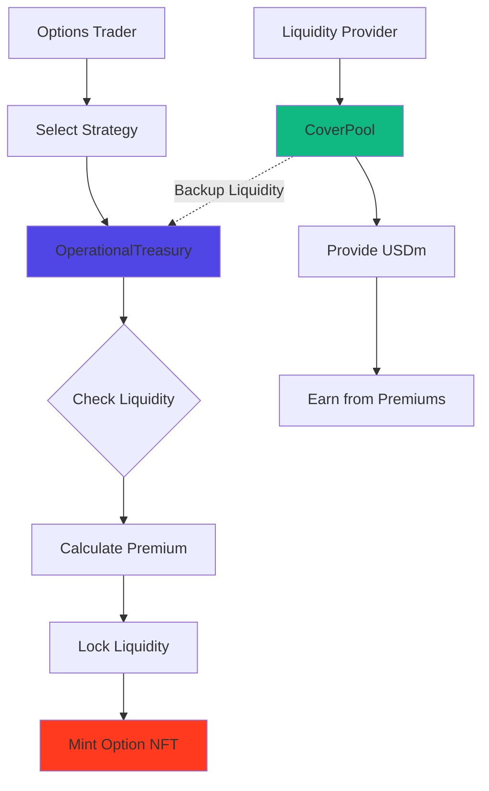

# Hedge

Real-time options trading powered by pool-based liquidity on MegaETH. Hedge enables sophisticated risk management and speculation through on-chain options with instant execution and transparent pricing.

## At a Glance

- Trade options on major token pairs with sub-10ms execution
- Pool-based liquidity model with USDm-only architecture
- 8 strategy types: calls, puts, straddles, strangles, and spreads
- Options positions as tradeable ERC721 NFTs
- Real-time Greeks calculations updated continuously
- Hedge liquidity positions, protect holdings, or speculate on volatility

## How It Works



**Hedge combines pool-based liquidity with on-chain options**:

1. **Liquidity Providers**: Deposit USDm into CoverPool to earn 70% of protocol profits from option premiums.

2. **Options Traders**: Purchase options by paying premiums in USDm. Liquidity is locked from OperationalTreasury to back the option.

3. **Exercise & Settlement**: When options are exercised, profits are paid from Treasury. CoverPool provides backup liquidity if needed.

All powered by MegaETH's sub-10ms execution for instant settlement and real-time position management.

## Why Use Hedge?

### Protect Liquidity Positions

Liquidity providers face impermanent loss risk. Hedge enables protection:

```
Scenario: Provide liquidity to ETH/USDm pool
Risk: ETH price drops, causing IL

Solution: Buy ETH put options
- If ETH drops: Put gains offset IL
- If ETH rises: Small premium paid, but LP fees continue
- Net: Downside protected, upside preserved
```

### Generate Leveraged Exposure

Options provide capital-efficient market exposure:

```
Scenario: Bullish on ETH
Strategy: Buy ETH call options

- Control 10 ETH with $500 premium (vs $20,000 to buy)
- Maximum loss: $500 (premium paid)
- Profit potential: Unlimited upside
- Capital efficiency: 97.5% less capital required
```

### Speculate on Volatility

Trade options for volatility exposure:

```
Scenario: Expect ETH volatility spike
Strategy: Buy straddle (call + put at same strike)

- If large move either direction: Profit from winning leg
- If price stays flat: Lose premiums
- Capital efficient volatility exposure
```

## Core Features

### Options Trading

**Available Strategies**:
- **Calls**: Right to buy token at strike price
- **Puts**: Right to sell token at strike price
- **Straddles**: Call + Put at same strike (volatility play)
- **Strangles**: Call + Put at different strikes (wide volatility play)
- **Spreads**: Multiple options to cap risk and reward

**How Trading Works**:
1. Select strategy (e.g., ETH Call)
2. Input parameters (amount, duration)
3. System calculates premium via strategy contract
4. Approve USDm spending
5. Purchase option
6. Receive option as ERC721 NFT
7. Exercise during exercise window (1 hour before expiry)

Available durations: 1 day to 30 days.

[Options trading guide →](options-trading.md)

### Pool-Based Liquidity

**USDm-Only Architecture**:

MegaFi uses a single-asset liquidity model:
- Liquidity providers deposit USDm
- Options traders pay premiums in USDm
- All settlements happen in USDm
- No token conversion, no impermanent loss for options

**OperationalTreasury**:
- Holds USDm reserves for option backing
- Locks liquidity when options are purchased
- Pays profits when options are exercised
- Manages risk through per-strategy limits

**CoverPool**:
- LP-provided USDm reserve pool
- Earns 70% of net protocol profits
- Provides backup liquidity for large payouts
- Weekly profit distribution via 7-day epochs

### NFT-Based Positions

Options are ERC721 tokens:

**Benefits**:
- Transferable: Sell option before expiry
- Composable: Use as collateral in other protocols
- Transparent: All data on-chain
- Tracked: Single position ID for entire lifecycle

**Position Ownership**:
```
Option Purchased → NFT Minted → Transfer/Hold/Exercise → NFT Burns
```

Each NFT contains option parameters (strike, expiry, size, strategy).

### Real-Time Greeks

Track option risk metrics in real-time:

**Delta**: Price sensitivity. How much option value changes per $1 token move.

**Gamma**: Delta sensitivity. How delta changes as price moves.

**Theta**: Time decay. How much value lost per day.

**Vega**: Volatility sensitivity. How value changes with volatility.

**Rho**: Interest rate sensitivity. Usually minimal in DeFi.

MegaETH's continuous execution enables Greeks updates with every swap and price change, not just every block.

### Exercise Mechanics

**Exercise Window**: Options have a 1-hour exercise window before expiry.

**Auto-Exercise**: In-the-money options auto-exercise at expiration.

**Manual Exercise**: Exercise early during the window if profitable.

```
Option Lifecycle:
Created → Active Period → Exercise Window (1h) → Expiry
                           └─ Can exercise here
```

**Settlement**:
1. Calculate profit based on current price vs strike
2. Transfer profit in USDm
3. Unlock liquidity from Treasury
4. Burn NFT

## Option Mechanics

### Buying Options

1. Navigate to Hedge → Options
2. Select strategy type (Call, Put, etc.)
3. Choose underlying asset (ETH, BTC)
4. Enter amount (e.g., 1 ETH)
5. Select duration (e.g., 7 days)
6. Review premium calculation
7. Approve USDm spending
8. Confirm purchase
9. Receive option NFT

Premium paid upfront. Maximum loss = premium paid.

### Selling Options

Advanced users can sell options to earn premiums:

1. Select strategy and parameters
2. Deposit required collateral
3. Receive premium immediately
4. Collateral locked until expiry or buyback

**Collateral Requirements**:
- **Covered Calls**: Must own underlying tokens
- **Cash-Secured Puts**: Must hold USDm equal to strike value

Risk: Obligation to deliver if exercised.

### Exercising Options

**During Exercise Window**:
1. Option becomes exercisable 1 hour before expiry
2. Click "Exercise" on in-the-money option
3. System calculates profit
4. USDm profit transferred to wallet
5. NFT burns

**Auto-Exercise**:
- System exercises profitable options at expiration
- No manual intervention needed
- Optimal execution guaranteed

## Pricing & Premiums

Options priced using Black-Scholes model:

### Premium Inputs

**Underlying Price**: Real-time from Chainlink oracles.

**Strike Price**: Exercise price selected by trader.

**Time to Expiration**: Duration selected (1-30 days).

**Implied Volatility**: Market expectation of future volatility.

**Risk-Free Rate**: DeFi lending rates (minimal impact).

### On-Chain Calculation

```
Premium Calculation Flow:
1. User inputs parameters
2. Strategy contract queries Chainlink for current price
3. Black-Scholes calculation executed on-chain
4. Premium returned instantly
5. User reviews and confirms
```

Transparent, deterministic pricing with no intermediaries.

[Pricing details →](pricing-models.md)

## Hedging Strategies

### Protective Put

Buy put to protect holdings:

```
Position: Hold 10 ETH at $2,000
Hedge: Buy 10 ETH puts at $1,800 (30 days)
Cost: $50 premium per ETH = $500 total

Outcome:
- ETH drops to $1,500: Put value = $3,000, loss offset
- ETH rises to $2,500: Put expires, participate in upside
- Max downside: $200/ETH + $50 premium = $250/ETH
```

### Covered Call

Sell call against holdings for income:

```
Position: Hold 10 ETH at $2,000
Strategy: Sell 10 ETH calls at $2,200 (30 days)
Income: $80 premium per ETH = $800 total

Outcome:
- ETH stays below $2,200: Keep ETH + $800 premium
- ETH rises above $2,200: Sell ETH at $2,200 + keep $800
- Additional yield: $800 / $20,000 = 4% monthly = 48% APY
```

### Collar

Combine protective put and covered call:

```
Position: Hold 10 ETH at $2,000
Buy: 10 ETH puts at $1,800 ($50 premium)
Sell: 10 ETH calls at $2,200 ($80 premium)
Net Credit: $30 per ETH = $300 total

Outcome:
- Downside capped at $1,800
- Upside capped at $2,200
- Net cost: Negative (received $300)
- Protected position with income
```

### LP Hedging

Protect liquidity positions:

```
LP Position: $20k in ETH/USDm pool
Risk: IL if ETH moves significantly

Hedge: Buy straddle (call + put at $2,000)
Cost: $100 per ETH = $500 for 5 ETH worth

Outcome:
- Large move either direction: Option gains offset IL
- Small moves: LP fees > option premium
- Protected LP position with capped cost
```

[More strategies →](hedging-strategies.md)

## Risk Management

### Strategy Limits

Each strategy has exposure limits:

```
Per-Strategy Limit: 20,000 USDm (example)
Total Protocol Limit: Managed via LimitController
```

Prevents over-concentration and ensures sufficient backing liquidity.

### Treasury Safety

**Before Option Purchase**:
- Strategy must be approved
- Duration within allowed range (1-30 days)
- Treasury + CoverPool liquidity sufficient
- Strategy limit not exceeded

**CoverPool Backup**:
- Provides additional USDm if Treasury insufficient
- Earns from protocol profits
- Acts as safety net for large payouts

### Collateral Requirements

Selling options requires collateral:

**Covered Options**:
```
Sell ETH call: Hold 1 ETH per contract
Sell ETH put: Hold strike price worth of USDm per contract
```

**Maintenance**:
- Collateral locked until expiry or position closed
- System ensures solvency throughout

[Risk controls →](risk-management.md)

## Hedge on MegaETH

### Real-Time Greeks

Traditional chains update Greeks every block (12 seconds). MegaETH updates continuously:

```
Traditional Chain:
Price: $2,000 (stale for 8 seconds)
Delta: 0.55 (calculated at last block)
Risk: Positions may be mishedged

MegaETH:
Price: $2,000.43 (real-time)
Delta: 0.5523 (recalculated continuously)
Risk: Perfect hedge maintenance
```

### Sub-10ms Exercise

Exercise and settle options instantly:

```
ITM Option at Expiration:
Submit exercise: 0ms
Verify position: 2ms
Calculate payout: 1ms
Transfer USDm: 5ms
Total: 8ms

Traditional: 15-30 seconds
```

### Instant Premium Calculation

On-chain pricing without delay:

```
Parameter input → Chainlink price query → Black-Scholes calculation → Premium display
Total latency: < 50ms
```

### High-Frequency Hedging

Real-time execution enables dynamic hedging:

```
Price change detected → Greeks recalculated → Hedge adjustment → Executed
All in < 100ms
```

## Liquidity Provider Benefits

### Earn from Premiums

LPs earn 70% of net protocol profits:

```
Weekly Profit Distribution:
- 70% → CoverPool (for LPs)
- 20% → Treasury (for reserves)
- 10% → Protocol (for development)
```

### Epoch System

7-day profit distribution cycles:

```
Day 0-5: Entry/Exit window (can deposit/withdraw)
Day 5-7: Locked period (no changes)
Day 7: fixProfit() called → Profits distributed
```

### No Impermanent Loss

USDm-only model eliminates IL:

```
Deposit: 10,000 USDm
Withdrawal: Principal + Profits (all in USDm)
No token conversion, no price risk
```

## Composability

### With DEX

Hedge LP positions automatically:

```
Strategy:
1. Provide liquidity to ETH/USDm
2. Buy protective puts from Hedge
3. LP fees help offset put premium
4. Downside protected LP position
```

### With Auto-Pools

Combine automated liquidity management with hedging:

```
Setup:
1. Deploy aggressive strategy mode (narrow zones)
2. Hedge with options to cap IL
3. Earn high fees with protected downside
```

## FAQ

**What options strategies are available?**  
8 strategies: Call, Put, Straddle, Strangle, Call Spread, Put Spread, and 2 inverse spreads.

**Are options physically or cash-settled?**  
Cash-settled in USDm. You receive profit in USDm, not the underlying token.

**Can I close options before expiration?**  
Yes. Options are ERC721 NFTs and can be transferred or sold on secondary markets.

**What happens if I don't exercise ITM options?**  
System auto-exercises at expiration. You don't lose value.

**When can I exercise options?**  
During the 1-hour exercise window before expiry. Auto-exercise occurs at expiration for ITM options.

**What's the minimum trade size?**  
Varies by strategy. Typically 0.1 ETH or equivalent.

**Are contracts audited?**  
Built on audited smart contracts. Additional security audits planned before mainnet launch.

**How are premiums calculated?**  
On-chain Black-Scholes model using Chainlink price feeds and configurable volatility parameters.

## Next Steps

Explore Hedge capabilities:

- [Options Trading](options-trading.md) - Trade calls and puts
- [Hedging Strategies](hedging-strategies.md) - Protect your positions
- [Risk Management](risk-management.md) - Understand risk controls
- [Pricing Models](pricing-models.md) - How options are priced

---

**Manage risk. Maximize returns.**
