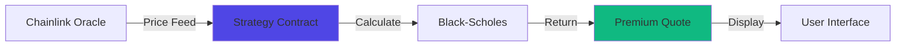

# Pricing Models

Understand how options are priced on MegaFi. Learn the factors that determine option values, how on-chain pricing works, and how to evaluate fair value.

## At a Glance

- Black-Scholes model implemented in strategy contracts
- On-chain premium calculation with transparent parameters
- Real-time pricing updates from Chainlink oracles
- Implied volatility configured per strategy
- Pool liquidity determines available sizes
- Instant quote generation (< 50ms)

## Option Value Components

Options have two value components:

### Intrinsic Value

Value if exercised immediately:

**Call Option**:
```
Intrinsic Value = max(0, Underlying Price - Strike Price)

Example:
ETH at $2,100
Strike: $2,000
Intrinsic Value: $2,100 - $2,000 = $100
```

**Put Option**:
```
Intrinsic Value = max(0, Strike Price - Underlying Price)

Example:
ETH at $1,900
Strike: $2,000
Intrinsic Value: $2,000 - $1,900 = $100
```

Intrinsic value is always ≥ 0. Options with intrinsic value are "in-the-money."

### Time Value

Value from possibility of favorable price movement before expiration:

```
Total Option Value = Intrinsic Value + Time Value

Example:
ETH at $2,000
$2,000 call trading at $120

Intrinsic: $0 (at-the-money)
Time Value: $120
Total Value: $120

Time value decreases as expiration approaches
```

## Black-Scholes Model

Core pricing model implemented in strategy contracts:

### Formula

Call Option Price:

```
C = S × N(d1) - K × e^(-r×T) × N(d2)

Where:
C = Call price
S = Current underlying price
K = Strike price
r = Risk-free rate
T = Time to expiration (years)
N() = Cumulative normal distribution
σ = Implied volatility

d1 = [ln(S/K) + (r + σ²/2) × T] / (σ × √T)
d2 = d1 - σ × √T
```

Put price derived via put-call parity.

### On-Chain Implementation

Strategy contracts implement Black-Scholes:

```
Premium Calculation Flow:

1. User requests quote with parameters:
   - Amount (e.g., 1 ETH)
   - Period (e.g., 7 days)
   - Additional params (e.g., spread for strangles)

2. Strategy contract executes:
   - Query Chainlink for current price
   - Get configured implied volatility
   - Calculate time to expiration
   - Execute Black-Scholes formula
   - Return premium (positivePNL) and max loss (negativePNL)

3. Result returned to user:
   - Premium in USDm (6 decimals)
   - Max potential loss
   - Calculated on-chain, transparent
```

### Pricing Inputs

**Underlying Price (S)**: Real-time from Chainlink oracles.

```
Chainlink Price Feeds:
- ETH/USD: 8 decimal precision
- BTC/USD: 8 decimal precision
- Updates: Multiple times per block
- Source: Aggregated from multiple data providers
```

**Strike Price (K)**: Current spot price at option creation.

```
Strike = Current Chainlink Price
All options are at-the-money at creation
```

**Time to Expiration (T)**: User-selected duration.

```
Minimum: 1 day (86,400 seconds)
Maximum: 30 days (2,592,000 seconds)
Typical: 7 days, 14 days, 30 days

Converted to years: seconds / 31,536,000
```

**Risk-Free Rate (r)**: DeFi lending rate.

```
Typical: 0-5% annually
Impact: Minimal in crypto options
Usually approximated as 0 for simplicity
```

**Implied Volatility (σ)**: Configured per strategy.

```
Strategy Parameter: K (volatility coefficient)
Example: K = 85000000 (represents ~85% annual volatility)

Admin configurable per strategy
Affects premium amount significantly
```

## On-Chain Pricing

### Strategy Contract Calculation

Each strategy implements pricing:

```solidity
// Pseudo-code for strategy pricing

function calculateNegativepnlAndPositivepnl(
    uint256 amount,      // Option size (e.g., 1e18 for 1 ETH)
    uint256 period,      // Duration in seconds
    bytes[] calldata additional  // Extra params
) public view returns (
    uint128 negativepnl,  // Max loss / locked liquidity
    uint128 positivepnl   // Premium to pay
) {
    // 1. Get current price from Chainlink
    uint256 currentPrice = priceProvider.latestRoundData();
    
    // 2. Calculate time factor
    uint256 timeInYears = period / 31536000;
    
    // 3. Get volatility parameter
    uint256 volatility = K; // Strategy-specific
    
    // 4. Execute Black-Scholes
    // ... mathematical calculation ...
    
    // 5. Return premium and max loss
    return (negativepnl, positivepnl);
}
```

### Real-Time Updates

Pricing updates continuously:



**Update Frequency**:
- Chainlink prices: Continuous (sub-second updates)
- Premium calculation: On-demand (instant)
- User quotes: Real-time as parameters change

**MegaETH Advantage**:
MegaETH's sub-10ms finality means pricing and execution happen nearly instantaneously with no stale price risk.

## Implied Volatility

Key parameter in option pricing:

### What Is IV?

Market's expectation of future price volatility:

```
High IV (e.g., 100%):
- Expects large price swings
- Options expensive
- Good for sellers

Low IV (e.g., 40%):
- Expects calm price action
- Options cheap
- Good for buyers
```

### IV Configuration

Set per strategy by protocol:

```
Strategy Parameters:
- K (volatility): Determines IV used in pricing
- Configurable by admin
- Reflects market conditions
- Updated periodically based on realized volatility

Example:
ETH Call Strategy: K = 85000000 (~85% annualized)
ETH Put Strategy: K = 90000000 (~90% annualized)
```

**Admin Adjustable**: IV parameters can be updated to reflect changing market conditions.

### IV and Premium

IV directly affects premium cost:

```
Example: ETH $2,000, 7-day Call

IV 40%: Premium ~$35
IV 60%: Premium ~$65
IV 80%: Premium ~$95
IV 100%: Premium ~$125

Higher volatility → Higher premiums
```

Traders can evaluate if premiums are relatively high or low based on recent volatility.

## Pricing Factors

### Underlying Price

Most significant factor:

```
Call options:
- Price up = Value up
- Price down = Value down

Put options:
- Price up = Value down
- Price down = Value up
```

**Continuous Updates**: Chainlink oracles provide frequent price updates, enabling precise pricing.

### Time Remaining

More time = More value:

```
ETH at $2,000
$2,200 calls:

7 days: $30
14 days: $55
30 days: $90

Longer duration = More opportunity for moves
```

**Time Decay**: Value decreases as expiration approaches.

### Volatility

Higher volatility = Higher value (both calls and puts):

```
ETH at $2,000
7-day ATM call

IV 40%: $45
IV 60%: $75
IV 80%: $105
IV 100%: $135

More volatility = Greater chance of large moves
```

### Amount

Larger positions require more liquidity:

```
ETH Call at $2,000:

0.1 ETH: Premium $8
1 ETH: Premium $80
10 ETH: Premium $800

Linear scaling (generally)
```

**Liquidity Constraint**: Very large orders may approach pool limits.

## Chainlink Price Feeds

### Oracle Integration

Strategy contracts query Chainlink:

```solidity
// Price feed query
(
    uint80 roundId,
    int256 answer,        // Price (8 decimals)
    uint256 startedAt,
    uint256 updatedAt,
    uint80 answeredInRound
) = priceProvider.latestRoundData();

uint256 currentPrice = uint256(answer);
// Example: 200000000000 = $2,000.00 (8 decimals)
```

### Feed Characteristics

**ETH/USD**:
- Decimals: 8
- Update Frequency: Every price deviation or time threshold
- Example: 200000000000 = $2,000.00

**BTC/USD**:
- Decimals: 8
- Update Frequency: Every price deviation or time threshold
- Example: 6500000000000 = $65,000.00

**Reliability**: Chainlink aggregates from multiple data providers for accurate pricing.

### Price Staleness

Safety checks prevent stale prices:

```
Contract Validation:
- Check updatedAt timestamp
- Require recent update (< threshold)
- Revert if price too old

Ensures pricing uses current market data
```

## Premium Quotes

### Getting a Quote

Real-time quote generation:

```
Quote Request Flow:

1. User inputs:
   - Strategy type (Call, Put, Straddle, etc.)
   - Amount (1 ETH)
   - Duration (7 days)

2. Frontend calls:
   strategy.calculateNegativepnlAndPositivepnl(1e18, 604800, [])

3. Contract returns:
   - negativePNL: 200000000 (200 USDm max loss)
   - positivePNL: 80000000 (80 USDm premium)

4. Display to user:
   - Premium: $80.00 USDm
   - Max Loss: $200.00 USDm

Total latency: < 50ms
```

### Quote Validity

Quotes remain valid briefly:

```
Quote Lifespan:
- Generated: On-demand
- Valid: Until next Chainlink update or parameter change
- Execution: Must approve and purchase quickly

Recommended: Review and purchase within 1-2 minutes
```

Price can change if underlying asset moves significantly.

## Greeks Impact on Pricing

### Delta

Option price change per $1 underlying move:

```
Delta 0.5:
- ETH rises $10 → Option value +$5
- ETH falls $10 → Option value -$5

Calls: Delta 0 to 1
Puts: Delta -1 to 0
```

### Gamma

Delta change rate:

```
Gamma 0.02:
- ETH moves $10 → Delta changes by 0.2

High Gamma: Near ATM, short expiry
Low Gamma: Far ITM/OTM, long expiry
```

### Theta

Time decay per day:

```
Theta -2:
- Option loses $2 value per day
- All else equal

Accelerates near expiration
```

### Vega

Volatility sensitivity:

```
Vega 5:
- IV rises 1% → Option value +$5
- IV falls 1% → Option value -$5

Long options: Positive vega
```

Greeks calculated continuously on MegaETH, updated with every relevant state change.

## Evaluating Fair Value

### Historical vs Implied Volatility

Compare IV to recent realized volatility:

```
Historical Volatility (30-day): 55%
Implied Volatility (30-day options): 75%

Analysis: IV > HV suggests options expensive
Strategy: Consider selling options
```

### Premium as % of Underlying

Relative premium cost:

```
ETH at $2,000
7-day call premium: $80

Premium %: $80 / $2,000 = 4%
Annualized: 4% × 52 = 208%

Evaluation: Compare to historical norms
```

### Break-Even Analysis

Required move to profit:

```
Buy ETH $2,000 call for $80

Break-even: $2,080
Required move: +4% in chosen timeframe

Question: Is 4% move likely?
```

## Pricing Transparency

### On-Chain Verification

All pricing is transparent:

```
Verifiable Data:
- Strategy contract source code
- Chainlink price feeds (public)
- Volatility parameters (on-chain)
- Black-Scholes formula (open source)
- Historical premiums (query on-chain)
```

No hidden fees or opaque pricing.

### Gas Efficiency

Optimized calculations:

```
Gas Costs:
- Premium quote: 0 gas (view function)
- Option purchase: ~250,000-350,000 gas
- On MegaETH: ~$0.005 total cost

Ultra-low overhead
```

## Advanced Concepts

### Volatility Smile

IV varies by moneyness (distance from spot):

```
Strike:  $1800  $1900  $2000  $2100  $2200
IV:       90%    75%    60%    75%    90%

Shape: Smile (higher at extremes)

Reason in crypto:
- Fat tails (more extreme moves than normal distribution)
- Demand for OTM protection
```

### Volatility Term Structure

IV varies by expiration:

```
Expiration:  7d    14d    30d
IV:          75%   65%    55%

Shape: Downward sloping

Interpretation: Near-term uncertainty higher
```

### Put-Call Relationships

Price relationships ensure consistency:

```
Put-Call Parity (theoretical):
Call - Put = Underlying - Strike × e^(-r×T)

On-chain pricing maintains consistency
Arbitrage opportunities minimal due to instant execution
```

## FAQ

**Who sets the option prices?**  
Prices calculated on-chain via Black-Scholes formula implemented in strategy contracts. No human intermediary.

**Can prices be manipulated?**  
No. Prices derive from Chainlink oracles (decentralized) and transparent on-chain math.

**How often do prices update?**  
Continuously. Chainlink provides sub-second price updates. Premiums recalculate instantly.

**What if Chainlink price is wrong?**  
Chainlink aggregates from multiple providers with outlier detection. Circuit breakers prevent stale prices.

**Do all strikes use the same IV?**  
Options created at-the-money at spot price. IV parameter is per-strategy, affecting all options from that strategy similarly.

**Can I see historical pricing?**  
Yes. All on-chain transactions are recorded. Query past premium values and Greeks via blockchain explorers or indexers.

**Why does my quote change?**  
Underlying price changes (via Chainlink updates) affect premiums. Request fresh quote if price moves.

**Are there hidden fees?**  
No. Premium is transparent. Small protocol fee (0.03% of notional) disclosed upfront.

## Next Steps

Apply pricing knowledge:

- [Options Trading](options-trading.md) - Trade based on valuations
- [Hedging Strategies](hedging-strategies.md) - Use pricing for hedge sizing
- [Risk Management](risk-management.md) - Understand position values

---

**Price is what you pay. Value is what you get.**
