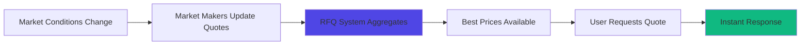

# Pricing Models

Understand how options are priced on MegaFi. Learn the factors that determine option values, how the pricing model works, and how to evaluate whether options are fairly priced.

## At a Glance

- Black-Scholes model adapted for DeFi and crypto markets
- Real-time pricing updates with every MegaPool state change
- Implied volatility derived from market prices
- On-chain calculation ensures transparency
- Arbitrage mechanisms keep prices efficient
- Historical volatility and pricing data available

## Option Value Components

Options have two value components:

### Intrinsic Value

Value if exercised immediately:

**Call Option**:
```
Intrinsic Value = max(0, Underlying Price - Strike Price)

Example:
ETH at $2,100
Strike: $2,000
Intrinsic Value: $2,100 - $2,000 = $100
```

**Put Option**:
```
Intrinsic Value = max(0, Strike Price - Underlying Price)

Example:
ETH at $1,900
Strike: $2,000
Intrinsic Value: $2,000 - $1,900 = $100
```

Intrinsic value is always ≥ 0. Options with intrinsic value are "in-the-money."

### Time Value

Value from possibility of favorable price movement before expiration:

```
Total Option Value = Intrinsic Value + Time Value

Example:
ETH at $2,000
$2,000 call trading at $120

Intrinsic: $0 (at-the-money)
Time Value: $120
Total Value: $120

Time value decreases as expiration approaches
```

## Black-Scholes Model

Core pricing model used by MegaFi:

### Formula

Call Option Price:

```
C = S × N(d1) - K × e^(-r×T) × N(d2)

Where:
C = Call price
S = Current underlying price
K = Strike price
r = Risk-free rate
T = Time to expiration (years)
N() = Cumulative normal distribution
σ = Implied volatility

d1 = [ln(S/K) + (r + σ²/2) × T] / (σ × √T)
d2 = d1 - σ × √T
```

Put price derived via put-call parity.

### Inputs

**Underlying Price (S)**: Real-time from MegaPools.

**Strike Price (K)**: Pre-defined by option contract.

**Time to Expiration (T)**: Days remaining / 365.

**Risk-Free Rate (r)**: DeFi lending rate (USDC yield).

**Implied Volatility (σ)**: Market expectation of future volatility.

### RFQ Pricing System

MegaFi uses a Request for Quote (RFQ) system for competitive options pricing:

```
1. User requests option quote (strike, expiration, size)
2. Multiple market makers provide competitive quotes
3. Best price automatically selected
4. User reviews and confirms
5. Trade executes instantly on MegaETH
Total time: < 100ms
```

**Benefits of RFQ**:
- Competitive pricing from multiple professional market makers
- Deep liquidity across all strikes and expirations
- Fast execution leveraging MegaETH's sub-10ms finality
- Transparent quote comparison

**How It Works**:
Market makers continuously monitor markets and provide real-time quotes. When you request a price, the system queries multiple makers simultaneously and presents the best available price. MegaETH's speed ensures quotes remain fresh and execution is near-instant.

## Implied Volatility

Most important input to option pricing:

### What Is IV?

Market's expectation of future price volatility:

```
High IV (e.g., 80%):
- Market expects large price swings
- Options expensive
- Good for sellers, bad for buyers

Low IV (e.g., 30%):
- Market expects calm price action
- Options cheap
- Good for buyers, bad for sellers
```

### IV Calculation

Derived by reversing Black-Scholes:

```
Given:
- Option market price
- Underlying price
- Strike
- Time to expiration
- Risk-free rate

Solve for: σ (implied volatility)
```

Cannot be solved algebraically. Iterative numerical methods used.

### IV Surface

IV varies by strike and expiration:

```
         Strikes
       $1800  $1900  $2000  $2100  $2200
7d:     65%    60%    55%    60%    65%  (vol smile)
30d:    55%    52%    50%    52%    55%
90d:    50%    48%    47%    48%    50%

Observations:
- OTM options: Higher IV (smile)
- ATM options: Lower IV (smile bottom)
- Shorter expiration: Higher IV (more uncertainty)
```

Interface displays IV surface for visualization.

### Historical vs Implied Volatility

**Historical Volatility (HV)**: Actual past price fluctuations.

```
Last 30 days ETH price moves:
Calculate standard deviation
Annualize: HV = 45%
```

**Implied Volatility (IV)**: Market's future expectation.

```
30-day ATM options trading at IV = 55%
```

**Comparison**:
```
If IV > HV: Options relatively expensive
If IV < HV: Options relatively cheap
```

Traders sell when IV > HV, buy when IV < HV.

## Greeks Pricing Impact

### Delta

Option price change for $1 underlying move:

```
Call delta ranges: 0 to 1
Put delta ranges: -1 to 0

ATM options: Delta ≈ ±0.5
Deep ITM: Delta → ±1
Deep OTM: Delta → 0
```

**Delta in pricing**:
```
ETH call with delta 0.6
If ETH rises $10:
Option value increases ≈ $6 (0.6 × $10)
```

### Gamma

Rate of delta change:

```
High Gamma: Delta changes rapidly
- ATM options near expiration
- Small price moves cause large delta shifts

Low Gamma: Delta stable
- ITM/OTM options
- Long-dated options
```

**Gamma in pricing**:
```
Option has gamma 0.05
ETH moves $10:
Delta increases 0.5 (0.05 × 10)
```

### Theta

Time decay per day:

```
Option value = Intrinsic + Time Value
Each day: Time value decreases

Theta accelerates near expiration:
90 days out: -$1/day
30 days out: -$2/day
7 days out: -$8/day
1 day out: -$20/day
```

**Theta in pricing**:
```
Option worth $100 with theta -$2
Tomorrow (all else equal):
Option worth $98
```

### Vega

Sensitivity to volatility:

```
High Vega: Sensitive to IV changes
- Long-dated options
- ATM options

Low Vega: Less sensitive
- Short-dated options
- Deep ITM/OTM options
```

**Vega in pricing**:
```
Option has vega 5
IV increases from 50% to 51%:
Option value increases $5
```

## Pricing Dynamics

### Real-Time Updates

MegaFi pricing updates continuously through the RFQ system:



**Update Frequency**:
- Market maker quotes: Continuous (sub-second)
- User quote requests: On-demand (< 100ms response)
- Underlying price feeds: Real-time from MegaPools

**MegaETH Advantage**:
MegaETH's sub-10ms finality means once you accept a quote, execution and settlement happen almost instantly. No waiting for block confirmations or dealing with stale prices.

### Competitive Pricing and Efficiency

RFQ system ensures competitive pricing:

```
Scenario:
User requests ETH $2,000 call quote

Market Maker A: $100
Market Maker B: $98
Market Maker C: $99

System automatically selects: $98 (best price)
User gets competitive execution
```

**Why RFQ is Efficient**:
- Market makers compete for your order
- Professional pricing from experienced traders
- Tight spreads due to competition
- MegaETH's low costs enable market makers to offer better prices

## Factors Affecting Price

### Underlying Price

Most significant factor:

```
Call options:
- Price up = Value up
- Price down = Value down

Put options:
- Price up = Value down
- Price down = Value up
```

### Time Remaining

More time = More value:

```
ETH at $2,000
$2,200 calls:

7 days: $30
30 days: $80
90 days: $140

Longer duration: More opportunity for favorable moves
```

### Volatility

Higher volatility = Higher value (both calls and puts):

```
ETH at $2,000
$2,000 ATM call

IV 40%: $70
IV 60%: $110
IV 80%: $150

More volatility: Greater chance of large moves
```

### Interest Rates

Higher rates increase call value, decrease put value:

```
Usually minimal impact in crypto (1-2% effect)
Risk-free rate based on stablecoin lending yields
```

## Evaluating Fair Value

### Is an Option Cheap or Expensive?

**Method 1: Historical IV Percentile**
```
Current IV: 55%
52-week range: 30% - 90%
Percentile: 42nd percentile

Interpretation: Below median, relatively cheap
```

**Method 2: HV vs IV**
```
Historical Volatility (30-day): 40%
Implied Volatility (30-day options): 55%

Interpretation: IV > HV, options expensive
```

**Method 3: Put-Call Parity**
```
Verify: Call - Put = Underlying - Strike × e^(-r×T)

If unequal: Arbitrage opportunity exists
```

### Pricing Tools

Interface provides:

**Option Calculator**: Input parameters, see fair value.

**IV Charts**: Historical IV by strike and expiration.

**Skew Visualizer**: See IV smile/skew.

**Comparisons**: Compare IV across expirations and strikes.

## Advanced Pricing Concepts

### Volatility Smile

IV varies by strike:

```
Strike:  $1800  $2000  $2200
IV:       62%    50%    62%

Shape: Smile (higher at extremes)

Reason:
- Fat tails in crypto (more large moves than normal distribution predicts)
- Demand for OTM puts (protection)
- Supply/demand dynamics
```

### Term Structure

IV varies by expiration:

```
Expiration:  7d    30d    90d
IV:          55%   48%    45%

Shape: Downward sloping (backwardation)

Interpretation: Near-term uncertainty higher
```

### Volatility Skew

Asymmetric IV:

```
OTM Puts: 65% IV
ATM: 50% IV
OTM Calls: 52% IV

Put Skew: Puts more expensive than calls
Reason: Downside protection demand
```

## FAQ

**Why do option prices change when underlying doesn't?**  
Time decay, volatility changes, or interest rate changes affect value.

**How does RFQ pricing compare to on-chain pricing?**  
RFQ provides competitive quotes from professional market makers. While Black-Scholes principles guide pricing, market makers factor in real-time supply/demand and risk management.

**How accurate is the pricing model?**  
Market makers use sophisticated pricing models based on Black-Scholes and other factors. RFQ competition ensures fair market pricing.

**What if I think an option is mispriced?**  
Arbitrage opportunity. Trade against it and potentially profit.

**Do all strikes use same IV?**  
No. IV varies by strike (smile/skew). Each strike has its own IV.

**Can I see historical pricing data?**  
Yes. Charts show option prices, IV, and Greeks over time.

## Next Steps

Apply pricing knowledge:

- [Options Trading](options-trading.md) - Trade based on valuations
- [Hedging Strategies](hedging-strategies.md) - Use pricing for hedge sizing
- [Risk Management](risk-management.md) - Understand position values

---

**Price is what you pay. Value is what you get.**

