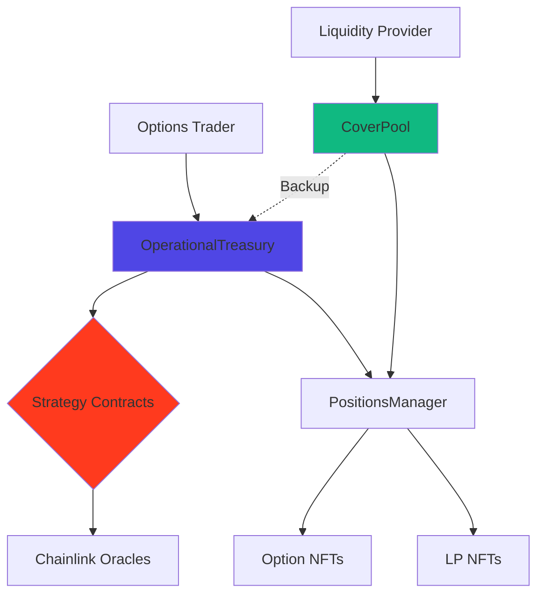

# Smart Contracts

Technical reference for MegaFi smart contracts. Understand contract architecture, key functions, and integration patterns for the pool-based options protocol.

> **Note**: Smart contracts are built on audited code and currently in development for MegaETH deployment. Security audits planned before mainnet launch. Contract addresses will be published upon deployment. Testnet contracts available for development.

## At a Glance

- Pool-based liquidity architecture with USDC-only model
- OperationalTreasury manages option lifecycle
- CoverPool provides LP staking and backup liquidity
- 8+ strategy contracts implement different option types
- ERC721 NFTs for both options and LP positions
- Transparent on-chain pricing via Black-Scholes

## Contract Architecture

### Core System



### Contract Hierarchy

**Core Contracts**:
- **OperationalTreasury**: Central hub for option creation and settlement
- **CoverPool**: LP liquidity pool with epoch-based profit distribution
- **PositionsManager**: ERC721 NFT manager for all positions
- **LimitController**: Per-strategy exposure limit enforcement

**Strategy Contracts** (8+ implementations):
- HegicStrategyCall (ETH, BTC)
- HegicStrategyPut (ETH, BTC)
- HegicStrategyStraddle (ETH, BTC)
- HegicStrategyStrangle (ETH, BTC)
- HegicStrategySpreadCall (ETH, BTC)
- HegicStrategySpreadPut (ETH, BTC)
- Inverse strategies (optional)

**External Dependencies**:
- USDC (ERC20 token)
- Chainlink Price Feeds (ETH/USD, BTC/USD)

## OperationalTreasury

**Purpose**: Central hub managing option lifecycle from creation to settlement.

### Key State Variables

```solidity
// Immutable
IERC20 public immutable token;                 // USDC address
IPositionsManager public immutable manager;    // NFT manager
ICoverPool public immutable coverPool;        // Backup liquidity
uint256 public immutable maxLockupPeriod;     // 30 days (2,592,000s)

// Mutable
uint256 public benchmark;                      // Reserve target
uint256 public lockedPremium;                 // Active premiums
uint256 public totalLocked;                   // Locked liquidity
mapping(uint256 => LockedLiquidity) public lockedLiquidity;
mapping(IHegicStrategy => uint256) public lockedByStrategy;
mapping(IHegicStrategy => bool) public acceptedStrategy;
```

### Data Structures

```solidity
enum LockedLiquidityState {
    Unlocked,  // 0
    Locked     // 1
}

struct LockedLiquidity {
    LockedLiquidityState state;
    IHegicStrategy strategy;
    uint128 negativepnl;    // Max loss
    uint128 positivepnl;    // Premium paid
    uint32 expiration;      // Unix timestamp
}
```

### Core Functions

#### buy() - Purchase Option

```solidity
function buy(
    IHegicStrategy strategy,
    address holder,
    uint256 amount,
    uint256 period,
    bytes[] calldata additional
) external nonReentrant
```

**Parameters**:
- `strategy`: Strategy contract address
- `holder`: Address receiving option NFT
- `amount`: Size in asset decimals (e.g., 1e18 for 1 ETH)
- `period`: Duration in seconds (86400 to 2592000)
- `additional`: Strategy-specific parameters (encoded bytes)

**Flow**:
1. Validate strategy is accepted
2. Calculate premium via strategy.create()
3. Transfer premium (USDC) from msg.sender
4. Lock liquidity (negativePNL)
5. Mint option NFT to holder
6. Emit Acquired event

**Requirements**:
- msg.sender approved USDC ≥ premium
- period within allowed range
- strategy limit not exceeded
- sufficient liquidity available

**Gas**: ~250,000-350,000

---

#### payOff() - Exercise Option

```solidity
function payOff(uint256 positionID, address account) 
    external 
    nonReentrant
```

**Parameters**:
- `positionID`: Option NFT token ID
- `account`: Address receiving profit

**Flow**:
1. Verify option not expired
2. Calculate profit via strategy.payOffAmount()
3. Unlock liquidity from Treasury
4. If Treasury balance < profit: call coverPool.payOut(deficit)
5. Transfer profit (USDC) to account
6. Emit Paid event

**Requirements**:
- msg.sender is owner or approved
- Within exercise window (1 hour before expiry)
- Option is in-the-money (profit > 0)

**Gas**: ~200,000-400,000

---

#### unlock() - Expire Option

```solidity
function unlock(uint256 lockedLiquidityID) 
    public 
    virtual
```

**Parameters**:
- `lockedLiquidityID`: Option NFT token ID

**Flow**:
1. Check option expired
2. Unlock liquidity back to Treasury
3. Emit Expired event

**Requirements**:
- block.timestamp > expiration

**Gas**: ~50,000-80,000

**Note**: Anyone can call after expiration

---

### Admin Functions

```solidity
function setBenchmark(uint256 value) external onlyAdmin;
function withdraw(address to, uint256 amount) external onlyAdmin;
function setStrategy(IHegicStrategy strategy, bool value) external onlyAdmin;
```

### Events

```solidity
event Acquired(
    uint256 indexed id,
    IHegicStrategy indexed strategy,
    address indexed holder,
    uint256 amount,
    uint256 premium
);

event Paid(
    uint256 indexed id,
    address indexed account,
    uint256 amount
);

event Expired(uint256 indexed id);
```

## CoverPool

**Purpose**: LP staking pool providing backup liquidity and profit distribution via 7-day epochs.

### Key State Variables

```solidity
// Immutable
IERC20 public immutable coverToken;      // USDC
IERC20 public immutable profitToken;     // USDC

// Constants
uint256 constant CHANGING_PRICE_DECIMALS = 1e30;
uint256 constant MINIMAL_EPOCH_DURATION = 7 days;

// Mutable
uint32 public windowSize;                // 5 days (entry/exit window)
uint256 public cumulativeProfit;        // Profit per share
uint256 public totalShare;              // Total LP shares
uint256 public currentEpoch;            // Current epoch number
address public payoffPool;              // Backup USDC source

mapping(uint256 => uint256) public shareOf;
mapping(uint256 => uint256) public bufferredUnclaimedProfit;
mapping(uint256 => uint256) public cumulativePoint;
mapping(uint256 => Epoch) public epoch;
```

### Data Structures

```solidity
struct Epoch {
    uint256 start;                      // Start timestamp
    uint256 changingPrice;              // 1e30 (USDC/USDC)
    uint256 cumulativePoint;            // Profit checkpoint
    uint256 totalShareOut;              // Shares withdrawing
    uint256 coverTokenOut;              // USDC withdrawing
    uint256 profitTokenOut;             // Profits distributing
    mapping(uint256 => uint256) outShare;
}
```

### Core Functions

#### provide() - Deposit Liquidity

```solidity
function provide(uint256 amount, uint256 positionId)
    external
    returns (uint256)
```

**Parameters**:
- `amount`: USDC to deposit (6 decimals)
- `positionId`: 0 for new, existing ID to add

**Flow**:
1. Check within entry window (first 5 days of epoch)
2. Transfer USDC from msg.sender
3. Calculate share: (amount × totalShare) / totalCoverToken
4. Mint or update LP NFT
5. Emit Provided event

**Returns**: Position ID (NFT token ID)

**Gas**: ~200,000-300,000

---

#### claim() - Claim Profits

```solidity
function claim(uint256 positionId)
    external
    returns (uint256 amount)
```

**Parameters**:
- `positionId`: LP NFT token ID

**Flow**:
1. Calculate claimable: buffered + ((cumulativeProfit - cumulativePoint) × share)
2. Transfer USDC to msg.sender
3. Update cumulativePoint
4. Reset buffered profit

**Returns**: USDC claimed (6 decimals)

**Gas**: ~100,000-150,000

---

#### withdraw() - Mark for Withdrawal

```solidity
function withdraw(uint256 positionId, uint256 shareAmount)
    external
```

**Parameters**:
- `positionId`: LP NFT token ID
- `shareAmount`: Share amount to withdraw

**Flow**:
1. Check within withdrawal window (first 5 days)
2. Mark shares for withdrawal in current epoch
3. Emit Withdrawn event

**Requirements**:
- Within window
- shareAmount ≤ position share

**Gas**: ~80,000-120,000

**Note**: Step 1 of 2-step withdrawal

---

#### withdrawEpoch() - Complete Withdrawal

```solidity
function withdrawEpoch(uint256 positionId, uint256[] calldata epochs)
    external
```

**Parameters**:
- `positionId`: LP NFT token ID
- `epochs`: Array of epoch IDs to withdraw

**Flow**:
1. For each closed epoch with outShare
2. Calculate USDC + profits to return
3. Transfer tokens
4. Clear epoch withdrawal data

**Requirements**:
- Epochs must be closed
- Position must have outShare in epoch

**Gas**: ~150,000 per epoch

**Note**: Step 2 of 2-step withdrawal

---

#### fixProfit() - Close Epoch

```solidity
function fixProfit() external
```

**Flow**:
1. Calculate net profit: balance - profitTokenBalance
2. Update cumulativeProfit += (profit / totalShare)
3. Close current epoch
4. Start next epoch
5. Emit EpochClosed event

**Requirements**:
- Called by admin weekly
- Previous epoch duration ≥ 7 days

**Gas**: ~100,000-150,000

---

### Backup Function

#### payOut() - Provide Emergency Liquidity

```solidity
function payOut(uint256 amount) 
    external 
    onlyRole(OPERATIONAL_TREASURY_ROLE)
```

**Parameters**:
- `amount`: USDC needed (6 decimals)

**Flow**:
1. Transfer USDC to Treasury
2. Update internal accounting

**Use**: Called by Treasury when balance insufficient for option payoff

---

### Events

```solidity
event Provided(
    uint256 indexed id,
    address indexed account,
    uint256 amount,
    uint256 share
);

event Withdrawn(
    uint256 indexed id,
    address indexed account,
    uint256 share
);

event Paid(
    uint256 indexed id,
    address indexed account,
    uint256 amount
);

event EpochClosed(
    uint256 indexed epochId,
    uint256 profit,
    uint256 cumulativeProfit
);
```

## Strategy Contracts

**Purpose**: Implement option pricing and payoff logic for different strategy types.

### IHegicStrategy Interface

```solidity
interface IHegicStrategy {
    function create(
        uint256 id,
        address holder,
        uint256 amount,
        uint256 period,
        bytes[] calldata additional
    ) external returns (
        uint32 expiration,
        uint256 positivepnl,
        uint256 negativepnl
    );
    
    function calculateNegativepnlAndPositivepnl(
        uint256 amount,
        uint256 period,
        bytes[] calldata additional
    ) external view returns (
        uint128 negativepnl,
        uint128 positivepnl
    );
    
    function payOffAmount(uint256 optionID)
        external
        view
        returns (uint256 profit);
}
```

### Strategy Implementations

**Call Options**:
```solidity
contract HegicStrategyCall is IHegicStrategy {
    IPriceProvider public priceProvider;  // Chainlink
    uint256 public K;                      // Volatility param
    uint32 public minPeriod;              // 1 day
    uint32 public maxPeriod;              // 30 days
    
    // Implements Black-Scholes pricing
    function calculateNegativepnlAndPositivepnl(...)
        external view returns (uint128, uint128);
}
```

**Put Options**:
```solidity
contract HegicStrategyPut is IHegicStrategy {
    // Similar structure to Call
    // Different payoff calculation
}
```

**Straddle**:
```solidity
contract HegicStrategyStraddle is IHegicStrategy {
    // Combines call + put at same strike
    // Premium = call premium + put premium
}
```

**Strangle**:
```solidity
contract HegicStrategyStrangle is IHegicStrategy {
    // Call + put at different strikes
    // Requires spread% parameter in additional bytes
}
```

**Spreads**:
```solidity
contract HegicStrategySpreadCall is IHegicStrategy {
    // Bull or bear call spread
    // Limited profit and loss
}
```

### Strategy Parameters

Each strategy configures:

```solidity
struct StrategyParams {
    uint256 K;                  // Volatility coefficient
    uint32 minPeriod;          // Min duration (e.g., 1 day)
    uint32 maxPeriod;          // Max duration (e.g., 30 days)
    uint32 exerciseWindowDuration;  // Exercise window (e.g., 1 hour)
    uint8 spotDecimals;        // Asset decimals (18 for ETH, 8 for BTC)
}
```

## PositionsManager

**Purpose**: ERC721 NFT manager for options and LP positions.

### Key Functions

```solidity
contract PositionsManager is ERC721, AccessControl {
    function mint(address to) external returns (uint256 id);
    function burn(uint256 id) external;
    
    // Standard ERC721
    function ownerOf(uint256 id) external view returns (address);
    function transferFrom(address from, address to, uint256 id) external;
    function approve(address to, uint256 id) external;
}
```

**Features**:
- Each position (option or LP) is an NFT
- Transferable between addresses
- Composable with other protocols
- Standard ERC721 interface

## LimitController

**Purpose**: Enforce per-strategy exposure limits.

### Functions

```solidity
contract LimitController is AccessControl {
    mapping(IHegicStrategy => uint256) public limit;
    
    function setLimit(IHegicStrategy strategy, uint256 amount)
        external
        onlyRole(DEFAULT_ADMIN_ROLE);
        
    function checkLimit(
        IHegicStrategy strategy,
        uint256 amount
    ) external view returns (bool);
}
```

**Usage**:
```
Before option purchase:
1. Treasury checks: lockedByStrategy[strategy] + negativePNL
2. Compare to: limitController.limit(strategy)
3. If exceeded: revert
```

## Integration Patterns

### Buying Options

```typescript
// 1. Approve USDC
await usdc.approve(treasury.address, premium);

// 2. Buy option
const tx = await treasury.buy(
    strategyAddress,
    userAddress,
    parseEther("1"),      // 1 ETH
    7 * 24 * 60 * 60,     // 7 days
    []                     // No additional params
);

// 3. Get option ID from event
const receipt = await tx.wait();
const acquiredEvent = receipt.events.find(e => e.event === "Acquired");
const optionId = acquiredEvent.args.id;
```

### Exercising Options

```typescript
// 1. Check payoff amount
const profit = await strategy.payOffAmount(optionId);

// 2. Exercise if profitable
if (profit > 0) {
    await treasury.payOff(optionId, userAddress);
}
```

### Providing Liquidity

```typescript
// 1. Approve USDC
await usdc.approve(coverPool.address, amount);

// 2. Provide liquidity
const positionId = await coverPool.provide(
    amount,
    0  // 0 for new position
);
```

### Claiming LP Profits

```typescript
// 1. Check claimable amount
const claimable = await coverPool.availableToClaim(positionId);

// 2. Claim if profitable
if (claimable > 0) {
    await coverPool.claim(positionId);
}
```

## Gas Optimizations

### Storage Packing

Efficient slot usage:

```solidity
struct LockedLiquidity {
    LockedLiquidityState state;  // 1 byte
    IHegicStrategy strategy;     // 20 bytes
    uint128 negativepnl;         // 16 bytes (slot 2)
    uint128 positivepnl;         // 16 bytes (slot 2)
    uint32 expiration;           // 4 bytes (slot 3)
}
// Total: 3 storage slots (optimized)
```

### View Functions

Premium calculations are view functions (zero gas):

```solidity
function calculateNegativepnlAndPositivepnl(...)
    external
    view  // No gas cost
    returns (uint128, uint128);
```

### Batch Operations

Query multiple positions efficiently:

```typescript
// Use multicall for batch reads
const calls = optionIds.map(id => 
    treasury.interface.encodeFunctionData("lockedLiquidity", [id])
);
const results = await multicall.aggregate(calls);
```

## Security Features

### Reentrancy Protection

All state-changing functions use `nonReentrant`:

```solidity
function buy(...) external nonReentrant {
    // Safe from reentrancy attacks
}
```

### Access Control

Role-based permissions:

```solidity
bytes32 public constant DEFAULT_ADMIN_ROLE = 0x00;
bytes32 public constant OPERATIONAL_TREASURY_ROLE = keccak256("OPERATIONAL_TREASURY_ROLE");

function fixProfit() external onlyRole(DEFAULT_ADMIN_ROLE) {
    // Only admin can close epochs
}
```

### Integer Safety

Solidity 0.8+ automatic overflow protection:

```solidity
uint256 result = a + b;  // Reverts on overflow
```

## Contract Addresses

See [Contract Addresses](contract-addresses.md) for deployed addresses.

**Development Status**: Contracts in development. Addresses will be published upon deployment to MegaETH.

## Audit Status

**Current**: Pre-audit phase. Built on audited Hegic protocol foundations.

**Planned**: Multi-firm security audits before mainnet launch.

## FAQ

**Are contracts upgradeable?**  
Core protocol uses transparent upgradeable proxies for future improvements.

**Can I verify contracts?**  
Yes. All contracts will be verified on MegaETH block explorer with source code published.

**Where are ABIs?**  
Will be available on GitHub and npm package upon deployment.

**How do I report security issues?**  
Contact contact@megafi.app with responsible disclosure.

**Are contract names final?**  
Yes. Contract names (including "Hegic" prefix) are the actual deployed names from the audited codebase.

## Next Steps

Explore technical documentation:

- [Architecture](architecture.md) - System design
- [Contract Addresses](contract-addresses.md) - Deployed addresses
- [Security Audits](security-audits.md) - Security information

---

**Open source. Transparent. Secure.**
